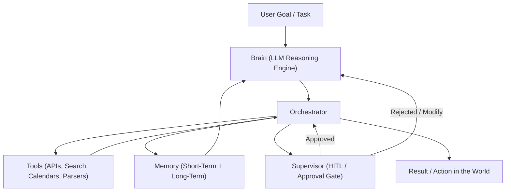
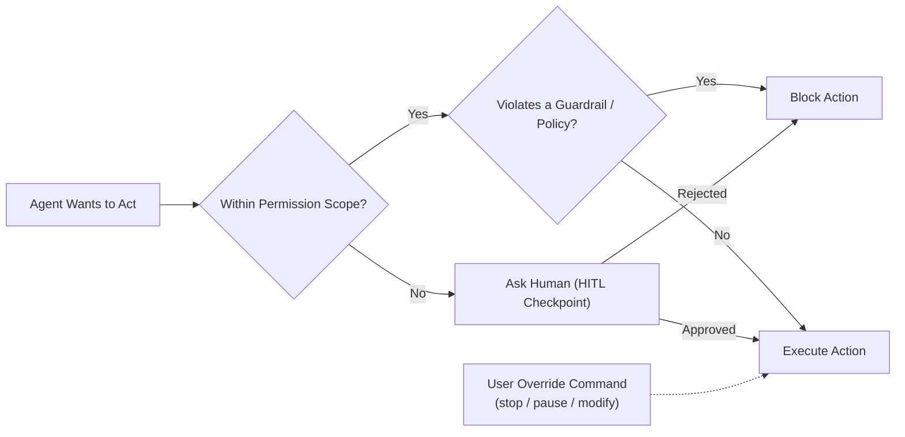
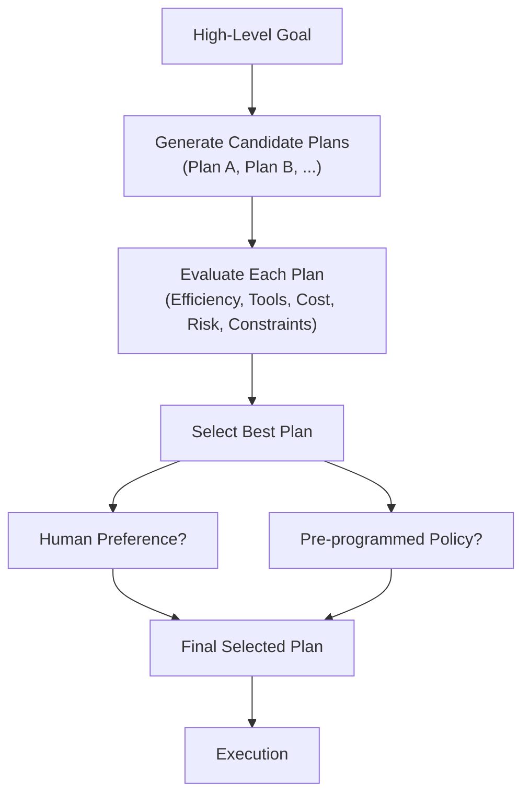
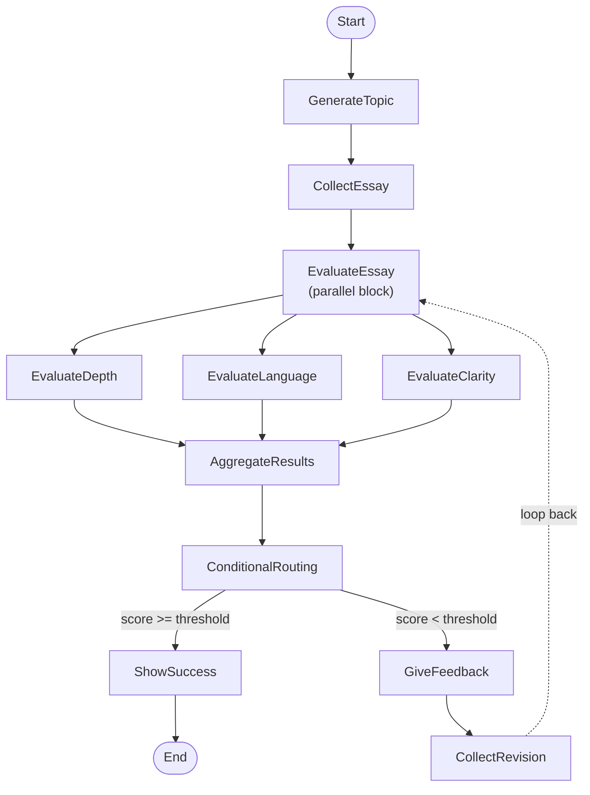
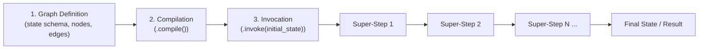
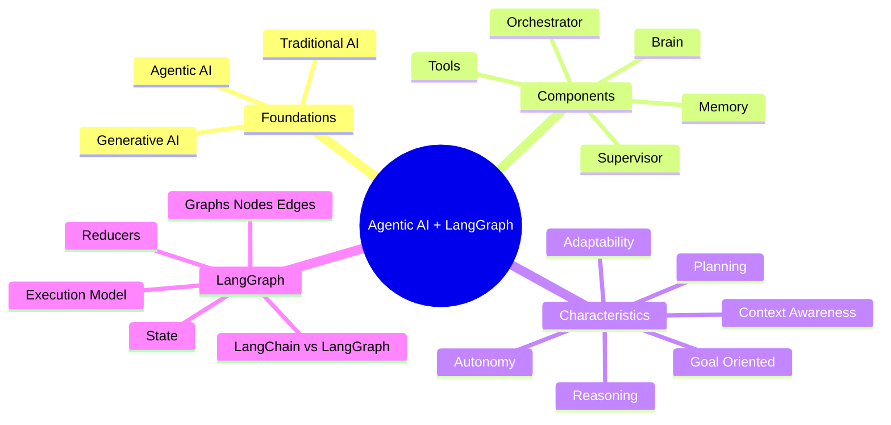

# 1. Traditional AI vs Generative AI vs Agentic AI

## 1.1 Traditional AI

Traditional AI is about **finding patterns in data and giving predictions**. A traditional (discriminative) model is trained to learn a mapping from an input $x$ to an output label or value $y$, i.e. it approximates a function

$$
f: X \rightarrow Y
$$

or, in probabilistic terms, it models the **conditional distribution** $P(y \mid x)$ - "given this input, what is the most likely output?" Classification, regression, spam detection, fraud detection, and recommendation ranking are all traditional-AI problems.

## 1.2 Generative AI

Generative AI is about **learning the distribution of data** so that it can generate a new sample from it. Instead of learning $P(y \mid x)$, a generative model learns the **joint or marginal distribution of the data itself**, $P(x)$, or in the case of language models, the conditional next-token distribution:

$$
P(x_t \mid x_1, x_2, \dots, x_{t-1})
$$

Once this distribution is learned, new samples (text, images, audio, code) can be **drawn/sampled** from it, which is why generative models can produce content that never existed in the training set, rather than simply classifying existing input.

### 1.2.1 Generative AI Applications

- Creative and business writing
- Software development
- Customer support
- Education
- Design

Generative AI is constantly evolving and improving - new architectures, larger context windows, and better alignment techniques keep expanding what it can do.

## 1.3 Generative AI vs Agentic AI - Core Distinctions

| Dimension         | Generative AI                   | Agentic AI                                         |
| ----------------- | ------------------------------- | -------------------------------------------------- |
| Primary purpose   | Creating content                | Solving a goal                                     |
| Mode of operation | Reactive (responds to a prompt) | Proactive / autonomous (pursues a goal on its own) |
| Nature            | A **capability**                | A **behaviour** built from many capabilities       |
| Relationship      | A building block                | Uses generative AI as one of its components        |

- Generative AI is about **creating content**; Agentic AI is about **solving a goal**.
- Generative AI is **reactive**; Agentic AI is **proactive** (autonomous).
- Generative AI is a **building block** of Agentic AI.
- Generative AI is a **capability**; Agentic AI is a **behaviour** consisting of many capabilities working together.

## 1.4 What Is Agentic AI?

> Agentic AI is a type of AI that can take up a task or goal from a user and then work toward completing it on its own, with minimal human guidance. It plans, takes action, adapts to changes, and seeks help only when necessary.

The defining idea is **goal-directed autonomy over multiple steps**, rather than a single reactive response.

---

# 2. Core Components of an Agentic AI System

An agentic system is generally composed of five interacting components:

1. **Brain** - the reasoning engine (typically an LLM) that interprets goals, makes decisions, and generates plans.
2. **Orchestrator** - the control layer that sequences steps, routes execution between nodes/tools, and manages the overall workflow (this is exactly the role LangGraph plays).
3. **Tools** - external functions, APIs, databases, or services the agent can call to act on the world (e.g. a calendar API, a resume parser, a job-board posting API).
4. **Memory** - the mechanism for retaining information across steps and sessions (short-term/working memory and long-term/persistent memory).
5. **Supervisor** - the approval / human-in-the-loop (HITL) layer that inserts checkpoints where a human can review, approve, or override the agent's actions.



These five components map directly onto the six characteristics discussed below: the **Brain** enables reasoning and planning, the **Orchestrator** enables autonomy and adaptability, **Tools** extend what the agent can act on, **Memory** enables context awareness, and the **Supervisor** keeps autonomy safely bounded.

---

# 3. Characteristics of Agentic AI - Overview

An agentic AI system is typically described using six characteristics:

1. **Autonomous**
2. **Goal Oriented**
3. **Planning**
4. **Reasoning**
5. **Adaptability**
6. **Context Awareness**

Each is explored in depth below, using a running example: an **AI recruiter agent** whose goal is to hire a suitable candidate for a role.

---

# 4. Autonomy

## 4.1 Definition

> Autonomy refers to the AI system's ability to make decisions and take actions on its own to achieve a given goal, without needing step-by-step human instructions.

**Example:** Our AI recruiter is autonomous.

## 4.2 Facets of Autonomy

Autonomy shows up in multiple facets of the agent's behaviour:

1. It is **proactive** (it acts without being re-prompted for every micro-step).
2. Autonomy spans multiple facets:
   - **a. Execution** - carrying out the steps of a task without supervision.
   - **b. Decision-making** - choosing between alternative actions.
   - **c. Tool usage** - deciding which external tool to call and when.
3. Autonomy **can be controlled** - it is not "all or nothing."

## 4.3 Mechanisms to Control Autonomy

| Mechanism                    | Description                                                               | Example                                                            |
| ---------------------------- | ------------------------------------------------------------------------- | ------------------------------------------------------------------ |
| **Permission Scope**         | Limits what tools or actions the agent can perform independently.         | Can screen candidates, but needs approval before rejecting anyone. |
| **Human-in-the-Loop (HITL)** | Inserts checkpoints where human approval is required before continuing.   | "Can I post this JD?"                                              |
| **Override Controls**        | Allows users to stop, pause, or change the agent's behaviour at any time. | "Pause screening" command to halt resume processing.               |
| **Guardrails / Policies**    | Defines hard rules or ethical boundaries the agent must follow.           | "Never schedule interviews on weekends."                           |



## 4.4 Why Autonomy Can Be Dangerous

Unchecked autonomy carries real operational and ethical risk:

- The application autonomously sends out job offers with **incorrect salaries or terms**.
- The application shortlists candidates by **age or nationality**, violating anti-discrimination laws.
- The application **overspends** on LinkedIn ads without a budget cap.

This is precisely why permission scopes, HITL checkpoints, override controls, and guardrails exist - autonomy must be **bounded**, not unlimited.

---

# 5. Goal Orientation

## 5.1 Definition

> Being goal-oriented means that the AI system operates with a persistent objective in mind and continuously directs its actions to achieve that objective, rather than just responding to isolated prompts.

## 5.2 Properties of Goals

1. Goals act as a **compass** for autonomy - they give direction to otherwise-open-ended decision-making.
2. Goals can come with **constraints** (budget limits, timelines, legal boundaries).
3. Goals are stored in **core memory**, so they persist across the whole task lifecycle.
4. Goals can be **altered** mid-task (e.g. a new hiring manager changes the required experience level).

---

# 6. Planning

## 6.1 Definition

> Planning is the agent's ability to break down a high-level goal into a structured sequence of actions or subgoals and decide the best path to achieve the desired outcome.

## 6.2 The Three-Step Planning Process

**Step 1 - Generate multiple candidate plans**

- Plan A: Post the JD on LinkedIn, GitHub Jobs, AngelList.
- Plan B: Use internal referrals and hiring agencies.

**Step 2 - Evaluate each plan** against criteria such as:

- **Efficiency** - Which is faster?
- **Tool availability** - Which tools are available?
- **Cost** - Does it require premium tools?
- **Risk** - Will it fail if we get no applicants?
- **Alignment with constraints** - remote-only? budget?

We can think of plan evaluation as a simple weighted-scoring function over criteria $c_1, \dots, c_n$ with weights $w_1, \dots, w_n$:

$$
\text{Score}(\text{Plan}) = \sum_{i=1}^{n} w_i \cdot c_i(\text{Plan})
$$

**Step 3 - Select the best plan**, with the help of:

- **Human-in-the-loop input** - e.g. "Which of these options do you prefer?"
- **A pre-programmed policy** - e.g. "Favor low-cost channels first."



---

# 7. Reasoning

## 7.1 Definition

> Reasoning is the cognitive process through which an agentic AI system interprets information, draws conclusions, and makes decisions - both while planning ahead and while executing actions in real time.

## 7.2 Reasoning During Planning

1. **Goal decomposition** - break down abstract goals into concrete steps.
2. **Tool selection** - decide which tools will be needed for which steps.
3. **Resource estimation** - estimate time, dependencies, and risks.

## 7.3 Reasoning During Execution

1. **Decision-making** - choosing between options (e.g. 3 candidates match → schedule the 2 best, reject the rest).
2. **HITL handling** - knowing when to pause and ask for help (e.g. unsure about the salary range).
3. **Error handling** - interpreting tool/API failures and recovering from them.

A useful mental model for the "decision-making" sub-step is an **expected-utility** calculation: given a set of possible actions $a \in A$, and possible outcomes/states $s_i$ with probabilities $P(s_i)$ and utility $U(a, s_i)$, the agent (implicitly, via the LLM's reasoning) prefers the action that maximizes:

$$
EU(a) = \sum_{i} P(s_i) \cdot U(a, s_i)
$$

This is not literally computed by the LLM as an equation, but it is a useful abstraction for _why_ one action is reasoned to be better than another.

---

# 8. Adaptability

## 8.1 Definition

> Adaptability is the agent's ability to modify its plans, strategies, or actions in response to unexpected conditions - all while staying aligned with the goal.

## 8.2 Triggers for Adaptation

1. **Failures** - e.g. the Calendar API goes down.
2. **External feedback** - e.g. a lower-than-expected number of applications.
3. **Changing goals** - e.g. the decision shifts to hiring a freelancer instead of a full-time employee.

Adaptability is what separates a rigid, hard-coded script from a genuinely agentic system: the plan is revisited and revised, not abandoned, when the environment changes.

---

# 9. Context Awareness

## 9.1 Definition

> Context awareness is the agent's ability to understand, retain, and utilize relevant information from the ongoing task, past interactions, user preferences, and environmental cues to make better decisions throughout a multi-step process.

## 9.2 Types of Context

| Type                                  | Description                                           | Example                                                                                                             |
| ------------------------------------- | ----------------------------------------------------- | ------------------------------------------------------------------------------------------------------------------- |
| **a. The original goal**              | The persistent objective the agent is working toward. | "Hire a backend engineer within 30 days."                                                                           |
| **b. Progress + interaction history** | What has already happened in the task.                | Job description was finalized and posted to LinkedIn & GitHub Jobs.                                                 |
| **c. Environment state**              | Live facts about the world relevant to the task.      | Number of applicants so far = 8; LinkedIn promotion ends in 2 days.                                                 |
| **d. Tool responses**                 | Outputs returned by tools/APIs the agent has called.  | Resume parser: "Candidate B has 3 years Django + AWS experience"; Calendar API: "No conflicts at 2 PM Wednesday."   |
| **e. User-specific preferences**      | Standing preferences of the human principal.          | Prefers remote-first candidates; likes receiving interview questions in a Google Doc.                               |
| **f. Policy or guardrails**           | Hard rules that bound the agent's behaviour.          | "Do not send an offer without explicit user approval"; "Never use platforms that require paid ads unless approved." |

## 9.3 Memory as the Implementation of Context Awareness

Context awareness is **implemented through memory**:

- **Short-term memory** - information relevant to the current task/session (e.g. the current conversation, the current candidate being screened).
- **Long-term memory** - information that persists across sessions (e.g. user preferences, historical hiring policies, past candidate outcomes).

---

# 10. Introduction to LangGraph

## 10.1 What Is LangGraph?

- LangGraph is an **orchestration framework** for building intelligent, stateful, multi-step LLM workflows.
- It enables advanced features like **parallelism, loops, branching, memory, and resumability**, making it ideal for agentic and production-grade AI applications.
- It models your logic as a **graph of nodes (tasks) and edges (routing)** instead of a linear chain.

Conceptually, a LangGraph program is a directed graph $G = (V, E)$ where:

- $V$ (vertices/nodes) are functions that read and update a shared **state**.
- $E$ (edges) define the possible transitions between nodes - including conditional edges, which act like `if/else` routing based on the current state.

## 10.2 Why a Graph Instead of a Chain?

A simple chain can only go forward, one step after another. A graph allows:

- **Branching** - different paths depending on the outcome of a step (e.g. score-based routing).
- **Looping** - revisiting a node (e.g. re-evaluating a revised essay).
- **Parallelism** - running independent nodes concurrently (e.g. evaluating depth, language, and clarity of an essay at the same time).
- **Resumability** - pausing and resuming the workflow later, including after human input.

---

# 11. LLM Workflows

## 11.1 Definition

1. LLM workflows are a **step-by-step process** using which we can build complex LLM applications.
2. Each step in a workflow performs a distinct task such as prompting, reasoning, tool calling, memory access, or decision-making.
3. Workflows can be **linear, parallel, branched, or looped**, allowing for complex behaviours like retries, multi-agent communication, or tool-augmented reasoning.

## 11.2 Common Workflow Patterns

| #   | Pattern                                    | Description                                                                          |
| --- | ------------------------------------------ | ------------------------------------------------------------------------------------ |
| 1   | **Single-Step Prompting**                  | One prompt, one response; simple Q&A, summarization, translation.                    |
| 2   | **Prompt Chaining**                        | Multi-step prompts; outputs from one step feed into the next for complex tasks.      |
| 3   | **ReAct (Reason + Act)**                   | LLM alternates reasoning and external actions (APIs, tools).                         |
| 4   | **Self-Consistency / Debate**              | Generate multiple reasoning paths and select the most consistent or correct answer.  |
| 5   | **Tool-Augmented Workflow**                | LLM interacts with external tools like calculators, databases, or code interpreters. |
| 6   | **Rewriting / Refinement Loop**            | Iteratively improve LLM output until it meets criteria.                              |
| 7   | **Retrieval-Augmented Generation (RAG)**   | LLM uses retrieved context from external knowledge sources.                          |
| 8   | **Multi-Agent / Collaborative Workflow**   | Multiple specialized LLM agents work together on a task.                             |
| 9   | **Few-Shot / Chain-of-Thought Prompting**  | Provide examples or reasoning steps to guide the model.                              |
| 10  | **Iterative Feedback / Human-in-the-Loop** | Human reviews output, provides feedback, LLM refines accordingly.                    |

Two of these patterns have natural mathematical framings worth knowing:

- **Self-Consistency** samples $k$ independent reasoning paths $r_1, \dots, r_k$ from the model and takes the **majority vote** over their final answers $a_1, \dots, a_k$:

$$
\hat{a} = \arg\max_{a} \sum_{j=1}^{k} \mathbb{1}[a_j = a]
$$

- **RAG** retrieves the top-$k$ documents most relevant to a query embedding $q$ by comparing against document embeddings $d_i$ using **cosine similarity**:

$$
\text{sim}(q, d_i) = \frac{q \cdot d_i}{\lVert q \rVert \, \lVert d_i \rVert}
$$

and conditions the final generation on the retrieved documents, i.e. it samples from $P(y \mid x, \text{retrieved}(x))$ instead of just $P(y \mid x)$.

---

# 12. Case Study - Graphs, Nodes, and Edges: The UPSC Essay Evaluator

**Scenario:** The system generates an essay topic, collects the student's submission, and evaluates it in parallel on depth of analysis, language quality, and clarity of thought. Based on the combined score, it either gives feedback for improvement or approves the essay.

## 12.1 Nodes

1. **GenerateTopic** → System generates a relevant UPSC-style essay topic and presents it to the student.
2. **CollectEssay** → Student writes and submits the essay based on the generated topic.
3. **EvaluateEssay (Parallel Evaluation Block)** → Three evaluation tasks run in parallel:
   - **EvaluateDepth** - analyzes depth of analysis, argument strength, and critical thinking.
   - **EvaluateLanguage** - checks grammar, vocabulary, fluency, and tone.
   - **EvaluateClarity** - assesses coherence, logical flow, and clarity of thought.
4. **AggregateResults** → Combines the three scores and generates a total score (e.g. out of 15).
5. **ConditionalRouting** → Based on the total score:
   - If score meets threshold → go to **ShowSuccess**.
   - If score is below threshold → go to **GiveFeedback**.
6. **GiveFeedback** → Provides targeted suggestions for improvement in weak areas.
7. **CollectRevision (optional loop)** → Student resubmits the revised essay, and the flow **loops back to EvaluateEssay**.
8. **ShowSuccess** → Congratulates the student and ends the flow.

## 12.2 Scoring Formalization

$$
\text{total\_score} = \text{depth\_score} + \text{language\_score} + \text{clarity\_score}
$$

$$
\text{route} =
\begin{cases}
\text{ShowSuccess}, & \text{total\_score} \geq \text{threshold} \\
\text{GiveFeedback}, & \text{total\_score} < \text{threshold}
\end{cases}
$$

## 12.3 Graph Diagram



This example demonstrates, in one diagram, **all four** of LangGraph's headline features: **branching** (ConditionalRouting), **parallelism** (the three evaluators), **looping** (CollectRevision back to EvaluateEssay), and **state** (scores accumulated in AggregateResults).

---

# 13. State in LangGraph

In LangGraph, **state** is the shared memory that flows through your workflow - it holds all the data being passed between nodes as your graph runs. Every node reads from the current state and returns updates that are merged back into it.

For the essay-evaluator example, the state schema would look like this (using Python type hints):

```python
essay_text: str
topic: str
depth_score: int
language_score: int
clarity_score: int
total_score: int
feedback: Annotated[list[str], add]
evaluation_round: int
```

- `essay_text`, `topic` - set once and read by multiple nodes.
- `depth_score`, `language_score`, `clarity_score`, `total_score` - populated/updated by the evaluation and aggregation nodes.
- `feedback` - a list that **grows** across revision rounds. It is annotated with a custom reducer (`add`) so that new feedback is **appended** rather than overwriting the previous list.
- `evaluation_round` - tracks how many times the loop (EvaluateEssay → GiveFeedback → CollectRevision) has executed, which is useful both for display and for capping the number of allowed revision loops.

---

# 14. Reducers

- Reducers in LangGraph define **how updates from nodes are applied to the shared state**.
- Each key in the state can have its own reducer, which determines whether new data **replaces, merges, or adds to** the existing value.

Formally, a reducer for a state key is a function:

$$
R : (S_{\text{key}}^{\text{old}}, \; U_{\text{key}}) \; \rightarrow \; S_{\text{key}}^{\text{new}}
$$

where $S_{\text{key}}^{\text{old}}$ is the existing value for that key, $U_{\text{key}}$ is the update a node just produced, and $S_{\text{key}}^{\text{new}}$ is the value written back into the shared state.

- **Default reducer** - simply **overwrites** the old value with the new one: $R(S^{\text{old}}, U) = U$. This is correct for something like `total_score`, which should just be replaced each time it's recomputed.
- **Custom reducer (e.g. `add`)** - **appends/merges** instead of overwriting, e.g. for a growing `feedback` list: $R(S^{\text{old}}, U) = S^{\text{old}} \, \Vert \, U$ (concatenation). This is essential for anything that should **accumulate** across loop iterations rather than be lost on every pass.

---

# 15. LangGraph Execution Model

1. **Graph Definition** - you define:
   - The **state schema**.
   - **Nodes** (functions that perform tasks).
   - **Edges** (which node connects to which, including conditional edges).
2. **Compilation** - you call `.compile()` on the `StateGraph`. This checks the graph structure (e.g. that every node is reachable, that conditional edges cover all cases) and prepares it for execution.
3. **Invocation** - you run the graph with `.invoke(initial_state)`. LangGraph sends the initial state as a message to the entry node(s).
4. **Super-Steps Begin** - execution proceeds in **rounds** (super-steps). In each super-step, every node that is scheduled to run executes (potentially in parallel), produces state updates, those updates are merged in via the reducers, and the graph then determines which node(s) become active in the next super-step.



> **Note:** This "super-step" model - where a graph advances in synchronized rounds, with each active node computing in parallel and updates merged via reducers before the next round begins - mirrors the classic **Bulk Synchronous Parallel (BSP)** model used in large-scale graph-processing systems like Google's Pregel. It is what allows LangGraph to run several nodes in parallel within one step (as in the essay evaluator's three parallel evaluators) while still guaranteeing a deterministic, well-defined merge of their outputs into one consistent state.

---

# 16. LangChain vs LangGraph

## 16.1 What Is LangGraph? (Reprise)

LangGraph is an orchestration framework that enables you to build **stateful, multi-step, and event-driven workflows** using large language models (LLMs). It is ideal for designing both **single-agent** and **multi-agent** agentic AI applications.

Think of LangGraph as a **flowchart engine for LLMs**: you define the steps (nodes), how they are connected (edges), and the logic that governs the transitions. LangGraph takes care of **state management, conditional branching, looping, pausing/resuming, and fault recovery** - features essential for building robust, production-grade AI systems.

## 16.2 When to Use What

| Use Case                                                                          | Recommended Framework |
| --------------------------------------------------------------------------------- | --------------------- |
| Simple, linear workflows - a prompt chain, a summarizer, a basic retrieval system | **LangChain**         |
| Complex, non-linear workflows needing conditional paths                           | **LangGraph**         |
| Workflows needing loops                                                           | **LangGraph**         |
| Workflows needing human-in-the-loop steps                                         | **LangGraph**         |
| Workflows needing multi-agent coordination                                        | **LangGraph**         |
| Workflows needing asynchronous or event-driven execution                          | **LangGraph**         |

## 16.3 Should We Still Use LangChain?

**Yes.** LangGraph is **built on top of** LangChain - it does not replace it. You still use LangChain components like:

- `ChatOpenAI` (LLMs).
- `PromptTemplate`.
- Retrievers.
- Document loaders.
- Tools, etc.

**LangGraph handles workflow orchestration**, while **LangChain provides the building blocks** for each step in that workflow. In short: LangChain gives you the individual Lego bricks (LLM wrappers, prompts, retrievers, tools); LangGraph gives you the blueprint and assembly logic (state, nodes, edges, branching, loops, and persistence) for snapping those bricks together into a robust, controllable agentic system.

---

# 17. Quick-Reference Summary



| Characteristic    | One-Line Essence                                                         |
| ----------------- | ------------------------------------------------------------------------ |
| Autonomy          | Acts on its own, within controllable bounds.                             |
| Goal Oriented     | Keeps a persistent objective as its compass.                             |
| Planning          | Breaks a goal into an evaluated, selected sequence of steps.             |
| Reasoning         | Interprets information to decide, both ahead of time and in the moment.  |
| Adaptability      | Revises the plan when the world doesn't cooperate.                       |
| Context Awareness | Remembers and uses everything relevant, via short- and long-term memory. |

| LangGraph Concept | One-Line Essence                                   |
| ----------------- | -------------------------------------------------- |
| Node              | A function/task in the workflow.                   |
| Edge              | A routing rule between tasks (can be conditional). |
| State             | The shared memory flowing through the graph.       |
| Reducer           | The rule for how an update merges into the state.  |
| Compilation       | Validates and prepares the graph for execution.    |
| Invocation        | Runs the compiled graph on an initial state.       |
| Super-step        | One synchronized round of node execution.          |
