## Contents

1. What is Deep Learning
2. Perceptron
3. How To Train A Perceptron
4. Problem With Perceptron
5. Multi Layer Perceptron
6. Forward Propagation
7. Loss Function
8. Back Propagation
9. Memoization
10. Gradient Descent
11. Vanishing Gradient Descent
12. How To Improve A Neural Network
13. Overfitting
14. Regularization
15. Activation Function
16. Weight Initialization
17. Batch Normalization
18. Optimizers In Deep Learning
19. Keras Tuner
20. CNN (Convolutional Neural Networks)
21. Data Augmentation
22. Pretrained Model
23. RNN
24. LSTM
25. History Of AI
26. Transformer
27. Self Attention

---

## 1. What is Deep Learning

Deep Learning is a subfield of Artificial Intelligence and Machine Learning inspired by the structure of the human brain. Deep learning algorithms attempt to draw conclusions the way humans would, by continually analyzing data using a layered logical structure called a Neural Network.

A neural network consists of:

- **Input layer** - receives the raw features
- **Hidden layer(s)** - intermediate computation layers
- **Output layer** - produces the final prediction
- **Weights** - the "wires" connecting neurons across layers

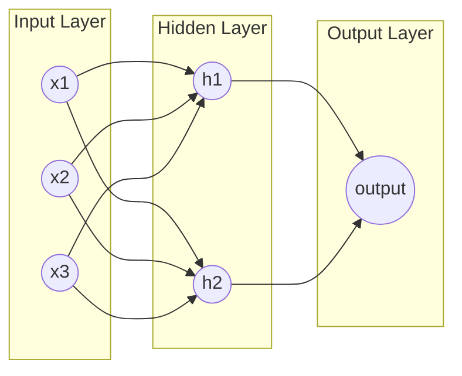

Machine Learning relies on **statistical learning**, while Deep Learning relies on a **neural network** that loosely mimics the human brain.

### Types of Neural Networks

- **ANN** - Artificial Neural Network - base feed-forward network
- **CNN** - Convolutional Neural Network - for images/spatial data
- **RNN** - Recurrent Neural Network - for sequential data
- **GAN** - Generative Adversarial Network - generator + discriminator, used to generate text/images

### Why is Deep Learning so famous?

- Applications across a huge variety of domains
- Exceptionally good performance on complex tasks
- Part of a broader family of ML methods based on artificial neural networks with **representation learning**
- Uses multiple layers to progressively extract higher-level features from raw input. E.g., in image processing, lower layers identify edges, higher layers identify concepts like digits, letters, or faces
- **Automatically extracts features** - called representation learning (in classical ML we must hand-engineer features and rules)
  - The first layer extracts primitive features; deeper layers extract increasingly complex features

### Deep Learning vs Machine Learning

| Aspect            | Machine Learning          | Deep Learning                                                     |
| ----------------- | ------------------------- | ----------------------------------------------------------------- |
| Data size         | Wins with less data       | Wins with more data                                               |
| Hardware          | CPU / GPU                 | GPU or more powerful hardware                                     |
| Training time     | Low (minutes–hours)       | High (days–weeks–months)                                          |
| Feature selection | Manual, needed            | Automatic                                                         |
| Interpretability  | Explainable ("white box") | Black box - harder to interpret, riskier in critical applications |

### Why Not DL (until recently)?

Deep learning ideas date back to Alan Turing in the 1960s, but practical success only came around 2012 due to a combination of factors:

- **Datasets** - large labeled datasets became available
- **Frameworks** - mature DL libraries emerged
- **Architecture** - better network designs
- **Hardware**
  - Moore's Law - hardware performance keeps increasing while price decreases
  - FPGA, ASIC, GPU, TPU, DSP, Edge TPU (drones, smart glasses), NPU
- **Community** - 1960 to 2011 was mostly research; breakthroughs "succeeded" publicly in 2012
- **Frameworks & libraries**
  - Google → Keras + TensorFlow (industry-oriented)
  - Meta (Facebook) → PyTorch + Caffe2 (research-oriented)
  - No-code / low-code tools: AutoML, Microsoft Custom Vision AI, Apple Create ML
- **Deep Learning Architectures** - pretrained datasets/models/architectures became widely shared

**Timeline drivers:** 2010 - smartphone revolution; 2015 - internet pricing decreases sharply - after which data volume began growing exponentially year over year.

### Types of Neural Networks (Main 5)

1. Multi-Layer Perceptron (MLP)
2. Convolutional Neural Network (CNN)
3. Recurrent Neural Network (RNN) - one important variant is LSTM
4. Auto Encoders
5. GAN - Generative Adversarial Network (Generator + Discriminator)

> A single perceptron cannot learn the XOR function because XOR is not linearly separable, and a single perceptron can only learn linear decision boundaries.

### ## Applications of Deep Learning

- Self-driving cars
- Game playing (e.g., AlphaGo)
- Virtual assistants
- Image colorization
- Image caption generation
- Text translation
- Pixel restoration
- Object detection
- GAN-based generation
- Deep Dreaming
- Drug research
- Vaccine development
- Fraud detection
- Education

---

## 2. Perceptron

### What is a Perceptron?

A Perceptron is an algorithm used for supervised machine learning. Due to its simple design, it is considered the fundamental building block of neural networks.

A perceptron is made up of:

- **Inputs** ($x_1, x_2, \dots, x_n$)
- **Weights** ($w_1, w_2, \dots, w_n$)
- **Bias** ($b$)
- **Activation function** ($f$)
- **Output** ($\hat{y}$)

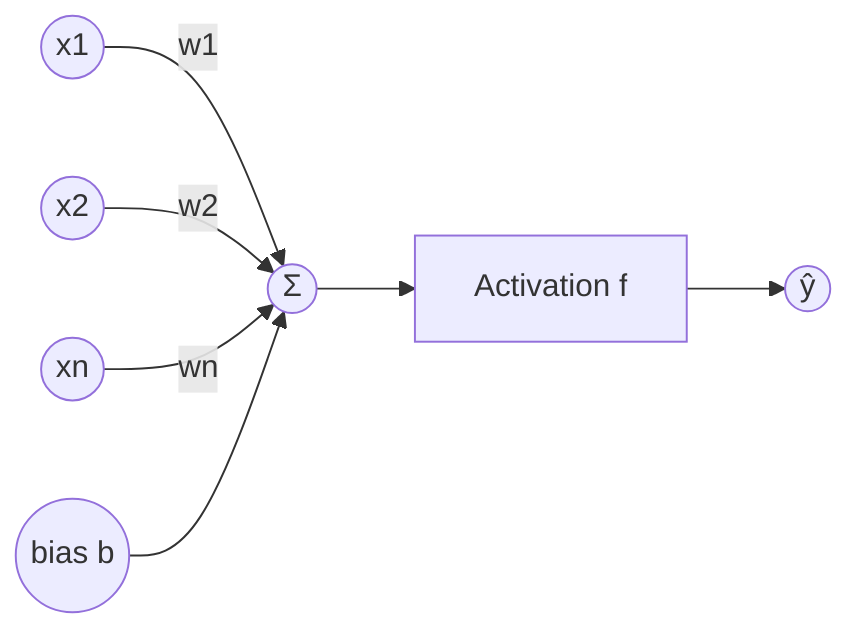

Mathematically, the perceptron computes a weighted sum of its inputs plus a bias, then passes the result through an activation function:

$$
z = \sum_{i=1}^{n} w_i x_i + b = w_1x_1 + w_2x_2 + \dots + w_nx_n + b
$$

$$
\hat{y} = f(z)
$$

We use the training data to learn/calculate the weights and bias, and during testing/inference we use these learned parameters to predict the output for new inputs.

![[image1.png]]

### Biological Neuron vs Perceptron

| #   | Biological Neuron                                     | Perceptron                                             |
| --- | ----------------------------------------------------- | ------------------------------------------------------ |
| 1   | Super complex; internal workings not fully understood | Simple model inspired by neurons; fully understandable |
| 2   | Connections can change over time (neuroplasticity)    | Connections (weights) only change during training      |
| 3   | Integrates and transmits signals                      | Acts as a binary classifier                            |
| 4   | Can handle complicated, non-linear patterns naturally | Can only separate linearly separable data              |
| 5   | Adapts and learns continuously from experience        | Limited adaptability; needs careful design             |
| 6   | Works in a network of billions of neurons             | Works in small networks or layers                      |
| 7   | Naturally robust and flexible                         | Simpler; easier to study but less powerful             |

A Perceptron is only weakly inspired by a biological neuron - the analogy is more conceptual than literal.

### Geometric Intuition

Geometrically, a perceptron is a binary classifier: it draws a hyperplane (a line in 2D, a plane in 3D) that divides the input space into two regions for classification.

$$
w_1x_1 + w_2x_2 + b = 0 \quad \text{(decision boundary)}
$$

**Biggest Limitation:** A perceptron only works on linearly separable data. It fails on non-linear data (e.g., it cannot represent the XOR function).

---

## 3. How To Train A Perceptron

**The "Jugaadu" (Quick & Practical) Trick:** Training a perceptron is conceptually as simple as linear regression: we pick a random point, check if it's misclassified, and if so, nudge the line's coefficients toward it. Repeat in a loop.

### The Perceptron Trick (Line Update)

The decision boundary in $n$ dimensions is a hyperplane:

$$
Ax + By + Cz + \dots + d = 0
$$

**Algorithm:**

1. Pick a random point.
2. If it is wrongly classified, update the coefficients (move the line toward/away from it).
3. If it is correctly classified, leave the coefficients unchanged.
4. Repeat the loop until the number of misclassified points is zero.

Plugging a point's coordinates into the line equation tells us where it lies:

$$
Ax + By + C
\begin{cases}
> 0 & \text{point lies above the line} \\
= 0 & \text{point lies on the line} \\
< 0 & \text{point lies below the line}
\end{cases}
$$

### One Unified Update Rule

Instead of writing separate if/else update rules for "above the line, move down" and "below the line, move up," we can express both cases with one single equation:

$$
W_{new} = W_{old} + \eta \,(y_i - \hat{y}_i)\, X_i
$$

where:

- $W$ - weight vector (including bias)
- $\eta$ - learning rate
- $y_i$ - true label of point $i$
- $\hat{y}_i$ - predicted label of point $i$
- $X_i$ - feature vector of point $i$ (with a $1$ appended for the bias term)

### Loss Function

We use a loss function to determine whether our decision boundary is "good enough." It can return the number of errors (misclassified points), or the distance of misclassified points from the line, etc.

### Updating via Gradient Descent

$$
W_{new} = W_{old} - \eta \, \frac{\partial L}{\partial W}
$$

**Perceptron ⇔ Logistic Regression:** A Perceptron becomes mathematically equivalent to Logistic Regression when the activation function is the sigmoid function, and the loss function is Binary Cross-Entropy Loss:

$$
\sigma(z) = \frac{1}{1+e^{-z}}, \qquad
L(y,\hat y) = -\big[y \log(\hat y) + (1-y)\log(1-\hat y)\big]
$$

**MSE** here refers to Mean Squared Error:

$$
\text{MSE} = \frac{1}{n}\sum_{i=1}^{n}(y_i - \hat{y}_i)^2
$$

---

## 4. Problem With Perceptron

A single perceptron cannot work with non-linear data.

- It works fine for AND and OR gate data (linearly separable)
- It fails on XOR gate data (not linearly separable)

$$
\text{XOR}(x_1, x_2) = x_1 \oplus x_2
$$

No single straight line (hyperplane) can separate the XOR truth table:

| $x_1$ | $x_2$ | XOR |
| ----- | ----- | --- |
| 0     | 0     | 0   |
| 0     | 1     | 1   |
| 1     | 0     | 1   |
| 1     | 1     | 0   |

This limitation is precisely what motivates the Multi-Layer Perceptron (MLP) - stacking perceptrons in layers allows the network to learn non-linear decision boundaries.

---

## 5. Multi Layer Perceptron (MLP)

### Why MLP?

A non-linear function/boundary can be approximated as a combination (superposition) of linear functions, smoothed together. This is exactly why we use a Multi-Layer Perceptron: multiple linear perceptrons are combined and passed through non-linear activation functions to approximate complex, non-linear decision boundaries.

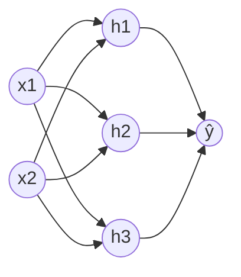

$$
z^{[1]} = W^{[1]}x + b^{[1]}, \qquad a^{[1]} = \sigma(z^{[1]})
$$

$$
z^{[2]} = W^{[2]}a^{[1]} + b^{[2]}, \qquad \hat{y} = \sigma(z^{[2]})
$$

**Superposition + Smoothening:** We take the (weighted) sum of the outputs of previous perceptrons and pass that sum again through a sigmoid (or other non-linear activation) to achieve a smooth, non-linear combined boundary:

$$
\hat{y} = \sigma\Big(\sum_i w_i \, \sigma(w_i^{(1)}x + b_i^{(1)}) + b\Big)
$$

This same idea generalizes to 3D and n-dimensional data.

### Multi-Class Classification

For multi-class classification, the output layer typically has a number of neurons equal to the number of classes, usually combined with a Softmax activation:

$$
\hat{y}_k = \text{softmax}(z_k) = \frac{e^{z_k}}{\sum_{j=1}^{K} e^{z_j}}
$$

### Increasing Model Capacity

Another way to change the architecture (besides width) is to increase the number of hidden layers - especially useful for capturing complex, non-linear data.

---

## 6. Forward Propagation

Forward propagation is the process of passing input data through the network layer by layer to compute the final output (prediction).

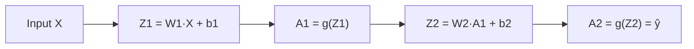

### The Math

For a network with $L$ layers, at layer $l$:

$$
Z^{[l]} = W^{[l]} A^{[l-1]} + b^{[l]}
$$

$$
A^{[l]} = g^{[l]}\big(Z^{[l]}\big)
$$

where:

- $A^{[l-1]}$ - activations from the previous layer (with $A^{[0]} = X$, the input)
- $W^{[l]}$ - weight matrix of layer $l$
- $b^{[l]}$ - bias vector of layer $l$
- $g^{[l]}$ - activation function of layer $l$ (e.g., ReLU, sigmoid, softmax)
- $A^{[l]}$ - activations (output) of layer $l$

This repeats layer after layer until the output layer, producing the final prediction $\hat{y} = A^{[L]}$. Fully expanded for a 3-layer network:

$$
\hat y = \sigma\Big(\sigma\big(\sigma(a^{[0]}W^{[1]}+b^{[1]})W^{[2]}+b^{[2]}\big)W^{[3]}+b^{[3]}\Big)
$$

### Why does the final layer of a regression model use a Linear activation instead of ReLU?

Because regression outputs can be any real value (positive or negative). A linear activation allows unrestricted output, while ReLU forces all negative predictions to zero - which would distort results for any target that can legitimately be negative.

$$
\text{Linear: } g(z) = z \qquad \text{ReLU: } g(z) = \max(0, z)
$$

---

## 7. Loss Function

A loss function measures how well a model is performing on a given dataset. It quantifies the difference between predicted outputs and actual targets.

> [!important]
> _You can't improve what you can't measure._ Without a loss function there is no way to know whether the model is learning, or how to guide it toward better performance.

### Types of Loss Functions

**Regression** (how far predictions are from actual values):

- Mean Squared Error (MSE) - average squared difference; sensitive to outliers
- Mean Absolute Error (MAE) - average absolute difference; robust to outliers
- Huber Loss - combination of MSE and MAE; less sensitive to outliers

**Classification** (how well predictions match class labels):

- Binary Cross-Entropy - for 2-class problems
- Categorical Cross-Entropy - for multi-class problems
- Hinge Loss - used in SVMs; focuses on margin violations

**Autoencoders** (reconstruction quality):

- KL Divergence - compares predicted distribution with actual distribution

**GANs:**

- Discriminator Loss - how well the discriminator distinguishes real vs. fake
- Minimax / Generator Loss - how well the generator fools the discriminator

**Embeddings / Metric Learning:**

- Triplet Loss - ensures similar samples are closer together, dissimilar samples farther apart

### Loss Function vs Cost Function

- **Loss** = error computed for a single row (single sample).
- **Cost** = the average loss over all rows.

$$
\text{Cost}(W,b) = \frac{1}{n}\sum_{i=1}^{n} \text{Loss}(y_i, \hat{y}_i)
$$

### 1. Mean Squared Error (MSE) / Squared Loss / L2 Loss

$$
L(y,\hat y) = (y - \hat y)^2, \qquad J(W,b) = \frac{1}{n}\sum_{i=1}^{n} (y_i - \hat y_i)^2
$$

We square the error so negative and positive errors don't cancel out - squaring guarantees a positive contribution from every sample.

**Advantages**

- Easy to interpret
- Differentiable everywhere → works well with Gradient Descent (taking the absolute value to force positivity would make it non-differentiable at 0)
- Has a **single (convex) local minimum**

**Disadvantages**

- The error's unit is **squared** - we often need to take the square root to interpret it in original units
- **Not robust to outliers** - since errors are squared, large errors get magnified, making MSE overly sensitive to outliers
- To use MSE in deep learning, the **last/output layer must use a linear activation function** - it doesn't matter what activation (ReLU, etc.) is used in the earlier layers

### 2. Mean Absolute Error (MAE) / L1 Loss

$$
L(y,\hat y) = |y - \hat y|, \qquad J(W,b) = \frac{1}{n}\sum_{i=1}^{n}|y_i - \hat y_i|
$$

**Advantages**

- Intuitive and easy to understand
- Same unit as $y$ (not squared)
- Robust to outliers

**Disadvantages**

- **Not differentiable at zero** - so instead of a true gradient we compute **sub-gradients**

### 3. Huber Loss

$$
L_{\delta}(y,\hat y) =
\begin{cases}
\dfrac{1}{2}(y-\hat y)^2, & |y-\hat y| \le \delta \\[4pt]
\delta \Big(|y-\hat y| - \dfrac{1}{2}\delta\Big), & |y - \hat y| > \delta
\end{cases}
$$

- If the point is an **outlier** → Huber loss behaves like **MAE**
- If the point is **not an outlier** → Huber loss behaves like **MSE**

Used when the dataset is a **mixture of "normal" points and outliers**, combining the best of both MAE and MSE.

### 4. Binary Cross-Entropy (Log Loss)

Used for **binary classification** problems.

$$
L(y,\hat y) = -\big[y\log(\hat y) + (1-y)\log(1-\hat y)\big]
$$

Requires the output activation to be Sigmoid.

### 5. Categorical Cross-Entropy

$$
L(y,\hat y) = -\sum_{k=1}^{K} y_k \log(\hat y_k)
$$

Requires the output activation to be Softmax.

**Sparse Categorical Cross-Entropy:** skips computing the log for all other classes and only calculates the loss term for the true class - much more efficient with many classes:

$$
L(y,\hat y) = -\log(\hat y_{\,\text{true class}})
$$

### Conclusion

| Task                       | Recommended Loss                               | Required Output Activation |
| -------------------------- | ---------------------------------------------- | -------------------------- |
| Regression                 | MSE / MAE / Huber                              | Linear                     |
| Binary Classification      | Binary Cross-Entropy                           | Sigmoid                    |
| Multi-class Classification | Categorical / Sparse Categorical Cross-Entropy | Softmax                    |

---

## 8. Back Propagation

Backpropagation computes the gradient of the loss function with respect to every weight, using the chain rule of calculus, propagating the error backward from the output layer to the input layer.

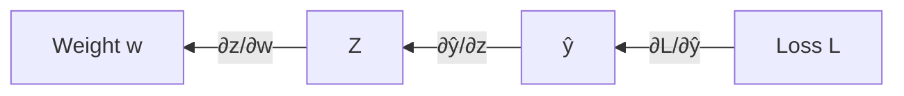

### Core Idea (Chain Rule)

$$
\frac{\partial L}{\partial w} = \frac{\partial L}{\partial \hat y} \cdot \frac{\partial \hat y}{\partial z} \cdot \frac{\partial z}{\partial w}
$$

Computed layer by layer, from output back to input, reusing intermediate gradients (see Memoization).

### Weight Update Rule

$$
W_{new} = W_{old} - \eta \, \frac{\partial L}{\partial W}
$$

where $\eta$ is the learning rate.

### Zigzag Motion & Learning Rate

When updating weights, the optimization path can zigzag across the loss surface instead of moving smoothly toward the minimum. To avoid this, we introduce a learning rate ($\eta$) that controls the size of each update step, smoothing convergence.

---

## 9. Memoization

Memoization means storing the result of a calculation so we don't have to compute it again if it's needed later.

$$
\text{Time saved} \;\propto\; \text{Storage spent}
$$

We trade storage (memory) for time (speed).

### Why it matters for Neural Networks

During backpropagation, the same intermediate derivatives (chain rule) are reused repeatedly across layers. By storing (memoizing) these intermediate values instead of recomputing them, backpropagation becomes dramatically faster:

$$
\frac{\partial L}{\partial w^{[1]}} \;\text{reuses}\; \frac{\partial L}{\partial z^{[2]}}, \frac{\partial L}{\partial z^{[3]}}, \dots
$$

---

## 10. Gradient Descent

Gradient Descent is an iterative optimization algorithm used to minimize the loss function by updating parameters in the direction opposite to the gradient:

$$
W_{new} = W_{old} - \eta \, \nabla_W J(W)
$$

where $\eta$ is the learning rate and $J(W)$ is the cost function.

> **Gradient descent is one of the most popular algorithms to perform optimization and by far the most common way to optimize neural networks.**

Gradient descent is a way to minimize an objective function **J(θ)** parameterized by a model's parameters **θ ∈ Rᵈ** by updating the parameters in the opposite direction of the gradient of the objective function **∇θJ(θ)** with respect to the parameters. The learning rate **η** determines the size of the steps we take to reach a (local) minimum. In other words, we follow the direction of the slope of the surface created by the objective function downhill until we reach a valley.

### Three Types of Gradient Descent

1. Stochastic Gradient Descent (SGD)
2. Batch Gradient Descent
3. Mini-Batch Gradient Descent

| Type       | Update frequency                                                                  |
| ---------- | --------------------------------------------------------------------------------- |
| Stochastic | Update after every single row → total updates = epochs × rows                     |
| Batch      | Update after processing the entire dataset → total updates = epochs               |
| Mini-batch | Update after every mini-batch → total updates = epochs × (rows / mini-batch size) |

> [!question] Which is faster (per update)?
> **Batch Gradient Descent** - since it only updates once per epoch, each individual update step is computationally "faster" to reach.

> [!question] Which converges faster / gives results more quickly overall?
> **Stochastic Gradient Descent** - because its update **frequency** is much higher, it makes progress toward the minimum more quickly in wall-clock terms.

> [!question] Which is more reliable for an $n$-degree polynomial (non-convex loss surface with local minima)?
> **Stochastic Gradient Descent** - its updates are "spiky" and follow a **zig-zag path**, which actually **helps it escape local minima**. **Batch Gradient Descent**, being smooth and deterministic, is more likely to get **stuck in a local minimum**.

### Why is batch size usually chosen as a power of 2?

To use RAM/memory effectively - computer memory architecture is inherently binary, so powers of 2 (32, 64, 128, 256, ...) align efficiently with hardware memory blocks.

---

## 11. Vanishing Gradient Descent (Problem)

Found only in deep neural networks (many layers), mostly when the activation function is Sigmoid or Tanh.

$$
\sigma(z) = \frac{1}{1+e^{-z}}, \qquad \sigma'(z) = \sigma(z)\big(1-\sigma(z)\big) \le 0.25
$$

When too many layers use Sigmoid/Tanh-like functions (small derivatives, $\le 0.25$), multiplying these small derivatives through the chain rule across many layers:

$$
\frac{\partial L}{\partial w^{[1]}} = \frac{\partial L}{\partial a^{[L]}}\cdot \sigma'(z^{[L]}) \cdots \sigma'(z^{[2]})\cdot \frac{\partial z^{[1]}}{\partial w^{[1]}}
$$

...causes the final gradient for early layers to become negligible or essentially zero - early layers stop learning.

### How To Handle This Problem?

1. Reduce network complexity
2. Use ReLU: $\text{ReLU}(z) = \max(0, z)$
3. Proper weight initialization - Glorot / Xavier
4. Batch Normalization
5. Residual connections (ResNet)

### Exploding Gradient Problem

The opposite problem - numbers become too large during the multiplicative chain-rule computation, causing the gradient to explode (common in RNNs):

$$
\frac{\partial L}{\partial w^{[1]}} \to \infty \quad \text{(unstable, very large updates)}
$$

---

## 12. How To Improve A Neural Network

### 1. Fine-tuning Hyperparameters

- Epochs
- Learning rate
- Batch size
- Neurons per layer
- Number of hidden layers
- Activation function
- Optimizer

### 2. Solving Common Problems

- Vanishing / Exploding Gradient
- Not enough data
- Slow training
- Overfitting / Underfitting

### Number of Hidden Layers

Instead of using many neurons in few layers, prefer fewer neurons across many layers - this leverages the network's capacity for representation learning.

It is not required that the number of neurons decrease as depth increases - keeping the same number of neurons in every layer can still yield good results.

### Number of Neurons Per Layer

By default, start with more neurons than required in a layer and decrease them later if needed.

### Batch Size

- Full batch
- Mini-batch - fine-tune batch size together with a learning rate scheduler (also called "warming up" the learning rate)
- Stochastic (batch size = 1)

### Epoch Value

Keep the number of epochs as high as possible, but use Early Stopping to halt training once improvement plateaus.

### Other Problems

#### Vanishing and exploding gradients

- Weight init
- Activation function
- Batch Norm
- Gradient clipping

#### Not enough data

- Transfer learning
- Unsupervised pretraining

#### Slow training

- Optimizers
  - Adam

- Learning rate schedulers

#### Overfitting

- L1 and L2 regularization
- Dropouts

Feature scaling is required - otherwise the ANN will fail to reach good accuracy and its training will fluctuate:

$$
x_{scaled} = \frac{x - \mu}{\sigma} \quad \text{(standardization)} \qquad \text{or} \qquad x_{scaled} = \frac{x - x_{min}}{x_{max}-x_{min}} \quad \text{(normalization)}
$$

## 13. Overfitting

### How To Solve Overfitting?

- Add more data
- Reduce model complexity
- Early stopping
- Regularization
- Dropout

### Dropout Technique

Dropout randomly switches off a fraction of neurons during each training iteration, forcing the remaining neurons to perform better and become more robust. Typically improves accuracy by roughly 2%.

**Why does this work?** Turning off neurons decreases their co-dependency on one another for producing the final output - no single neuron (or small group) can dominate, so the network learns more redundant, distributed representations.

**Random Forest Analogy:** Dropout is analogous to a Random Forest: in every epoch/iteration, turning off different neurons effectively trains a slightly different sub-architecture. Averaging over these many different sub-architectures behaves like ensemble learning.

### Math of Dropout (Inverted Dropout at test time)

If $p$ is the dropout probability (probability of a neuron being OFF), then $(1-p)$ is the probability of it being present. During inference, we scale the weights by $(1-p)$:

$$
W_{\text{test}} = (1-p)\, W_{\text{train}}
$$

**Tuning $p$:** if overfitting → increase $p$; if underfitting → decrease $p$.

> [!tip] Rules of thumb
>
> - Dropout is traditionally **not** applied right after the last (output) layer.
> - **CNN**: $p \approx 40\%$–$50\%$
> - **RNN**: $p \approx 20\%$–$30\%$
> - **ANN**: $p \approx 10\%$–$50\%$

---

## 14. Regularization

Ways to solve overfitting: increase data (augmentation/web-scraping), remove nodes (dropout), or regularization - add a penalty term to the cost function.

$$
J_{\text{reg}}(W) = J(W) + \lambda \cdot R(W)
$$

### L2 Regularization (Ridge)

$$
J_{\text{reg}}(W) = J(W) + \frac{\lambda}{2m}\sum_{i=1}^{n} w_i^2
$$

### L1 Regularization (Lasso)

$$
J_{\text{reg}}(W) = J(W) + \frac{\lambda}{m}\sum_{i=1}^{n} |w_i|
$$

where $\lambda$ is the regularization strength and $m$ is the number of training samples.

> [!important]
> **L2 regularization is generally more efficient than L1** - L2 is smooth and differentiable everywhere and tends to shrink weights toward small values, whereas L1 can drive weights **exactly to zero** (inducing sparsity) but is non-differentiable at zero.

---

## 15. Activation Function

In artificial neural networks, each neuron forms a weighted sum of its inputs and passes the resulting scalar through an activation function. If a neuron has $n$ inputs, its output is:

$$
a = g\Big(\sum_{i=1}^{n} w_i x_i + b\Big) = g(z)
$$

If no activation function is used, the neural network can only capture linear relationships (behaves like linear regression) no matter how many layers it has. With a non-linear activation function, it can model complex, non-linear functions.

### Properties of an Ideal Activation Function

- Non-linear
- Differentiable at every point (exception: ReLU, not differentiable at $z=0$, yet works extremely well)
- Computationally inexpensive
- Zero-centered
- Non-saturating (Sigmoid/Tanh are saturating - squeeze inputs exponentially, leading to vanishing gradients)

### 1. Sigmoid Function

$$
\sigma(z) = \frac{1}{1+e^{-z}}, \qquad \sigma(z) \in (0,1)
$$

**Advantages**

1. Output is between 0 and 1 → can be interpreted as a **probability**
2. Non-linear → can capture non-linear data
3. Differentiable everywhere

**Disadvantages**

1. **Saturating** function → causes the **vanishing gradient problem**
2. **Not zero-centered** → slows down training, because all the gradients for the weights of a neuron end up having the **same sign** (all positive or all negative) during a single update, so weights cannot be adjusted independently in different directions
   - Simply subtracting 0.5 from the output does **not** fix the underlying vanishing-gradient issue

### 2. Tanh(x) Activation Function

$$
\tanh(z) = \frac{e^{z}-e^{-z}}{e^{z}+e^{-z}}, \qquad \tanh(z) \in (-1,1)
$$

**Advantages**

1. Non-linear
2. Differentiable
3. **Zero-centered** (output can be both positive and negative) → training is faster than sigmoid

**Disadvantages**

1. Still a **saturating** function → vanishing gradient problem
2. Computationally more expensive than ReLU

### 3. ReLU (Rectified Linear Unit)

$$
\text{ReLU}(z) = \max(0, z)
$$

One of the best and most widely used activation functions today.
**Advantages**

1. Non-linear (piecewise linear)
2. **Not saturated** in the positive region
3. Computationally **inexpensive**
4. **Converges faster** than sigmoid

**Disadvantages**

1. **Not differentiable** at $z=0$
2. **Not zero-centered** → mitigated using **Batch Normalization** (see [[16 - Batch Normalization]])
3. \*\*Dying ReLU problem

**Dying ReLU Problem:** a neuron that outputs zero for every input stops updating and remains dead forever (unrecoverable).

> [!danger]
> If **more than 50%** of neurons die, model accuracy drops significantly, and the network fails to capture the underlying pattern. In the worst case, **100%** of neurons can die.

Causes: high learning rate; highly negative bias.
Solutions: lower learning rate; small positive bias initialization; use a ReLU variant instead.

### Variants of ReLU

**Leaky ReLU:**

$$
f(z) = \max(0.01z,\; z)
$$

**Parametric ReLU (PReLU):**

$$
f(z) = \max(az,\; z)
$$

Here $a$ is a trainable parameter (learned during training, unlike the fixed 0.01 in Leaky ReLU).

**ELU (Exponential Linear Unit):**

$$
f(z) =
\begin{cases}
z, & z > 0 \\
\alpha\,(e^{z}-1), & z \le 0
\end{cases}
$$

Performs better than ReLU on some datasets.

**SELU (Scaled Exponential Linear Unit):**

$$
f(z) = \lambda
\begin{cases}
z, & z > 0 \\
\alpha\,(e^{z}-1), & z \le 0
\end{cases}
$$

Here $\alpha$ and $\lambda$ are fixed (not trained).

- **Advantage:** SELU is **self-normalizing**, which helps the network converge faster.
- **Disadvantage:** It is relatively new, so not as much research/validation has been done on it compared to ReLU/ELU.

---

## 16. Weight Initialization

Poor weight initialization directly causes training problems such as vanishing/exploding gradients, often due to a combination of sigmoid activation + wrong initialization.

### What NOT To Do

**1. Initialize with zero:** causes the dead neuron problem - every neuron computes the same output/gradient, so nothing ever differentiates them. With sigmoid, all nodes in a layer behave like a single node, updating in bulk, never capturing non-linearity.

**2. Non-zero constant value:** just as bad - same symmetry problem as zero initialization.

**3. Random initialization (small values):**

- Tanh/Sigmoid → vanishing gradient problem
- ReLU → works better, but convergence is too slow

**4. Random initialization (large values):**

- Tanh/Sigmoid → saturation → slow convergence
- ReLU → gradients too large and unstable (zig-zag)

### What Should Be Done - Practical Heuristics

- **Xavier / Glorot Initialization** - for **Tanh / Sigmoid**
  - Normal variant
  - Uniform variant
- **He Initialization** - for **ReLU**
  - Normal variant
  - Uniform variant

**Xavier (Glorot) Normal:**

$$
W \sim \mathcal{N}\left(0,\ \frac{2}{n_{in}+n_{out}}\right)
$$

**He Normal:**

$$
W \sim \mathcal{N}\left(0,\ \frac{2}{n_{in}}\right)
$$

**Xavier (Glorot) Uniform:**

$$
W \sim U\left(-\sqrt{\frac{6}{n_{in}+n_{out}}},\ \sqrt{\frac{6}{n_{in}+n_{out}}}\right)
$$

**He Uniform:**

$$
W \sim U\left(-\sqrt{\frac{6}{n_{in}}},\ \sqrt{\frac{6}{n_{in}}}\right)
$$

where $n_{in}$ and $n_{out}$ are the number of input and output units (fan-in / fan-out).

---

## 17. Batch Normalization

Batch Normalization **mean-centers** the data (roughly into a $[-1,1]$ range in each dimension).

- **Unnormalized data** → training is **slow**, because the data distribution is non-uniform
- **Normalized data** → training is **faster and more stable** (less fluctuation)

$$
\text{Normalization: mean} = 0,\ \text{standard deviation} = 1
$$

### Internal Covariate Shift

Refers to the change in the distribution of each layer's inputs during training, as previous layers' parameters change. The more common approach normalizes activations per mini-batch, before the activation function.

### The Batch Normalization Formula

$$
\mu_B = \frac{1}{m}\sum_{i=1}^{m} z_i, \qquad \sigma_B^2 = \frac{1}{m}\sum_{i=1}^{m}(z_i - \mu_B)^2
$$

$$
\hat{z}_i = \frac{z_i - \mu_B}{\sqrt{\sigma_B^2 + \epsilon}}, \qquad y_i = \gamma \hat{z}_i + \beta
$$

$\gamma$ (scale) and $\beta$ (shift) are learnable parameters - in Keras, $\gamma$ defaults to 1, $\beta$ defaults to 0. Every neuron has its own $\gamma,\beta$, updated via backpropagation:

$$
\gamma_{new} = \gamma_{old} - \eta\frac{\partial L}{\partial \gamma}, \qquad \beta_{new} = \beta_{old} - \eta\frac{\partial L}{\partial \beta}
$$

### Where do we get mean/std at test time (with just 1 sample)?

We use the Exponentially Weighted Moving Average (EWMA) of the mean and variance accumulated during training:

$$
\mu_{\text{running}} = \alpha\,\mu_{\text{running}} + (1-\alpha)\,\mu_B
$$

### Advantages

1. More stable training
2. Faster training
3. Acts as a regularizer
4. Reduces the negative impact of poor weight initialization

---

## 18. Optimizers In Deep Learning

Optimizers exist to increase the speed (and stability) of training deep neural networks. The base optimizer is Gradient Descent (Batch, Mini-batch, Stochastic).

### Challenges with Plain Gradient Descent

1. Choosing the right learning rate
2. Learning rate scheduling
3. Getting stuck in local minima instead of the global minimum
4. Cannot use a different learning rate for different weights
5. Saddle points - gradient ~zero, updates stall

### What's Next? (Better Optimizers)

1. Momentum
2. AdaGrad
3. NAG (Nesterov Accelerated Gradient)
4. RMSProp
5. Adam

### Exponentially Weighted Moving Average (EWMA)

A technique to identify trends in time-moving series data. Used in time series forecasting, finance, signal processing, and deep learning optimizers.

$$
V_t = \beta V_{t-1} + (1-\beta)\theta_t
$$

$\beta$ effectively averages over the last $\frac{1}{1-\beta}$ data points. Higher $\beta$ → smoother, more stable curve (more weight to past). Lower $\beta$ → noisier graph that reacts quickly to recent changes.

### 1. Momentum Optimization

A contour plot is a top-down 2D heat-map view of a 3D loss surface. In non-convex optimization we face: local minima, saddle points (near-constant gradient), and high-curvature regions.

Momentum borrows the idea of momentum from Newtonian physics: instead of slowing down whenever the gradient shrinks, the optimizer speeds up - velocity accumulates via acceleration.

$$
V_t = \beta V_{t-1} + (1-\beta)\nabla_W J(W), \qquad W_{new} = W_{old} - \eta V_t
$$

$\beta$ is typically 0.9 (the "decay factor").

**Disadvantage:** Momentum can **oscillate** around the global minimum due to the high speed it has built up, taking slightly longer to settle. Overall, though, it is still **faster than plain SGD**.

### 2. Nesterov Accelerated Gradient (NAG)

A tweak on Momentum that reduces oscillation and smooths convergence near the minimum.

**Key difference from Momentum:** Momentum computes the gradient and velocity/history at the same point, then takes the combined jump. NAG first takes the momentum "look-ahead" jump, then computes the gradient at that lookahead position, then takes the further step.

$$
V_t = \beta V_{t-1} + (1-\beta)\nabla_W J(W - \beta V_{t-1}), \qquad W_{new} = W_{old} - \eta V_t
$$

### 3. AdaGrad (Adaptive Gradient)

Learning rate is not fixed - it adapts per parameter. Near a saddle point, one dimension often updates faster than another; AdaGrad provides a different learning rate per dimension:

$$
v_t = v_{t-1} + \big(\nabla_W J(W)\big)^2, \qquad W_{new} = W_{old} - \frac{\eta}{\sqrt{v_t + \epsilon}}\,\nabla_W J(W)
$$

### 4. RMSProp (enhancement of AdaGrad)

AdaGrad's $v_t$ can grow unboundedly large, shrinking the effective learning rate too much. RMSProp uses an exponentially decaying average instead of a raw cumulative sum:

$$
v_t = \beta v_{t-1} + (1-\beta)\big(\nabla_W J(W)\big)^2, \qquad W_{new} = W_{old} - \frac{\eta}{\sqrt{v_t + \epsilon}}\,\nabla_W J(W)
$$

Considered one of the best optimizers on its own, but Adam performs even better.

### 5. Adam (Adaptive Moment Estimation)

Merges Momentum (first moment) and RMSProp-style adaptation (second moment):

$$
m_t = \beta_1 m_{t-1} + (1-\beta_1)\nabla_W J(W), \qquad v_t = \beta_2 v_{t-1} + (1-\beta_2)\big(\nabla_W J(W)\big)^2
$$

Bias correction (since $m_t, v_t$ start at 0 and are biased early in training):

$$
\hat m_t = \frac{m_t}{1-\beta_1^t}, \qquad \hat v_t = \frac{v_t}{1-\beta_2^t}
$$

Final update rule:

$$
W_{new} = W_{old} - \frac{\eta}{\sqrt{\hat v_t}+\epsilon}\,\hat m_t
$$

Common defaults: $\beta_1 = 0.9,\ \beta_2 = 0.999,\ \epsilon = 10^{-8}$.

---

## 19. Keras Tuner

Keras Tuner is a hyperparameter tuning library for Deep Learning, built to work with Keras/TensorFlow models. It helps automatically search over hyperparameters such as number of layers, neurons per layer, learning rate, activation functions, optimizer choice, and batch size, using strategies like Random Search, Hyperband, and Bayesian Optimization.

```python
import keras_tuner as kt

def build_model(hp):
    model = keras.Sequential()
    model.add(keras.layers.Dense(
        units=hp.Int('units', min_value=32, max_value=512, step=32),
        activation=hp.Choice('activation', ['relu', 'tanh'])
    ))
    model.add(keras.layers.Dense(1, activation='sigmoid'))
    model.compile(
        optimizer=keras.optimizers.Adam(
            hp.Choice('learning_rate', [1e-2, 1e-3, 1e-4])),
        loss='binary_crossentropy', metrics=['accuracy'])
    return model

tuner = kt.RandomSearch(build_model, objective='val_accuracy', max_trials=10)
tuner.search(X_train, y_train, epochs=10, validation_data=(X_val, y_val))
```

---

## 20. CNN (Convolutional Neural Networks)

CNNs are a special kind of neural network designed for processing data with a known grid-like topology, such as time-series data (1D) or images (2D). They are heavily inspired by the visual cortex in the brain.

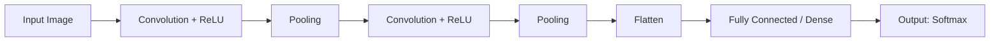

### Why not just use ANN on images?

Because ANN results on images are not very good - CNNs perform far better by exploiting spatial structure and using far fewer parameters through weight sharing.

![[image.png]]

### CNN Applications

Image classification, object localization, object detection, face detection/recognition, image segmentation, super resolution, black & white → color conversion, pose estimation.

### Intuition & History

- Neocognitron model - Fukushima - for detecting Japanese characters
- Yann LeCun - introduced CNN with backprop-trained convolution
- 2012 - AlexNet achieved a breakthrough in image recognition, kicking off the modern deep-learning revolution

### Horizontal & Vertical Edge Detectors

Filters (kernels) are commonly sized 3×3 by default. Filters are initialized with random values, and backpropagation automatically learns the optimal filter weights during training.

### Output Size Formula (Grayscale image)

For an input of size $n \times n$ convolved with a filter of size $f \times f$:

$$
\text{Output size} = (n - f + 1) \times (n - f + 1)
$$

### For RGB / Multi-Channel Images

$$
\text{Input: } n \times n \times c \;\;\longrightarrow\;\; \text{Output: } (n-f+1)\times(n-f+1) \times c'
$$

where $c$ is the number of input channels and $c'$ is the number of filters used. Multiple filters can be applied simultaneously, each producing its own output feature map, stacked together.

### Problems With Plain Convolution

- Every time we apply a filter, the spatial size shrinks, losing information as we stack more convolution layers.
- Border pixels are used in far fewer convolution computations than central pixels, so their contribution is under-represented.

Solved using **Padding**: add rows/columns of zeros around the border.

$$
\text{Output size} = (n + 2p - f + 1) \times (n + 2p - f + 1)
$$

### Strides

The stride is the number of pixels the filter shifts per step (default = 1).

$$
\text{Output size} = \left\lfloor \frac{n + 2p - f}{s} + 1 \right\rfloor \times \left\lfloor \frac{n + 2p - f}{s} + 1 \right\rfloor
$$

The output feature map may or may not be a perfect square depending on the stride.

### The Problem With Convolution (General)

1. Memory issues - storing many large feature maps is expensive.
2. Translation variance - CNN features are location-dependent.

We want translation invariance, achieved by down-sampling via **Pooling**.

### Pooling

Types: Max, Min, Average, Global Max/Min/Avg, L2 Pooling.

Advantages: reduces size (dimensionality reduction); translation invariance; enhances features (keeps strongest activations); no training required (pure aggregation, no learnable parameters).

Disadvantages: not effective for tasks like image segmentation (precise spatial detail matters); can cause information loss.

### CNN Architecture / LeNet

LeNet (LeCun et al.) is one of the earliest successful CNN architectures, used for digit recognition.

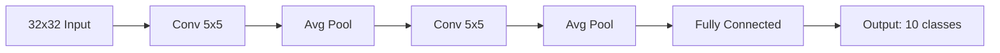

### CNN vs ANN

**Similarities:** backpropagation happens in both; both perform a dot product + bias addition (an ANN "node" is analogous to a CNN "filter").

**Differences:** in CNN, trainable parameters don't depend on input size (in ANN they do); computation cost in CNN comes from sliding filters over large spatial inputs; CNNs generally overfit less than fully-connected ANNs on image data (parameter sharing); plain CNNs can still lose some spatial-arrangement information (mitigated by pooling/architecture design).

### Forward & Backward Propagation in CNN

A CNN can be thought of as two separate parts: the convolutional part (feature extraction: Conv + Pooling layers) and the ANN part (fully-connected/Dense layers for final classification).

### Backpropagation in CNN

Backpropagation through Max Pooling is essentially its reverse operation: the gradient is routed back only to the position that held the maximum value during the forward pass (all other positions receive zero gradient).

---

## 21. Data Augmentation

To increase the amount of training data, we apply transformations to existing images: rotation, skewing, zoom in/out, flipping, shifting, brightness changes, etc.

Benefits: reduces overfitting; helps the model discard spurious/"stupid" features it might otherwise latch onto (like background artifacts), by exposing it to realistic variations of the same object.

### Usage in Keras

```python
from tensorflow.keras.preprocessing.image import ImageDataGenerator

datagen = ImageDataGenerator(
    rotation_range=20,
    zoom_range=0.2,
    width_shift_range=0.1,
    height_shift_range=0.1,
    horizontal_flip=True
)

model.fit_generator(datagen.flow(X_train, y_train, batch_size=32),
                     epochs=10)
```

---

## 22. Pretrained Model

### Why use a pretrained model?

1. Data collection is hard.
2. Training requires a lot of time/compute.

### ImageNet Dataset

A large visual database created in 2006 by Fei-Fei Li: ~1.4 million images, 20,000 categories (well-organized, labelled), ~1 million images with bounding-box annotations, built via crowd-sourcing.

### ImageNet Challenge (ILSVRC) - Error Rate Over Time

| Year | Model                         | Top-5 Error |
| ---- | ----------------------------- | ----------- |
| 2010 | -                             | 28%         |
| 2011 | -                             | 25%         |
| 2012 | AlexNet (Deep Learning + GPU) | 16%         |
| 2013 | ZFNet                         | 11.7%       |
| 2014 | VGG                           | 7.3%        |
| 2015 | GoogLeNet                     | 6.7%        |
| 2016 | ResNet                        | 3.5%        |

This progression was revolutionary - the human eye's error rate is roughly 5%, and ResNet (2016) surpassed human-level performance on this benchmark.

Keras provides many of these pretrained models out of the box. Since target classes often overlap with what these models were trained on, we can leverage **Transfer Learning**.

### Transfer Learning

Instead of building from scratch, use a pretrained model and retrain only the final Dense layers - since primitive/low-level features (edges, textures, shapes) learned by convolutional layers are largely similar across image tasks.

- **Transfer Learning** - train only the Dense layer parameters; keep the convolutional base frozen.
- **Fine-tuning** - train the Dense layers plus the last few convolutional layers (unfrozen), using a very small learning rate (e.g., $1\text{e-}5$) to avoid destroying pretrained weights.

$$
\eta_{\text{fine-tune}} \approx 10^{-5}
$$

### Keras Functional API / Non-Linear Neural Networks

The Functional API in Keras allows building non-linear architectures (multiple inputs/outputs, branches, skip connections) unlike the simple Sequential model.

```python
from tensorflow.keras.applications import VGG16
from tensorflow.keras import layers, models

base_model = VGG16(weights='imagenet', include_top=False, input_shape=(224,224,3))
base_model.trainable = False  # Transfer Learning: freeze convolutional base

x = layers.Flatten()(base_model.output)
x = layers.Dense(256, activation='relu')(x)
output = layers.Dense(num_classes, activation='softmax')(x)

model = models.Model(inputs=base_model.input, outputs=output)
```

---

## 23. RNN (Recurrent Neural Network)

### Why RNN?

| Network | Best suited for                     |
| ------- | ----------------------------------- |
| ANN     | Tabular data (order doesn't matter) |
| CNN     | Images (spatial data)               |
| RNN     | Sequential data (order matters)     |

RNN is used wherever position/semantics matter - e.g., in a text paragraph both the meaning of words and their order matter. Text data has variable input size, but ANNs expect a fixed input size - another key reason for using RNNs.

### Applications

Semantic/sentiment analysis, sentence completion, image caption generation, Google Translate, NLP question answering.

### How RNN Works

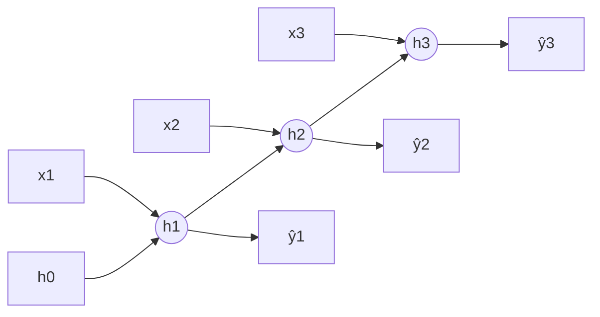

Instead of feeding the entire input at once, RNN processes it one timestep at a time (e.g., word by word). At every timestep, the network produces a feedback (hidden state) that acts as input for the next timestep. At the first timestep, we feed a random/zero-initialized feedback vector; for later timesteps, we use the feedback from the previous timestep.

$$
h_t = \tanh\big(W_{xh}\, x_t + W_{hh}\, h_{t-1} + b_h\big)
$$

$$
\hat y_t = \text{softmax}\big(W_{hy}\, h_t + b_y\big)
$$

Every hidden-to-hidden connection has a weight ($W_{hh}$) but no separate bias - only neurons have bias.

### Embedding

Words are first converted into dense numeric vectors (embeddings) before being fed into the RNN.

### Types of RNN

1. **Many-to-One** - sequential input, scalar output (sentiment analysis, movie rating)
2. **One-to-Many** - non-sequential input, sequential output (image captioning)
3. **Many-to-Many** - sequential input, sequential output:
   - Same length (POS tagging, NER)
   - Variable length (Google Translate)
4. **One-to-One** - just a plain feed-forward network, not actually an RNN

### Problems With RNN

**1. Long-Term Dependency Problem:** RNNs sometimes "forget" older context due to the vanishing gradient problem - the gradient shrinks toward zero as it's multiplied backward through many timesteps. The network ends up depending mostly on short-term dependencies.

Mitigations: different activation functions (ReLU/Leaky ReLU); better weight initialization; step-RNNs; LSTM.

**2. Unstable/Stagnated Training:** Exploding Gradient - long-term dependency terms become too large due to repeated multiplication, dominating over short-term signal.

Mitigations: gradient clipping; controlled learning rate; LSTMs.

---

## 24. LSTM (Long Short-Term Memory)

In RNN, there is only a single pathway for memory (short-term), so under heavy load the network loses long-term memory. In LSTM, there are two pathways: one for long-term memory and one for short-term memory.

- Long-term memory → Cell State ($C_t$)
- Short-term memory → Hidden State ($h_t$)

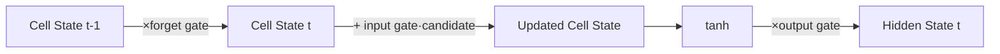

### The Three Gates: Forget, Input, and Output

**Forget Gate** - decides what to discard from the cell state:

$$
f_t = \sigma(W_f\,[h_{t-1}, x_t] + b_f)
$$

**Input Gate** - decides what new information to add:

$$
i_t = \sigma(W_i\,[h_{t-1}, x_t] + b_i), \qquad \tilde C_t = \tanh(W_C\,[h_{t-1}, x_t] + b_C)
$$

**Cell State Update:**

$$
C_t = f_t \odot C_{t-1} + i_t \odot \tilde C_t
$$

**Output Gate** - decides what to output as the hidden state:

$$
o_t = \sigma(W_o\,[h_{t-1}, x_t] + b_o), \qquad h_t = o_t \odot \tanh(C_t)
$$

### How To Improve Performance

1. More data
2. Hyperparameter tuning
3. Advanced architectures: Stacked LSTM, Bidirectional LSTM, Transformers

### GRU (Gated Recurrent Unit)

GRU has fewer parameters and a simpler architecture than LSTM. LSTM performs better on some datasets; GRU's performance is comparable on others. GRU has two gates: Reset gate and Update gate (no separate cell state).

$$
z_t = \sigma(W_z\,[h_{t-1}, x_t]) \quad \text{(update gate)}
$$

$$
r_t = \sigma(W_r\,[h_{t-1}, x_t]) \quad \text{(reset gate)}
$$

$$
\tilde h_t = \tanh(W\,[r_t \odot h_{t-1}, x_t])
$$

$$
h_t = (1-z_t)\odot h_{t-1} + z_t \odot \tilde h_t
$$

All gate computations are fully-connected neural network layers with the same number of nodes.

NLP tokenizer techniques (related topic): Word2Vec, One-Hot Encoding (OHE), Bag of Words (BOW).

### Deep RNN

$$
h_t^{[l]} = g\big(W^{[l]}\,[h_t^{[l-1]}, h_{t-1}^{[l]}] + b^{[l]}\big)
$$

where $l$ denotes the layer and $t$ the timestep.

**When to use:** need hierarchical representation, customization for advanced tasks - complex tasks (speech recognition), large datasets (otherwise overfitting), when simpler RNNs fail, and when sufficient compute is available.

Variants: Deep LSTM, Deep GRU.

Disadvantages: overfitting must be controlled; training time increases significantly.

### Bidirectional RNN

Useful where future input can affect the interpretation of past input. Processes the sequence from both directions (start→end and end→start), running two RNNs and combining their outputs:

$$
h_t = [\overrightarrow{h_t}\,;\, \overleftarrow{h_t}]
$$

Variants: BiLSTM, BiGRU.

Applications: Named Entity Recognition, machine translation, sentiment analysis, time series forecasting, NLP tagging.

Drawbacks: increased complexity (more training needed); not suitable for real-time speech recognition (introduces latency, since it must see "future" input first).

---

## 25. History Of AI (NLP Evolution to LLMs)

### Stage 1 - Encoder-Decoder (LSTM-based)

The encoder compresses the entire input into a single final hidden state, which the decoder must use for the whole output. This bottleneck means the model cannot handle sequences longer than ~30 words effectively.

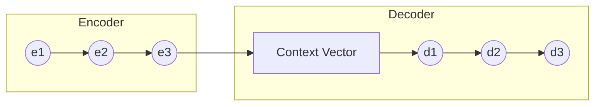

### Stage 2 - Attention Mechanism

Every encoder hidden state is made available to every decoder output step (not just the final one). The encoder stores all states; the decoder changes to use them. We need a mechanism to determine which encoder state is relevant for which output - the Attention Mechanism. This form of attention is still fundamentally sequential (no parallel processing) - slow to train.

### Stage 3 - "Attention Is All You Need"

The landmark Transformer paper introduced a fully parallel-processing architecture, removing recurrence entirely.

### Stage 4 - Transfer Learning (for NLP)

Before 2018, transfer learning wasn't seriously applied to NLP, due to lack of large labeled datasets and task specificity. In 2018, ULMFiT showed transfer learning could work for NLP - pretraining used language modeling (predicting the next word) rather than machine translation.

Advantages: rich feature learning; massive data availability (unsupervised next-word prediction means any text can be used without manual labeling).

### Stage 5 - Large Language Models (LLMs)

2018: Google BERT (encoder-only) and OpenAI GPT (decoder-only).

Qualities of LLMs: billions of bytes of training data; require clusters of GPUs (supercomputer-scale hardware); training time of days to weeks; cost in the millions of dollars (feasible only for large companies); enormous energy consumption (e.g., training GPT-3 reportedly consumed roughly a month's worth of power for a city).

### The Grand Finale - ChatGPT

GPT = the underlying model. ChatGPT = the conversational application built on top of GPT.

The biggest breakthrough behind ChatGPT's usability: RLHF (Reinforcement Learning from Human Feedback), involving: supervised fine-tuning; reinforcement learning; incorporating safety and ethical guidelines; minimizing biases; improving contextual understanding; dialogue-specific training; continuous improvement via ongoing human feedback.

---

## 26. Transformer

Introduced in 2017 in the landmark paper "Attention Is All You Need." Unlike RNNs, transformer computations for different positions are not sequentially dependent on one another, enabling full parallelization.

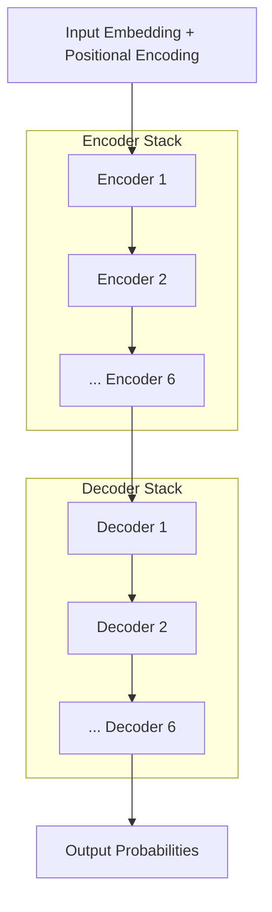

### Impact of Transformers

Revolutionized NLP; democratized AI (scalable, trainable on huge diverse datasets and fine-tunable on small task-specific datasets); multimodal capability; accelerated Generative AI; unified deep learning across many problem types.

### Advantages

Scalability; transfer-learning friendly; multimodal input/output; flexible architecture (encoder-only → BERT, decoder-only → GPT); rich ecosystem (Hugging Face); easy to integrate with other architectures (GANs + Transformer → image generation; RL + Transformer; CNN + Transformer → vision-language models).

### Applications

ChatGPT, DALL·E 2, AlphaFold (Google DeepMind - protein structure prediction), OpenAI Codex (natural language → code).

### Disadvantages

High-cost GPU compute for parallel processing; needs large amounts of data; prone to overfitting on small datasets; high energy consumption; hard to interpret (black-box); can inherit/amplify biases; ethical concerns.

### Future Directions

Improving efficiency; enhancing multimodal capabilities; responsible AI (bias/ethics); domain-specific transformers; multilingual models; improved interoperability.

---

## 27. Self Attention

### Word Embedding - The Problem With "Average Meaning"

A static word embedding (e.g., Word2Vec) is computed once (from average co-occurrence statistics across a corpus) and reused everywhere. If the "average" meaning is a poor fit for a given sentence, the embedding used there will also be wrong. We need contextual embeddings (meaning changes based on surrounding words), not static embeddings.

Self-Attention solves this by producing a context-aware representation for every word. Trade-off: we sacrifice some fine-grained sequential semantics (compared to RNN-style processing), but gain full parallel processing.

### Query, Key, Value Vectors

Each word's embedding is projected into three different vectors: Query ($Q$), Key ($K$), and Value ($V$), via learned linear transformations:

$$
Q = XW^Q, \qquad K = XW^K, \qquad V = XW^V
$$

The three weight matrices start randomly initialized and are learned via backpropagation.

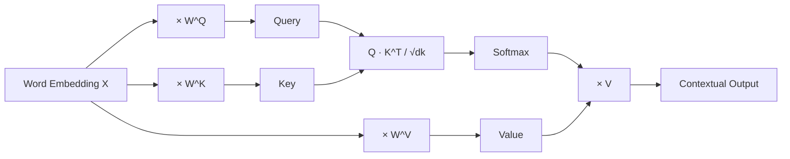

### Scaled Dot-Product Attention

$$
\text{Attention}(Q,K,V) = \text{softmax}\left(\frac{QK^{T}}{\sqrt{d_k}}\right)V
$$

**Why scale by $\sqrt{d_k}$?** To minimize the unstable gradient problem. A low-dimensional dot product tends to have low variance; a high-dimensional dot product tends to have high variance. High variance is problematic because softmax assigns a very high probability to the largest value and near-zero to the rest, causing vanishing gradients (weights barely update). Dividing by $\sqrt{d_k}$ (where $d_k$ is the key dimensionality) counteracts this - since $\text{Var}(X/c) = \text{Var}(X)/c^2$, dividing by $\sqrt{d_k}$ reduces variance by exactly $d_k$. $Q$, $K$, and $V$ typically share the same dimensionality.

### Self-Attention vs Bahdanau Attention vs Luong Attention

Self-Attention generates contextual encodings to capture semantics/dependencies within the same sequence. Luong Attention computes attention between two different sequences (e.g., source/target in translation). Self-Attention computes attention scores within the same sequence.

### Multi-Head Attention

Self-attention only lets a word attend to others from a single perspective. Multi-Head Attention allows multiple perspectives simultaneously - instead of one set of $(Q,K,V)$, we use $h$ sets (heads), each with dimensionality $d_{model}/h$:

$$
\text{head}_i = \text{Attention}(QW_i^Q,\ KW_i^K,\ VW_i^V)
$$

$$
\text{MultiHead}(Q,K,V) = \text{Concat}(\text{head}_1,\dots,\text{head}_h)\,W^O
$$

$W^O$ ensures the output shape matches the required input shape for the next layer, and learns which head/perspective matters more, as well as which words matter more within each perspective.

### Positional Encoding

Contextual embeddings from self-attention capture relationships between words and can be computed in parallel, but lose positional/order information (e.g., "Nitish killed the lion" vs "The lion killed Nitish" would look the same without positional info).

Naive idea (❌): append the position index directly - fails because indices can become huge, and doesn't capture relative distance well.

Better idea (✅): use sine/cosine functions of different frequencies to build an $n$-dimensional positional encoding vector:

$$
PE_{(pos, 2i)} = \sin\left(\frac{pos}{10000^{2i/d_{model}}}\right), \qquad
PE_{(pos, 2i+1)} = \cos\left(\frac{pos}{10000^{2i/d_{model}}}\right)
$$

Increasing the number of frequency components reduces the chance that two positions get the same encoding. Rather than concatenating the positional encoding with the word embedding (which increases parameter count/training time), we simply add them element-wise:

$$
E_{\text{final}} = E_{\text{word}} + PE_{\text{position}}
$$

Conceptually, this is similar to binary encoding but expressed continuously using sine/cosine functions instead of discrete bits.

### Normalization in Deep Learning

Normalization transforms data/model outputs to have mean 0 and variance 1. Batch Normalization doesn't work well inside transformers because sequences are padded with many zeros, skewing batch statistics. Instead, transformers use **Layer Normalization**, applied between sub-layers - Batch Norm normalizes across the batch dimension; Layer Norm normalizes across the feature dimension (per sample):

$$
\text{LayerNorm}(x) = \gamma \cdot \frac{x - \mu}{\sqrt{\sigma^2+\epsilon}} + \beta
$$

### The Transformer Block

The original paper stacks 6 encoders and 6 decoders (tunable, not fixed). Data flow: Input Embedding → Encoder 1...6 → Decoder 1...6 → Output.

**Why residual (skip) connections?** No definitive answer in the paper, but likely: stable training (prevents vanishing gradients); allows skipping an unhelpful transformation.

**Why a Feed-Forward Network in each block?** Likely to introduce non-linearity beyond what pure attention captures.

**Why stack more than one encoder block?** Human language is complex - a single layer isn't enough; multiple layers progressively refine the representation.

### Masked Multi-Head Attention

The transformer decoder is autoregressive at inference time but processed non-autoregressively (in parallel) at training time. If every decoder position could attend to all positions (including future ones) during training, the model would effectively "cheat" by seeing the correct future word - data leakage.

**Solution - Masking:** during training, mask out dependency on future words, forcing each position to depend only on earlier positions, enabling parallel training while avoiding data leakage.

### Cross Attention

Self-Attention: Query, Key, Value all from the same sequence.
Cross-Attention: Query from one sequence (e.g., decoder), Key & Value from another sequence (e.g., encoder output).

Use cases: image captioning, text-to-image generation, text-to-speech, translation (Google Translate).

All encoder blocks are structurally identical to each other (and likewise for decoder blocks) - only learned parameters differ. In self-attention, the output represents one sequence; in cross-attention, two sequences are involved.

### Decoder Block in Transformer

Combines: Masked Multi-Head Self-Attention → Cross-Attention (with encoder outputs) → Feed-Forward Network, each followed by residual connections and layer normalization.

### Inference

At inference time, the decoder generates output tokens one at a time, autoregressively - each newly generated token is fed back in as input for generating the next one.
