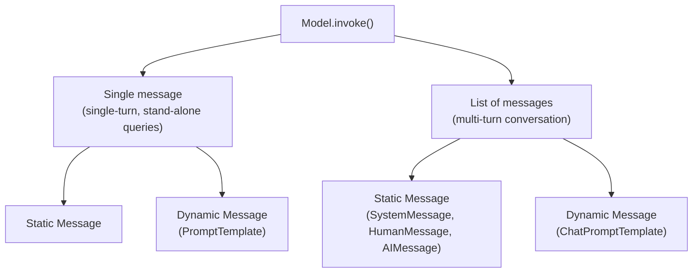
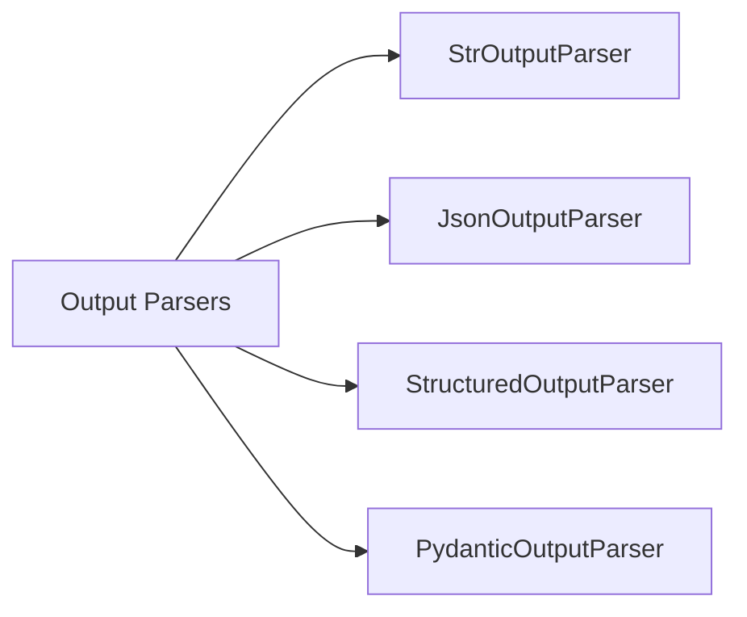
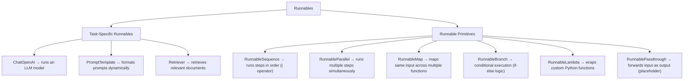
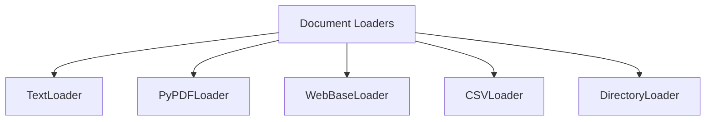
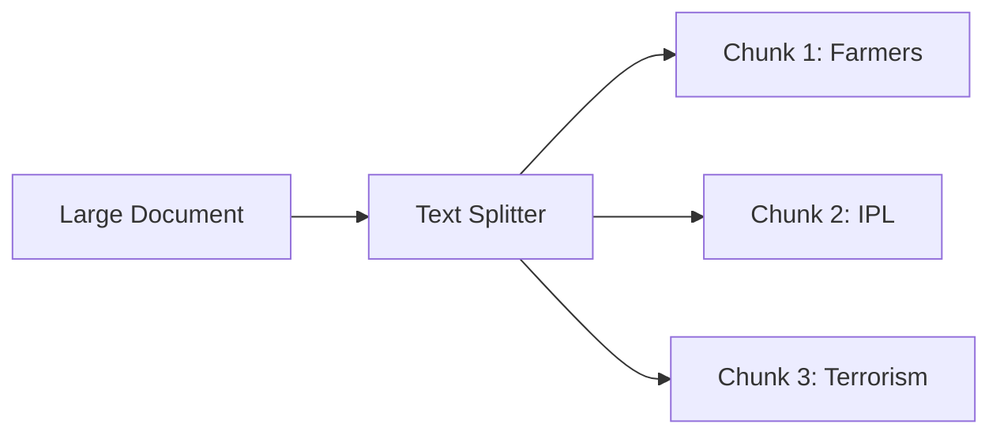
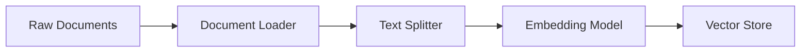
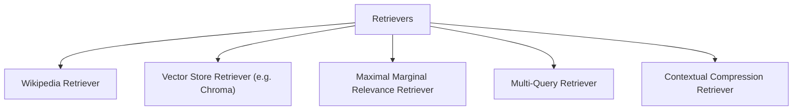
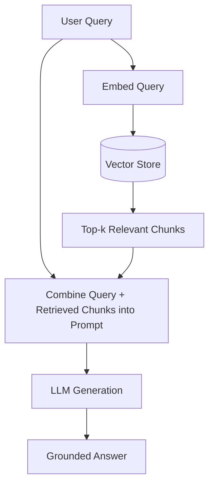
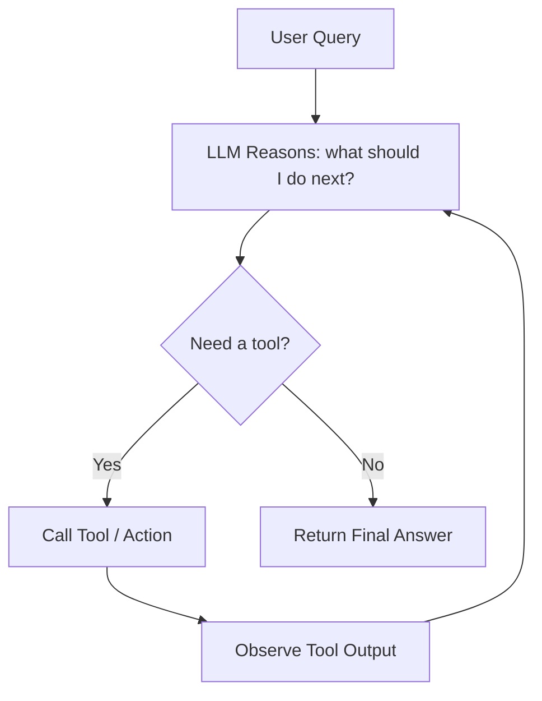

## What is Generative AI

Generative AI is a category of artificial intelligence that creates new content - text, images, music, audio, or code - by learning the underlying statistical patterns present in existing data and then sampling from that learned distribution to produce novel outputs that mimic human creativity.

Generative AI sits inside **Deep Learning**, which itself sits inside **Machine Learning**, which sits inside **Artificial Intelligence**. Within Generative AI, the major families of models are:

- **GANs** (Generative Adversarial Networks) - a generator and a discriminator trained adversarially against each other.
- **VAEs** (Variational Autoencoders) - encode data into a probabilistic latent space and decode samples back out.
- **Diffusion Models** - learn to reverse a gradual noising process to generate images/audio from noise.
- **Large Language Models (LLMs)** - transformer-based models such as GPT, Claude, Gemini, LLaMA that generate text token by token.

### Impact areas

- Customer support (AI chat agents, ticket triage)
- Content creation (copywriting, art, video, music)
- Education (personalized tutoring, content summarization)
- Software development (code generation, debugging, code review)

### Is GenAI actually useful? A simple test

A technology can be considered genuinely successful if the answer to all of the following is "yes":

1. Does it solve real-world problems?
2. Is it useful on a daily basis?
3. Is it impacting world economics?
4. Is it creating new jobs?
5. Is it accessible to the average person?

Generative AI passes all five checks, which is why it is considered a genuinely transformative (and not just hyped) technology.

### Foundation models

Modern generative models are usually not narrow, task-specific models - they are **foundation models**, i.e. large, generalized models pretrained on massive corpora that can be adapted to many downstream tasks.

- **LLMs** - Large Language Models (text-only, e.g. GPT-4, LLaMA)
- **LMMs** - Large Multi-Modal Models (text + image + audio, e.g. GPT-4V, Gemini)

---

## Two Ways to Look at Generative AI: Builder vs User Perspective

Anyone working in the Generative AI space can be placed into one of two broad camps, and there is an overlap zone between them:
- **Builder's Perspective (Data Scientist)** - focuses on building the model itself: architecture design, pretraining, fine-tuning internals, optimization.
- **User's Perspective (Software Developer / AI Engineer)** - focuses on _consuming_ existing foundation models via APIs and building real, usable products/applications on top of them.
- **AI Engineer** - the emerging hybrid role that sits at the intersection: understands enough of the builder side to reason about model behaviour, but primarily works like a software engineer wiring models into applications.

### Builder's Perspective - topics

- **Transformer architecture** - the neural network architecture behind virtually all modern LLMs.
  - Types of transformers:
    - **Encoder-only** (e.g. BERT) - good for understanding/classification tasks.
    - **Decoder-only** (e.g. GPT) - good for autoregressive text generation.
    - **Encoder–Decoder** (e.g. T5) - good for sequence-to-sequence tasks like translation and summarization.
- **Pretraining**
  - Training objectives (e.g. Masked Language Modeling for encoders, Causal/Next-token prediction for decoders)
  - Tokenization strategies (BPE, WordPiece, SentencePiece)
  - Training strategies (data mixture, curriculum, batching)
  - Handling strategies (long context handling, data cleaning, deduplication)
- **Optimization**
  - Training optimization (mixed precision, gradient accumulation, distributed training)
  - Model compression (pruning, distillation, quantization)
  - Optimizing inference (KV-caching, speculative decoding, batching)
- **Evaluation** - benchmarking on metrics like perplexity, accuracy, human-preference win-rate.
- **Fine-tuning**
  - Task-specific tuning
  - Instruction tuning
  - Continuous pretraining
- **Deployment** - serving the trained model in production (scaling, latency, cost).

### User's Perspective - topics

- Building basic LLM apps
- Open Source vs Closed Source LLMs
- Using LLM APIs
- LangChain
- Hugging Face
- Ollama
- Prompt Engineering
- RAG (Retrieval-Augmented Generation)
- Fine-tuning
- Agents
- LLMOps
- Miscellaneous (multimodal LLMs like Stable Diffusion, etc.)

### Two categories from the user's perspective

- **User Perspective sub-topics**
  - Prompt engineering
  - RAG (question answering on personal/private data)
  - Vector databases
  - Fine-tuning
- **Builder Perspective sub-topics**
  - RLHF (Reinforcement Learning from Human Feedback - used to prevent abusive outputs and for censoring/aligning the model)
  - Pretraining
  - Fine-tuning (this straddles both user and builder - a builder designs the tuning method, a user often just runs it)
  - Quantization (optimizing model size/speed)
  - AI Agents (question answering on personal data **plus** performing real-world actions)

We generally study the User's Perspective and Builder's Perspective **in parallel**, because a good AI Engineer benefits from understanding both.

---

## Why LangChain

LangChain is an **open source framework** that helps in building LLM-based applications. It provides modular components and end-to-end tools that help developers build complex AI applications such as chatbots, question-answering systems, retrieval-augmented generation (RAG) pipelines, autonomous agents, and more.

### Features of LangChain

1. Supports all the major LLMs (OpenAI, Anthropic, Google, open-source models via Hugging Face, etc.)
2. Simplifies developing LLM-based applications
3. Integrations available for all major tools (vector stores, document loaders, APIs)
4. Open source / free / actively developed
5. Supports all major GenAI use cases

### Why LangChain specifically? ("Why LangChain first")

If you map out everything a Generative-AI developer needs to learn, it clusters into:

- **Building Basic LLM Apps**
  - Open Source vs Closed Source LLMs
  - Using LLM APIs
  - LangChain
  - Hugging Face
  - Ollama
- **Prompt Engineering**
- **RAG**
- **Fine Tuning**
- **Agents**
- **LLMOps**
- **Miscellaneous**

LangChain acts as the connective tissue across almost _all_ of these clusters - it is the one framework that touches Prompting, RAG, Fine-tuning workflows, and Agents alike, which is why it makes sense to learn it early.

### Alternatives to LangChain

- **LlamaIndex** - more specialised toward data ingestion/RAG.
- **Haystack** - production-oriented NLP/RAG pipeline framework.

### LangChain Roadmap

1. **Fundamentals**
   1. What is LangChain
   2. LangChain Components
   3. Models
   4. Prompts
   5. Parsing Output
   6. Runnables & LCEL (LangChain Expression Language)
   7. Chains
   8. Memory
2. **RAG**
   1. Document Loaders
   2. Text Splitters
   3. Embeddings
   4. Vector Stores
   5. Retrievers
   6. Building a RAG application
3. **Agents**
   1. Tools & Toolkits
   2. Tool Calling
   3. Building an AI Agent

### What can you build with LangChain?

- Conversational Chatbots
- AI Knowledge Assistants
- AI Agents
- Workflow Automation
- Summarization / Research Helpers

---

## LangChain Components

LangChain is an open source framework for developing applications powered by LLMs. Rather than writing raw, provider-specific API calls scattered throughout an application, LangChain gives you **standard, swappable building blocks**.

### The six core components

1. **Models** - the interface to talk to LLMs, chat models, and embedding models.
2. **Prompts** - reusable, dynamic instructions/queries sent to the model.
3. **Chains** - pipelines that connect multiple LLM calls / steps together, representing a workflow with defined input → output.
4. **Memory** - a way to persist conversational state across calls, since raw LLM API calls are stateless.
5. **Indexes** - connect your application to external knowledge (PDFs, websites, databases). Made up of:
   1. Doc Loader
   2. Text Splitter
   3. Vector Store
   4. Retrievers (Embedding + Semantic Search)
6. **Agents** - an LLM that can reason about what to do next _and_ actually take actions using tools.

### Why not just call each provider's SDK directly?

Without LangChain, switching providers means rewriting your integration code. For instance, calling OpenAI directly vs Anthropic directly looks like this:

**Raw OpenAI SDK:**

```python
from openai import OpenAI
client = OpenAI()

completion = client.chat.completions.create(
    model="gpt-4o-mini",
    messages=[
        {"role": "system", "content": "You are a helpful assistant."},
        {
            "role": "user",
            "content": "Write a haiku about recursion in programming."
        }
    ]
)

print(completion.choices[0].message)
```

**Raw Anthropic SDK:**

```python
import anthropic
client = anthropic.Anthropic()

message = client.messages.create(
    model="claude-3-5-sonnet-20241022",
    max_tokens=1000,
    temperature=0,
    system="You are a world-class poet. Respond only with short poems.",
    messages=[
        {
            "role": "user",
            "content": [
                {"type": "text", "text": "Why is the ocean salty?"}
            ]
        }
    ]
)
```

Notice that the method names, parameter names, and message-shape are all different between providers. **LangChain unifies this** with a single consistent interface, so switching providers is a one-line change:

```python
# OpenAI via LangChain
from langchain_openai import ChatOpenAI
from dotenv import load_dotenv

load_dotenv()
model = ChatOpenAI(model='gpt-4', temperature=0)
result = model.invoke("Now divide the result by 1.5")
print(result.content)
```

```python
# Anthropic (Claude) via LangChain
from langchain_anthropic import ChatAnthropic
from dotenv import load_dotenv

load_dotenv()
model = ChatAnthropic(model='claude-3-opus-20240229')
result = model.invoke("Hi who are you")
print(result.content)
```

Only the import and the class name change (`ChatOpenAI` → `ChatAnthropic`) - the rest of your application logic (`model.invoke(...)`, `result.content`) stays identical. This is the central value proposition of LangChain: **write once, swap the model underneath**.

LangChain's documentation lists every supported model, and this uniform interface works for both **text (chat) models** and **embedding models**.

### Prompting in LangChain - quick preview

1. Dynamic and reusable prompts
2. Role-based prompts (system / user / assistant)
3. Few-shot prompts

### Chains (preview)

A **Chain** represents/defines the workflow for more than one LLM call, wiring together input → processing → output.

### Indexes (preview)

An **Index** connects your application to external knowledge - PDFs, websites, or databases. It has four parts:

1. **Doc Loader** - reads raw data in.
2. **Text Splitter** - breaks large documents into manageable chunks.
3. **Vector Store** - stores chunk embeddings for fast similarity search.
4. **Retrievers** - combine embeddings + semantic search to fetch relevant chunks (Embedding + Semantic Search).

### Memory (preview)

LLM API calls are inherently **stateless** - every call is independent and the model has no memory of previous turns unless you explicitly resend the conversation history. LangChain's Memory component solves this by managing that history for you.

**Types of Memory in LangChain:**

- **ConversationBufferMemory** - stores a transcript of recent messages. Great for short chats, but can grow large quickly as the conversation lengthens (since the whole transcript is resent every call).
- **ConversationBufferWindowMemory** - only keeps the last _N_ interactions, which avoids excessive token usage by discarding older turns.
- **Summarizer-Based Memory** - periodically summarizes older chat segments to keep a condensed memory footprint instead of storing every raw message.
- **Custom Memory** - for advanced use cases, lets you store specialized state (e.g. the user's preferences or key facts about them) inside a custom memory class you design yourself.

### Agents (preview)

An agent doesn't just answer a question - it can also _do_ things. **AI Agent = chatbot with superpowers.**

Unlike a plain chatbot, an agent has:

1. **Reasoning capability** - it can perform Chain-of-Thought style reasoning to decide _what_ to do.
2. **Tool access** - it can call external tools like APIs, retrieve personal information, run code, query databases, etc.

---

## LangChain Models - Deep Dive

The **Model** component in LangChain is a crucial part of the framework. It is designed to facilitate interactions with various language models and embedding models, abstracting away the complexity of working directly with different LLMs, chat models, and embedding models - and provides a **uniform interface** to communicate with all of them. This makes it easier to build applications that rely on AI-generated text, text embeddings for similarity search, and retrieval-augmented generation (RAG).

### Types of Models in LangChain

1. **Language Models**
   1. LLMs
   2. Chat Models
2. **Embedding Models**

### Plan of action

- **Language Models**
  - Closed source: OpenAI, Claude (Anthropic), Gemini (Google)
  - Open source: Hugging Face
- **Embedding Models**
  - Closed source: OpenAI
  - Open source: Hugging Face

### LLMs vs Chat Models

Both are systems designed to process, generate, and understand natural language text - but they differ significantly:

- **LLMs** - general-purpose models used for raw text generation. They take a string (plain text) as input and return a string (plain text) as output. These are traditionally older models and are **not recommended for modern use**.
- **Chat Models** - language models specialized for conversational tasks. They take a _sequence of messages_ as input (as opposed to a plain string) and return chat messages as output. These are newer and are the **recommended choice for modern use cases**.

| Feature          | LLMs (Base Models)                                                             | Chat Models (Instruction-Tuned)                                              |
| ---------------- | ------------------------------------------------------------------------------ | ---------------------------------------------------------------------------- |
| Purpose          | Free-form text generation                                                      | Optimized for multi-turn conversations                                       |
| Training Data    | General text corpora (books, articles)                                         | Fine-tuned on chat datasets (dialogues, user-assistant conversations)        |
| Memory & Context | No built-in memory                                                             | Supports structured conversation history                                     |
| Role Awareness   | No understanding of "user" and "assistant" roles                               | Understands "system", "user", and "assistant" roles                          |
| Example Models   | GPT-3, LLaMA-2-7B, Mistral-7B, OPT-1.3B                                        | GPT-4, GPT-3.5-turbo, LLaMA-2-Chat, Mistral-Instruct, Claude                 |
| Use Cases        | Text generation, summarization, translation, creative writing, code generation | Conversational AI, chatbots, virtual assistants, customer support, AI tutors |

### Open Source vs Closed Source Models

Open-source language models are freely available AI models that can be downloaded, modified, fine-tuned, and deployed without restrictions from a central provider. Unlike closed-source models such as OpenAI's GPT-4, Anthropic's Claude, or Google's Gemini, open-source models allow full control and customization.

| Feature       | Open-Source Models                              | Closed-Source Models                            |
| ------------- | ----------------------------------------------- | ----------------------------------------------- |
| Cost          | Free to use (no API costs)                      | Paid API usage (e.g., OpenAI charges per token) |
| Control       | Can modify, fine-tune, and deploy anywhere      | Locked to provider's infrastructure             |
| Data Privacy  | Runs locally (no data sent to external servers) | Sends queries to provider's servers             |
| Customization | Can fine-tune on specific datasets              | No access to fine-tuning in most cases          |
| Deployment    | Can be deployed on-premise servers or cloud     | Must use vendor's API                           |

### Some famous Open Source Models

| Model              | Developer    | Parameters | Best Use Case                                    |
| ------------------ | ------------ | ---------- | ------------------------------------------------ |
| LLaMA-2-7B/13B/70B | Meta AI      | 7B – 70B   | General-purpose text generation                  |
| Mixtral-8x7B       | Mistral AI   | 8×7B (MoE) | Efficient & fast responses                       |
| Mistral-7B         | Mistral AI   | 7B         | Best small-scale model (outperforms LLaMA-2-13B) |
| Falcon-7B/40B      | TII UAE      | 7B – 40B   | High-speed inference                             |
| BLOOM-176B         | BigScience   | 176B       | Multilingual text generation                     |
| GPT-J-6B           | EleutherAI   | 6B         | Lightweight and efficient                        |
| GPT-NeoX-20B       | EleutherAI   | 20B        | Large-scale applications                         |
| StableLM           | Stability AI | 3B – 7B    | Compact models for chatbots                      |

### Where to find open-source models

**Hugging Face** - the largest repository of open-source LLMs. It offers the model hub itself plus two main ways to use these models:

- **API of Hugging Face** (Inference API - call the hosted model over the network)
- **Download it locally** (run the model weights yourself, on your own hardware)

### Disadvantages of Open-Source Models

| Disadvantage                 | Details                                                                                                         |
| ---------------------------- | --------------------------------------------------------------------------------------------------------------- |
| High Hardware Requirements   | Running large models (e.g., LLaMA-2-70B) requires expensive GPUs                                                |
| Setup Complexity             | Requires installation of dependencies like PyTorch, CUDA, transformers                                          |
| Lack of RLHF                 | Most open-source models don't have fine-tuning with human feedback, making them weaker in instruction-following |
| Limited Multimodal Abilities | Open models don't support images, audio, or video like GPT-4V                                                   |

---

## Prompts in LangChain

**Prompts** are instructions and queries given to a model to guide its output.

### Streamlit (aside)

Streamlit is frequently paired with LangChain to quickly build a UI for ML/LLM demos.

### The problem with hardcoded ("static") prompts

A static prompt has fixed text baked in - you cannot easily change part of the wording per use-case without string-manipulating the whole thing. A **dynamic prompt** injects variables into a fixed template at runtime instead.

Example of a rich, parameterized prompt template used for summarizing a research paper:

```text
Please summarize the research paper titled "{paper_input}" with the following specifications:
Explanation Style: {style_input}
Explanation Length: {length_input}
1. Mathematical Details:
   - Include relevant mathematical equations if present in the paper.
   - Explain the mathematical concepts using simple, intuitive code snippets where applicable.
2. Analogies:
   - Use relatable analogies to simplify complex ideas.
If certain information is not available in the paper, respond with: "Insufficient information available" instead of guessing.
Ensure the summary is clear, accurate, and aligned with the provided style and length.
```

Here `{paper_input}`, `{style_input}`, and `{length_input}` are placeholders - `style_input` might be _simple_, _maths-heavy_, or _code-oriented_, for instance.

### PromptTemplate

A **PromptTemplate** in LangChain is a structured way to create prompts dynamically by inserting variables into a predefined template. Instead of hardcoding prompts, `PromptTemplate` allows you to define placeholders that get filled in at runtime with different inputs.

This makes prompts reusable, flexible, and easy to manage - especially when working with dynamic user input or automated workflows.

### Why use PromptTemplate instead of plain Python f-strings?

1. **Default validation** - it automatically checks the number of variables and their types, catching mistakes early (an f-string will happily run even if you forgot to fill a placeholder incorrectly).
2. **Reusability** - a `PromptTemplate` object can be saved (e.g. serialized to a `.json` file) and reloaded later.
3. **LangChain ecosystem alignment** - because it's a first-class LangChain object, it plugs directly into chains, runnables, and other components without glue code.

### Chat Prompt Templates

When you call `model.invoke(...)`, the input can take one of two shapes:



- **Single message** → used for single-turn, stand-alone queries. Can be static plain text, or dynamic via a `PromptTemplate`.
- **List of messages** → used for multi-turn conversations. Can be static (explicit `SystemMessage`, `HumanMessage`, `AIMessage` objects) or dynamic (via a `ChatPromptTemplate`).

### MessagesPlaceholder

A **`MessagesPlaceholder`** in LangChain is a special placeholder used inside a `ChatPromptTemplate` to dynamically insert chat history or a list of messages at runtime. This is what lets a `ChatPromptTemplate` merge a static system instruction with a variable-length block of prior conversation turns.

---

## Structured Output

In LangChain, **structured output** refers to the practice of having language models return responses in a well-defined data format (for example, JSON) rather than free-form text. This makes the model's output easier to parse and work with programmatically.

**Example:**

- **Prompt:** _"Can you create a one-day travel itinerary for Paris?"_
- **LLM's Unstructured Response:**
  > Here's a suggested itinerary: _Morning: Visit the Eiffel Tower. Afternoon: Walk through the Louvre Museum. Evening: Enjoy dinner at a Seine riverside café._

This is human-readable, but a program cannot reliably pull out "Morning activity" as a discrete field from free text - hence the need for **structure**.

All raw textual output is fundamentally **unstructured** by default. There are two broad categories of LLMs with respect to structure:

1. LLMs that give structured output **by default** (i.e. natively support function-calling / JSON mode).
2. LLMs that **cannot** give structured output on their own - these need help from output parsers.

### Ways to get structured output from an LLM

1. **TypedDict**
2. **Pydantic**
3. **JSON Schema**

#### TypedDict

`TypedDict` is a way to define a dictionary in Python where you specify exactly what keys and value types should exist. It helps ensure that your dictionary follows a specific structure.

**Why use TypedDict?**

- It tells Python what keys are required and what types of values they should have.
- It does **not** validate data at runtime - it only helps with type hints for better coding/IDE support, but nothing stops incorrect data from slipping through.

Variants: simple `TypedDict`, Annotated `TypedDict`, and use with `Literal` types for constrained string values, plus more complex combinations with their own pros/cons.

#### Pydantic

Pydantic is a **data validation and data parsing** library for Python. It ensures that the data you work with is correct, structured, and type-safe - and unlike `TypedDict`, it _does_ validate values at runtime and can coerce types automatically.

#### JSON Schema

JSON Schema defines structure in a standard, language-agnostic JSON format. It's ideal when you don't want to import extra Python libraries but still want a formal structure/validation definition of the output shape.

### When to use what?

**Use `TypedDict` if:**

- You only need type hints (basic structure enforcement).
- You don't need validation (e.g. checking numbers are positive).
- You trust the LLM to return correct data.

**Use `Pydantic` if:**

- You need data validation (e.g., sentiment must be `"positive"`, `"neutral"`, or `"negative"`).
- You need default values if the LLM misses fields.
- You want automatic type conversion (e.g., `"100"` → `100`).

**Use `JSON Schema` if:**

- You don't want to import extra Python libraries (Pydantic).
- You need validation but don't need actual Python objects.
- You want to define structure in a standard JSON format (e.g. for cross-language interoperability).

| Feature                      | TypedDict | Pydantic | JSON Schema |
| ---------------------------- | --------- | -------- | ----------- |
| Basic structure              | ✅        | ✅       | ✅          |
| Type enforcement             | ✅        | ✅       | ✅          |
| Data validation              | ❌        | ✅       | ✅          |
| Default values               | ❌        | ✅       | ❌          |
| Automatic conversion         | ❌        | ✅       | ❌          |
| Cross-language compatibility | ❌        | ❌       | ✅          |

---

## Output Parsers

**Output Parsers** in LangChain help convert raw LLM responses into structured formats like JSON, CSV, Pydantic models, and more. They ensure consistency, validation, and ease of use in applications.



### StrOutputParser

The `StrOutputParser` is the **simplest** output parser in LangChain. It is used to parse the output of a Language Model (LLM) and return it as a plain string.

Without a parser, a raw LangChain LLM response is an `AIMessage` object bundled with a lot of metadata, for example (illustrative structure):

```text
content='A black hole is a region in space where gravity is so strong that nothing, not even light, can escape its pull. It is formed when a massive star collapses upon itself.'
additional_kwargs={'refusal': None}
response_metadata={
    'token_usage': {'completion_tokens': 37, 'prompt_tokens': 15, 'total_tokens': 52, ...},
    'model_name': 'gpt-3.5-turbo-0125',
    'finish_reason': 'stop'
}
id='run-...'
usage_metadata={'input_tokens': 15, 'output_tokens': 37, 'total_tokens': 52}
```

`StrOutputParser` strips all of that away and just gives you the `content` string - `'A black hole is a region in space where gravity is so strong...'`.

### StructuredOutputParser

`StructuredOutputParser` is an output parser in LangChain that helps extract structured JSON data from LLM responses based on **predefined field schemas**.

It works by defining a list of fields (`ResponseSchema`) that the model should return, ensuring the output follows a structured format. Each `ResponseSchema` typically has a name and a description telling the LLM what that field should contain; the parser then builds formatting instructions from these schemas and injects them into the prompt.

### PydanticOutputParser

**What is `PydanticOutputParser` in LangChain?**

`PydanticOutputParser` is a structured output parser in LangChain that uses **Pydantic models** to enforce schema validation when processing LLM responses.

**Why use `PydanticOutputParser`?**

- ✅ **Strict Schema Enforcement** → Ensures that LLM responses follow a well-defined structure.
- ✅ **Type Safety** → Automatically converts LLM outputs into Python objects.
- ✅ **Easy Validation** → Uses Pydantic's built-in validation to catch incorrect or missing data.
- ✅ **Seamless Integration** → Works well with other LangChain components (chains, runnables).

---

## Chains

A **Chain** connects multiple steps - usually LLM calls, prompts, and parsers - into a single reusable pipeline, so that `input → step 1 → step 2 → ... → output` is expressed declaratively instead of being manually wired with imperative code.

### Types of chains

1. **Simple Chain** - one prompt → one LLM call → one output.
2. **Sequential Chain** - output of one step feeds as input into the next step, across multiple steps.
3. **Parallel Chain** - several independent chains run on the same input simultaneously, and their outputs are later combined.
4. **Conditional Chain** - routes execution down different paths depending on a condition (similar to if/elif/else).

### Common named Chains in (legacy) LangChain

| Chain Name                                   | Description                                                         |
| -------------------------------------------- | ------------------------------------------------------------------- |
| LLMChain                                     | Basic chain that calls an LLM with a prompt template                |
| SequentialChain                              | Chains multiple LLM calls in a specific sequence                    |
| SimpleSequentialChain                        | A simplified version of `SequentialChain` for easier use            |
| ConversationalRetrievalChain                 | Handles conversational Q&A with memory and retrieval                |
| RetrievalQA                                  | Fetches relevant documents and uses an LLM for question-answering   |
| RouterChain                                  | Directs user queries to different chains based on intent            |
| MultiPromptChain                             | Uses different prompts for different user intents dynamically       |
| HydeChain (Hypothetical Document Embeddings) | Generates hypothetical answers to improve document retrieval        |
| AgentExecutorChain                           | Orchestrates different tools and actions dynamically using an agent |
| SQLDatabaseChain                             | Connects to SQL databases and answers natural language queries      |

### Problems with the "named chains" approach

1. There end up being **too many different chain classes**, each with subtly different behaviour - this becomes hard to learn and remember for an AI engineer.
2. The number of these chain classes keeps growing, so the framework's surface area/database of chain types becomes huge and unwieldy.

**This is exactly the motivation for Runnables** - instead of dozens of bespoke chain classes, LangChain standardizes everything behind one uniform interface.

---

## Runnables & LCEL (LangChain Expression Language)

Runnables **standardize all the different LangChain components and pipeline parts under a single common method name: `invoke()`**. Any Runnable - whether it's a model, a prompt, a parser, or an entire chain - exposes the same `.invoke()` (plus `.batch()` and `.stream()`) interface. This uniformity is what lets you compose them together with the pipe operator `|`, which is the essence of **LCEL**.

There are two broad categories of Runnables:



### 1. Task-Specific Runnables

- **Definition:** these are core LangChain components that have been converted into Runnables so they can be used inside pipelines.
- **Purpose:** perform task-specific operations like LLM calls, prompting, retrieval, etc.
- **Examples:**
  - `ChatOpenAI` → runs an LLM model.
  - `PromptTemplate` → formats prompts dynamically.
  - `Retriever` → retrieves relevant documents.

### 2. Runnable Primitives

- **Definition:** these are the fundamental building blocks for structuring execution logic in AI workflows.
- **Purpose:** they help orchestrate execution by defining how different Runnables interact (sequentially, in parallel, conditionally, etc.).
- **Examples:**
  - `RunnableSequence` → runs steps in order (the `|` operator).
  - `RunnableParallel` → runs multiple steps simultaneously.
  - `RunnableMap` → maps the same input across multiple functions.
  - `RunnableBranch` → implements conditional execution (if/else logic).
  - `RunnableLambda` → wraps custom Python functions into Runnables.
  - `RunnablePassthrough` → just forwards input as output (acts as a placeholder).

#### RunnableSequence

`RunnableSequence` is a sequential chain of Runnables in LangChain that executes each step one after another, passing the output of one step as the input to the next.

It is useful when you need to compose multiple Runnables together in a structured workflow. Conceptually:

$$
\text{RunnableSequence}(f_1, f_2, \dots, f_n)(x) = f_n(f_{n-1}(\dots f_2(f_1(x))\dots))
$$

which in LCEL syntax is simply written as:

```python
chain = prompt | model | parser
result = chain.invoke({"topic": "cats"})
```

#### RunnableParallel

`RunnableParallel` is a Runnable primitive that allows multiple Runnables to execute **in parallel**. Each Runnable receives the **same input** and processes it independently, producing a **dictionary of outputs**. Formally, given branches $f_1, \dots, f_n$ and a shared input $x$:

$$
\text{RunnableParallel}(f_1,\dots,f_n)(x) = \{\,k_1: f_1(x),\ k_2: f_2(x),\ \dots,\ k_n: f_n(x)\,\}
$$

```python
chain = RunnableParallel({
    "joke": joke_chain,
    "poem": poem_chain
})
result = chain.invoke({"topic": "cats"})
# {"joke": "...", "poem": "..."}
```

#### RunnablePassthrough

`RunnablePassthrough` is a special Runnable primitive that simply returns the input as output, without modifying it. It's most useful inside a `RunnableParallel` when you want one branch of the parallel step to carry the _original_ input forward unchanged (for example, so it can be recombined later alongside a transformed branch).

#### RunnableLambda

`RunnableLambda` is a Runnable primitive that allows you to apply **custom Python functions** within an AI pipeline. It acts as middleware between different AI components, enabling preprocessing, transformation, API calls, filtering, and post-processing steps inside a LangChain workflow - anything that isn't already a first-class LangChain component can be wrapped as a `RunnableLambda`.

```python
from langchain_core.runnables import RunnableLambda

count_words = RunnableLambda(lambda x: len(x.split()))
chain = prompt | model | parser | count_words
```

#### RunnableBranch - conditional chains

`RunnableBranch` is a control-flow component in LangChain that allows you to conditionally route input data to different chains or Runnables based on custom logic.

It functions like an **if/elif/else block** for chains - you define a set of condition functions, each associated with a Runnable (e.g. an LLM call, a prompt chain, or a tool). The first matching condition is executed. If no condition matches, a default Runnable is used (if provided).

```python
from langchain_core.runnables import RunnableBranch

branch = RunnableBranch(
    (lambda x: x["length"] > 500, summarize_chain),
    (lambda x: x["length"] < 50, expand_chain),
    default_chain
)
```

---

## Document Loaders

**Document Loaders** are the entry point of the RAG pipeline - they read raw data from a source and convert it into LangChain `Document` objects (each holding `page_content` and `metadata`).



### TextLoader

`TextLoader` is a simple and commonly used document loader in LangChain that reads plain text (`.txt`) files and converts them into LangChain `Document` objects.

**Use case:** ideal for loading chat logs, scraped text, transcripts, code snippets, or any plain text data into a LangChain pipeline.

**Limitation:** works only with `.txt` files.

### PyPDFLoader

`PyPDFLoader` is a document loader in LangChain used to load content from PDF files and convert each page into a `Document` object.

```python
[
    Document(page_content="Text from page 1", metadata={"page": 0, "source": "file.pdf"}),
    Document(page_content="Text from page 2", metadata={"page": 1, "source": "file.pdf"}),
    ...
]
```

**Limitations:** it uses the `PyPDF` library under the hood - not great with scanned PDFs or complex layouts.

**Which PDF loader should you actually use?**

| Use Case                       | Recommended Loader                                   |
| ------------------------------ | ---------------------------------------------------- |
| Simple, clean PDFs             | `PyPDFLoader`                                        |
| PDFs with tables/columns       | `PDFPlumberLoader`                                   |
| Scanned/image PDFs             | `UnstructuredPDFLoader` or `AmazonTextractPDFLoader` |
| Need layout and image data     | `PyMuPDFLoader`                                      |
| Want best structure extraction | `UnstructuredPDFLoader`                              |

### DirectoryLoader

`DirectoryLoader` is a document loader that lets you load multiple documents from a directory (folder) of files, using a `glob` pattern to select which files to include.

| Glob Pattern   | What It Loads                          |
| -------------- | -------------------------------------- |
| `"**/*.txt"`   | All `.txt` files in all subfolders     |
| `"*.pdf"`      | All `.pdf` files in the root directory |
| `"data/*.csv"` | All `.csv` files in the `data/` folder |
| `"**/*"`       | All files (any type, all folders)      |

`**` = recursive search through subfolders.

### Load vs Lazy Load

|           | `load()` - Eager Loading                                         | `lazy_load()` - Lazy Loading                                                                                                             |
| --------- | ---------------------------------------------------------------- | ---------------------------------------------------------------------------------------------------------------------------------------- |
| Behaviour | Loads everything at once                                         | Loads on demand                                                                                                                          |
| Returns   | A **list** of `Document` objects                                 | A **generator** of `Document` objects                                                                                                    |
| Memory    | Loads all documents immediately into memory                      | Documents are not all loaded at once; fetched one at a time as needed                                                                    |
| Best when | Number of documents is small; you want everything loaded upfront | You're dealing with large documents/lots of files; you want to stream processing (e.g. chunking, embedding) without using lots of memory |

Example scenario: loading **500 PDFs** - using `lazy_load()` gives you a generator of documents so you don't blow up RAM trying to hold every page of every PDF in memory simultaneously.

### WebBaseLoader

`WebBaseLoader` is a document loader in LangChain used to load and extract text content from web pages (URLs). It uses **BeautifulSoup** under the hood to parse HTML and extract visible text.

**When to use:** for blogs, news articles, or public websites where the content is primarily text-based and static.

**Limitations:**

- Doesn't handle JavaScript-heavy pages well (use `SeleniumURLLoader` for that).
- Loads only static content (what's in the raw HTML, not what renders after client-side JS executes).

### CSVLoader

`CSVLoader` is a document loader used to load CSV files into LangChain `Document` objects - **one `Document` per row**, by default.

---

## Text Splitting

Every LLM has a **context length limit** - the maximum number of tokens it can process in a single call. If you feed a document larger than this limit, the model will either truncate the input or start hallucinating/losing coherence. This is exactly why **Text Splitters** exist: they break large documents into smaller, semantically coherent chunks that fit comfortably inside the context window (and inside embedding-model input limits too).

Example: given a large mixed document covering three unrelated subjects (e.g. one section about farmers, one about the IPL, and one about terrorism), a text splitter would break it into **three separate chunks** - one per topic - rather than one undifferentiated blob, which then lets a retriever fetch just the relevant chunk instead of the whole document.

### Common families of text splitters

1. **Length-based splitting** - split every $N$ characters or tokens, optionally with overlap. Simple but can cut sentences/ideas mid-way.
2. **Text-structure-based splitting** (`RecursiveCharacterTextSplitter`) - tries to split on a prioritized list of separators (e.g. `"\n\n"`, then `"\n"`, then `" "`, then `""`) so that it prefers to break at paragraph/sentence boundaries before falling back to a hard character cut. This is the most commonly used general-purpose splitter.
3. **Document-structure-based splitting** - splits along structural boundaries native to the format itself, e.g. Markdown headers, HTML tags, or code syntax (functions/classes for source code).
4. **Semantic-meaning-based splitting** - instead of a fixed rule, it embeds sentences and splits where the _meaning_ shifts significantly (detected via a drop in embedding similarity between consecutive sentences), producing chunks that are topically coherent rather than just length-coherent.

### Key parameters

- `chunk_size` - the maximum size of each chunk (in characters or tokens).
- `chunk_overlap` - how many characters/tokens of overlap to keep between consecutive chunks, so that context isn't lost right at a chunk boundary.

$$
\text{number of chunks} \approx \left\lceil \frac{\text{len(document)} - \text{chunk\_overlap}}{\text{chunk\_size} - \text{chunk\_overlap}} \right\rceil
$$



---

## Embeddings & Vector Stores

### Embeddings

An **embedding** is a numerical (vector) representation of text such that semantically similar pieces of text end up close together in vector space. An embedding model maps a chunk of text $x$ to a vector $\vec{v} \in \mathbb{R}^d$ (commonly $d = 384, 768, 1536,$ etc., depending on the model).

Similarity between two embeddings is most commonly measured using **cosine similarity**:

$$
\text{sim}(\vec{A}, \vec{B}) = \cos(\theta) = \frac{\vec{A} \cdot \vec{B}}{\|\vec{A}\|\,\|\vec{B}\|}
$$

A value closer to $1$ means the two texts are semantically very similar; a value closer to $0$ (or negative) means they are unrelated/opposite.

### Vector Stores

A **Vector Store** is a specialized database designed to store embeddings and perform extremely fast **similarity search** over potentially millions of vectors (typically via approximate nearest-neighbour indexing, e.g. HNSW, IVF).

Common vector stores used with LangChain:

- **Chroma** - lightweight, easy to run locally, popular for prototyping.
- **FAISS** - Facebook AI Similarity Search, an efficient in-memory/on-disk library for nearest-neighbour search.
- **Pinecone** - fully managed, cloud-hosted vector database.
- **Weaviate** - open-source vector database with hybrid (vector + keyword) search support.

The typical RAG ingestion pipeline is:



---

## Retrievers

A **Retriever** is a LangChain component that, given a query, returns the most relevant `Document` objects from some underlying data source - typically a vector store, but not necessarily.



### Wikipedia Retriever

The Wikipedia Retriever is **not** a document loader - it internally performs its own filtering/search against Wikipedia's API and returns only the most relevant articles/snippets for a given query, rather than loading a fixed, pre-determined set of pages.

### Vector Store Retriever (e.g. Chroma)

The most standard retriever type - wraps a vector store and, given a query, embeds the query and returns the top-$k$ most similar chunks by cosine similarity (or another distance metric).

### Maximal Marginal Relevance (MMR) Retriever

Plain top-$k$ similarity search can return several near-duplicate chunks that are all "close" to the query but redundant with each other. **MMR** fixes this by balancing _relevance to the query_ against _diversity from what's already been selected_:

$$
\text{MMR} = \arg\max_{D_i \in R \setminus S} \Big[\ \lambda \cdot \text{Sim}_1(D_i, Q) \; - \; (1-\lambda)\cdot \max_{D_j \in S} \text{Sim}_2(D_i, D_j)\ \Big]
$$

Where:

- $R$ = the full candidate set of retrieved documents, $S$ = documents already selected so far.
- $Q$ = the query.
- $\text{Sim}_1(D_i, Q)$ = relevance of candidate document $D_i$ to the query.
- $\text{Sim}_2(D_i, D_j)$ = similarity between candidate $D_i$ and an already-selected document $D_j$.
- $\lambda \in [0,1]$ = trade-off parameter - $\lambda = 1$ reduces to plain relevance ranking, $\lambda = 0$ maximizes pure diversity.

### Multi-Query Retriever

Instead of relying on a single phrasing of the user's query (which might miss relevant documents phrased differently), the **Multi-Query Retriever** uses an LLM to generate several _reformulations_ of the original query, retrieves candidates for each reformulation, and then merges/deduplicates the results - improving recall.

### Contextual Compression Retriever

A standard retriever might return whole chunks even when only a sentence or two inside that chunk is actually relevant to the query - wasting context-window budget and potentially confusing the downstream LLM. The **Contextual Compression Retriever** wraps a base retriever with a _compressor_ step: after retrieving candidate documents, it uses an LLM (or an embedding-based filter) to extract/keep only the parts of each document that are actually relevant to the query, discarding the rest before passing the result on.

---

## LangChain Hub

LangChain Hub is a shared, community-driven repository of reusable **prompts** and **tools** - worth exploring before writing a prompt or tool from scratch, since a well-tested version may already exist there.

---

## Retrieval-Augmented Generation (RAG)

### The problems with fine-tuning that motivate RAG

1. Fine-tuning is **complex**, so it needs real technical expertise to do correctly.
2. Fine-tuning carries a real **computation cost** (GPU time, data prep).
3. Fine-tuning is **not suitable when information is updated too frequently** - you'd have to keep re-training every time the underlying facts change.

This is exactly the gap that **In-Context Learning**, and by extension **RAG**, fills.

### In-Context Learning (ICL)

In-Context Learning is the phenomenon where an LLM "learns" how to perform a task purely from examples given inside the prompt itself - via **few-shot** or **multi-shot prompting** - without any weight updates at all. It is considered an **emergent property** of large language models (i.e. it appears reliably only once models are scaled past a certain size, rather than being explicitly engineered in).

### What RAG actually is, and what it solves

**RAG (Retrieval-Augmented Generation)** combines a retriever (pulling relevant chunks from an external knowledge base) with a generator (the LLM), so the model's answer is _grounded_ in retrieved evidence rather than purely from its parametric memory.

RAG solves:

1. It can give results based on **private/custom data** that the base LLM was never trained on.
2. Because retrieval happens at query time, **you don't need to fine-tune every time new data arrives** - you simply add the new data to the vector store.
3. It substantially reduces **hallucinations**, since the model is grounded by retrieved, real source text rather than guessing from parametric memory alone.

### RAG pipeline (end-to-end)



### Fine-tuning refresher: LoRA and QLoRA

When fine-tuning _is_ the right tool, full fine-tuning (updating every parameter of a multi-billion parameter model) is extremely expensive. **LoRA (Low-Rank Adaptation)** and **QLoRA** were developed to make fine-tuning dramatically cheaper.

**LoRA.** Instead of updating the full weight matrix $W_0 \in \mathbb{R}^{d \times k}$ of a layer, LoRA freezes $W_0$ entirely and injects a small, trainable **low-rank update**:

$$
W = W_0 + \Delta W = W_0 + \frac{\alpha}{r}\,B A
$$

where $B \in \mathbb{R}^{d \times r}$, $A \in \mathbb{R}^{r \times k}$, the rank $r \ll \min(d,k)$, and $\alpha$ is a scaling factor. Only $A$ and $B$ (a tiny fraction of the original parameter count) are trained; $W_0$ never changes. This drastically cuts the number of trainable parameters and the GPU memory needed for gradients/optimizer state.

**QLoRA** goes further by additionally **quantizing** the frozen base model $W_0$ down to 4-bit precision (using a technique called 4-bit NormalFloat, NF4) before applying the same LoRA adapters on top, plus using double quantization and paged optimizers to manage memory spikes. This lets you fine-tune models that would otherwise not even fit in GPU memory at full precision.

---

## Tools & Agents

### Tools in LangChain

A **Tool** is just a Python function (or an API call) that is packaged in a way the LLM can understand and choose to call when needed.

**LLMs (like GPT) are great at:**

- Reasoning
- Language generation

**But they cannot, on their own:**

- Access live/real-time data
- Do reliable math
- Call external APIs
- Run code
- Interact with a database

Tools are the bridge that plugs these missing capabilities into an LLM-driven workflow.

### Types of Tools

1. **Built-in tools** - ready-made tools that LangChain ships with (e.g. web search, Wikipedia lookup, a Python REPL, shell access).
2. **Custom tools** - tools you write yourself (typically by wrapping a plain Python function with the `@tool` decorator, or via `StructuredTool`/`Tool.from_function`) to expose your own APIs, databases, or business logic to the LLM.

Explore the **LangChain Hub** for a library of community-shared tools and prompts before building your own from scratch.

### Agents

An agent gives you an answer to a question **and** does the requisite work to get there. **AI Agent = chatbot with superpowers.**

Unlike a plain chatbot, an agent has:

1. **Reasoning capability** (chain-of-thought) - it plans out multi-step approaches instead of just pattern-matching a single response.
2. **Tools** - access to APIs, personal data sources, calculators, code execution, etc., which it decides to invoke as part of its reasoning loop.

### The typical Agent reasoning loop (ReAct-style)

Most modern LangChain agents follow a **Reason → Act → Observe** loop:



At each step the LLM decides, based on everything observed so far, whether it has enough information to answer directly (`Final Answer`) or whether it needs to invoke another tool and observe the result before reasoning again. This loop is what is orchestrated internally by an `AgentExecutor` in LangChain.

### Next-token generation - the mechanics under everything above

Every model call discussed above - chat completion, structured-output extraction, agent reasoning steps - ultimately reduces to the same core mechanism: the transformer produces a probability distribution over the vocabulary for the next token, via a softmax over its output logits $z$:

$$
P(w_t \mid w_{<t}) = \frac{\exp(z_t)}{\sum_{j \in V} \exp(z_j)}
$$

and generation proceeds autoregressively, sampling (or greedily choosing) one token at a time and feeding it back in as part of the context for the next step, until an end-of-sequence token is produced or a length limit is hit.
