# Machine Learning - The Complete Notes

## 1. Foundations of Machine Learning

### 1.1 What is Machine Learning?

> [!quote] Definition
> Machine Learning is a field of computer science that gives computer systems the ability to **learn patterns from data** and make predictions or decisions, **without being explicitly programmed** with hard-coded rules for every situation.

Instead of writing `if/else` rules for every possible case, we show the algorithm many examples (data), and it _learns_ the underlying function/pattern that maps inputs to outputs.

### 1.2 AI vs ML vs DL vs Generative AI

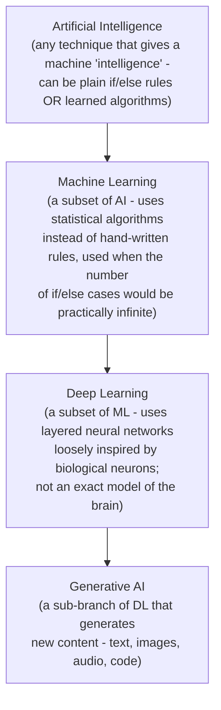

| Layer             | Core idea                                                                                                         | Example                                 |
| ----------------- | ----------------------------------------------------------------------------------------------------------------- | --------------------------------------- |
| **AI**            | Any way of giving a machine "intelligence," hard-coded or learned                                                 | A rule-based chess engine, a thermostat |
| **ML**            | Learns statistical patterns from data instead of manual rules; used when situations are too numerous to enumerate | Spam filter, price prediction           |
| **DL**            | Neural networks with many layers, loosely modeled on (not identical to) the brain                                 | Image recognition, speech-to-text       |
| **Generative AI** | A DL sub-branch that generates novel content rather than just classifying/predicting                              | ChatGPT, image generators               |

### 1.3 Types of Data

- **Numerical data** - quantities (age, price, temperature). Sub-types: _discrete_ (countable, e.g. number of children) and _continuous_ (measurable, e.g. height).
- **Categorical data** - labels/categories (city, gender, product type). Sub-types: _nominal_ (no inherent order, e.g. color) and _ordinal_ (has a natural order, e.g. rating: poor/average/good).

### 1.4 Types of Machine Learning

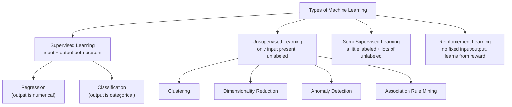

- **Supervised Learning** - both inputs (features) and correct outputs (labels) are given; the model learns the mapping.
  - **Regression** → output is numerical/continuous (e.g. predicting house price).
  - **Classification** → output is categorical (e.g. spam vs not spam).
- **Unsupervised Learning** - only inputs are given, no labels; the model finds structure on its own.
  - **Clustering** - group similar points together (customer segmentation).
  - **Dimensionality Reduction** - compress features while retaining information (PCA).
  - **Anomaly Detection** - find unusual points (fraud detection).
  - **Association** - find rules like "people who buy X also buy Y" (market basket analysis).
- **Semi-Supervised Learning** - only a small subset of data is labeled; the algorithm propagates labels to the rest. Common in image tagging where labeling everything by hand is expensive.
- **Reinforcement Learning** - an **agent** interacts with an **environment**, takes **actions**, and gets **rewards/penalties**; it improves policy over time through trial and error (no fixed input-output dataset upfront).

### 1.5 Batch (Offline) vs Online (Incremental) Learning

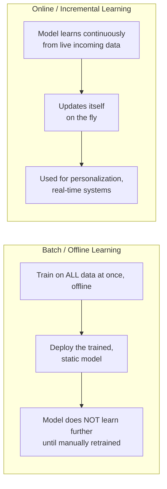

|               | Batch Learning                                                                    | Online Learning                                                                          |
| ------------- | --------------------------------------------------------------------------------- | ---------------------------------------------------------------------------------------- |
| Training      | Uses the entire dataset at once, offline                                          | Learns incrementally, in real time or mini-batches                                       |
| Freshness     | Static after deployment - becomes stale over time, needs periodic full retraining | Always up to date                                                                        |
| Risk          | Predictable, low risk of live corruption                                          | Riskier - can be biased or even manipulated ("poisoned") by bad live data                |
| Learning rate | N/A (trained once)                                                                | Must be tuned carefully - too high forgets old patterns, too low can't adapt to new ones |
| Use case      | Most traditional pipelines                                                        | Recommendation engines, stock trading, fraud detection                                   |

- **Learning rate** (in the online setting): controls how much new data overrides previously learned patterns. Too high → catastrophic forgetting of old patterns; too low → can't adapt to new trends.
- **Out-of-core learning**: when a dataset is too large to fit in memory, it's learned in sequential chunks/batches (relevant for both batch pipelines with huge data, and online learning).
- Libraries built for real-time/incremental training: [`river`](https://github.com/online-ml/river), [Vowpal Wabbit](https://vowpalwabbit.org/).

### 1.6 Instance-Based vs Model-Based Learning

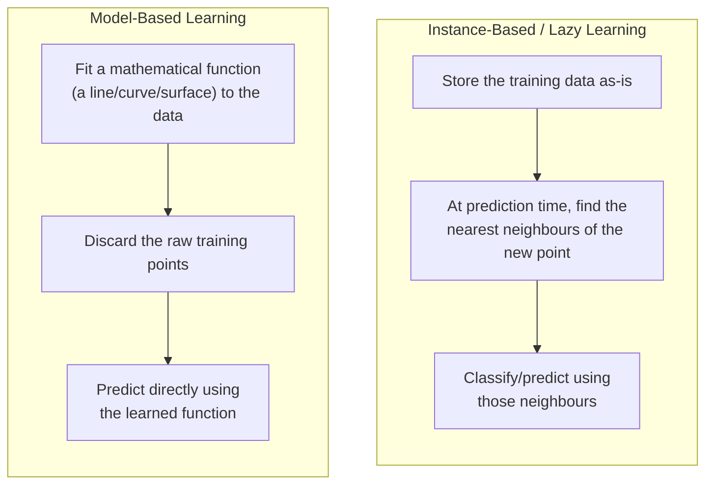

- **Instance-based (lazy) learning**: just memorizes the training data. At prediction time, it looks at where the new point lies relative to stored points (distance-based) and classifies accordingly. Examples: **KNN**, RBF networks, kernel-based methods. "Lazy" because no real work is done until prediction time.
- **Model-based learning**: fits a general curve/function (a model) to the training data during training. At prediction time it just evaluates that function - no need to keep the original training points around. Examples: **Linear Regression, Logistic Regression, Decision Trees**.

### 1.7 Challenges in Machine Learning

- **Data collection** - via web scraping, APIs, public archives; often the hardest part of a real project.
- **Insufficient / poorly labeled data** - more (good) data usually beats a fancier algorithm; a well-known NLP finding is that with enough data, the choice of algorithm often matters less than data volume.
- **Non-representative data** - caused by _sampling noise_ (small sample size) or _sampling bias_ (systematically skewed collection method).
- **Poor quality data** - a large fraction (often quoted as more than half) of any real ML project's time goes into cleaning data.
- **Irrelevant features** - garbage in, garbage out; solved via feature engineering.
- **Overfitting** - forcing the model to touch/match every single training point exactly, instead of learning the general trend, since training data is a _sample_, not the whole population.
- **Underfitting** - the opposite: the model is too simple to capture even the general trend.
- **Software/production integration** - not every environment (web, mobile, embedded) can run every ML framework equally well.
- **Offline learning deployment** - keeping a static model useful in a changing world.
- **Cost** - training, infra, and especially _maintenance_ cost. See Google's classic paper: ["Machine Learning: The High-Interest Credit Card of Technical Debt"](https://research.google/pubs/machine-learning-the-high-interest-credit-card-of-technical-debt/).
- All of this - automating training, deployment, monitoring, and retraining - is the discipline called **MLOps**.

### 1.8 Applications of ML

- **B2B** (business-to-business) vs **B2C** (business-to-consumer) - a useful lens for categorizing use cases.
- **Retail** (Amazon, Big Bazaar): demand forecasting for stock up/down before big sales; using browsing/purchase history for targeted marketing and even selling anonymized/aggregated behavioral data - _"if you are not paying for the product, you are the product."_ Cross-selling: classic example is placing baby diapers near beer/snacks because purchase-pattern analysis showed correlation, even though it seems unrelated on the surface.
- **Banking & Finance**: credit scoring - predicting whether a borrower will repay a loan.
- **Transportation (e.g. ride-hailing)**: _surge pricing_ - dynamic pricing based on real-time demand/supply analysis.
- **Manufacturing (e.g. Tesla)**: IoT sensor data (temperature, vibration, etc.) feeding predictive maintenance models that flag a robotic arm or machine likely to fail _before_ it actually breaks.
- **Social media (e.g. Twitter/X)**: sentiment analysis of posts - useful signal for things like predicting stock moves or election outcomes ahead of time.

### 1.9 Machine Learning Development Life Cycle (MLDLC)

Analogous to the Software Development Life Cycle, but tailored to data-driven systems.

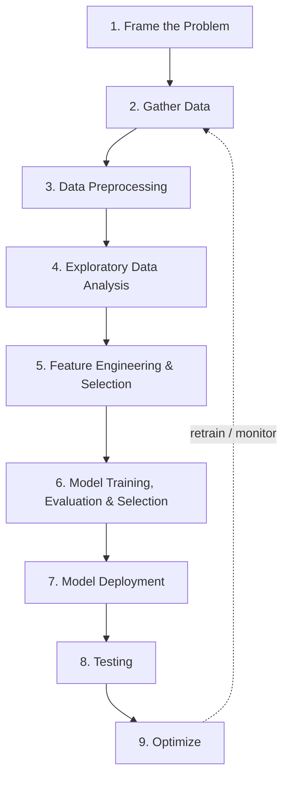

1. **Frame the problem** - define the actual business problem, pick a suitable ML approach, identify target users, expected benefit, cost, and pricing. Don't reinvent the wheel - check for existing solutions first.
2. **Gather data** - Kaggle, direct CSVs, web scraping, Hugging Face datasets, data warehouses via **ETL** (Extract–Transform–Load), database clusters, JSON/SQL sources, etc.
3. **Data preprocessing** - remove duplicates, handle missing values, scale/standardize, handle outliers.
4. **Exploratory Data Analysis (EDA)** - study input–output relationships, visualize, run univariate/bivariate/multivariate analysis, detect outliers and class imbalance. _("To cut a tree in 6 hours, spend 4 hours sharpening the axe.")_
5. **Feature engineering & selection** - construct new useful features, drop redundant/irrelevant ones.
6. **Model training, evaluation & selection** - train candidate models, evaluate with metrics (MSE, accuracy, etc.), tune hyperparameters, and often use **Ensemble Learning** to push performance further.
7. **Model deployment** - expose the model as an API/service so other software can call it.
8. **Testing** - alpha/beta/gamma testing, A/B testing in production.
9. **Optimize** - backups, load balancing, overall system design, and deciding a retraining cadence so the model doesn't "rot" as real-world data drifts.

### 1.10 Job Roles: Data Scientist vs Data Analyst vs ML Engineer vs Data Engineer

A simple way to remember the split: **the Data Engineer builds the pipes that move and store data (the past), the Data Analyst explains what already happened, the Data Scientist builds models that predict what will happen (the future), and the ML Engineer productionizes and scales those models.**

| Role               | Primary focus                                            | Typical tools                                         | Looks at                                                 |
| ------------------ | -------------------------------------------------------- | ----------------------------------------------------- | -------------------------------------------------------- |
| **Data Engineer**  | Building & maintaining data pipelines, warehouses, ETL   | SQL, Spark, Airflow, cloud data stores                | "Plumbing" - makes clean data available to everyone else |
| **Data Analyst**   | Descriptive analytics, dashboards, reporting             | SQL, Excel, BI tools (Tableau/Power BI), basic stats  | The past - _what happened?_                              |
| **Data Scientist** | Statistical modeling, predictive models, experimentation | Python/R, scikit-learn, statistics, EDA               | The future - _what will happen, and why?_                |
| **ML Engineer**    | Deploying, scaling, monitoring ML models in production   | Python, Docker, Kubernetes, CI/CD, cloud ML platforms | Production - _how do we run this reliably at scale?_     |

> Job-hunting tip from the original notes: general job boards like [AngelList/Wellfound](https://www.angellist.com/) are useful for startup-stage Data/ML roles.

---

## 2. Math Foundations You Actually Need

> [!note] Why this section exists
> The original notes jump straight into algorithms and assume comfort with vectors, probability, and derivatives. This section is the missing prerequisite chapter - just the parts of linear algebra, probability/statistics, and calculus that show up repeatedly later in this note.

### 2.1 Linear Algebra Essentials

**Scalars, vectors, matrices, tensors**

- **Scalar**: a single number, e.g. $5$ - a 0-dimensional tensor.
- **Vector**: an ordered list of numbers, e.g. $\mathbf{v} = [4, 2, 1, 6]$ - a 1-dimensional tensor. Its _vector-dimension_ is the count of elements (here, 4).
- **Matrix**: a 2D grid of numbers - a 2-dimensional tensor.
- **Tensor**: the general n-dimensional container (this is why the library **TensorFlow** is named after it).

> [!tip] Don't confuse "dimension of a vector" with "dimension of a tensor"
> The _vector's_ dimension = number of elements it holds (its length). The _tensor's_ dimension (a.k.a. **rank**) = number of axes/indices needed to address an element = number of nested array levels.
>
> - **Rank** = number of axes = number of dimensions of the tensor.
> - **Shape** = a tuple giving the size along each axis, e.g. `(2, 3, 4)`.
> - **Size** = total number of scalars stored = product of all shape values.

Examples of tensor rank in practice:

| Rank | Name      | Example                                                                                                                                                                                |
| ---- | --------- | -------------------------------------------------------------------------------------------------------------------------------------------------------------------------------------- |
| 0    | Scalar    | a single price value                                                                                                                                                                   |
| 1    | Vector    | one row of features                                                                                                                                                                    |
| 2    | Matrix    | a full tabular dataset (rows × columns)                                                                                                                                                |
| 3    | 3D tensor | a color image (height × width × RGB channels)                                                                                                                                          |
| 4    | 4D tensor | a _batch_ of color images (batch × height × width × channels)                                                                                                                          |
| 5    | 5D tensor | a batch of videos (batch × frames × height × width × channels) - e.g. 4 video clips at 60fps can already be tens of GB, which is why video compression formats like MP4/MPEG/MKV exist |

**Matrix operations**

$$
A = \begin{bmatrix} a_{11} & a_{12} \\ a_{21} & a_{22} \end{bmatrix}, \qquad
A^\top = \begin{bmatrix} a_{11} & a_{21} \\ a_{12} & a_{22} \end{bmatrix}
$$

- **Transpose** $A^\top$: flip rows and columns.
- **Matrix multiplication**: $(AB)_{ij} = \sum_k A_{ik}B_{kj}$ - valid only when inner dimensions match.
- **Identity matrix** $I$: $AI = IA = A$.
- **Inverse** $A^{-1}$: satisfies $AA^{-1}=I$ (only exists for square, non-singular matrices - this is why solving Linear Regression by direct matrix inversion, the _Ordinary Least Squares (OLS)_ closed form, becomes computationally expensive/unstable as the number of features grows).
- **Determinant** $|A|$: a scalar describing how a matrix scales area/volume; $|A| = 0$ means the matrix is singular (not invertible).
- **Dot product**: $\mathbf{a}\cdot\mathbf{b} = \sum_i a_i b_i = \|\mathbf{a}\|\|\mathbf{b}\|\cos\theta$ - measures alignment between two vectors.
- **Norm** (vector length): $L_2$ norm $\|\mathbf{v}\|_2 = \sqrt{\sum_i v_i^2}$, $L_1$ norm $\|\mathbf{v}\|_1 = \sum_i |v_i|$. These reappear directly in Ridge ($L_2$) and Lasso ($L_1$) regularization later.

**Eigenvalues and eigenvectors** (the heart of PCA - see §9)

$$A\mathbf{v} = \lambda \mathbf{v}$$

An **eigenvector** $\mathbf{v}$ of matrix $A$ is a direction that does _not_ get rotated when transformed by $A$ - only _scaled_ by a factor $\lambda$, the corresponding **eigenvalue**. Geometrically: most vectors change direction when multiplied by a matrix; eigenvectors are the special directions that don't.

### 2.2 Probability & Statistics Essentials

- **Mean (average)**: $\bar{x} = \frac{1}{n}\sum_i x_i$
- **Variance**: $\sigma^2 = \frac{1}{n}\sum_i (x_i-\bar{x})^2$ - average squared deviation from the mean; tells you about the spread of **one** variable.
- **Standard deviation**: $\sigma = \sqrt{\sigma^2}$ - same units as the data, easier to interpret than variance.
- **Covariance** between two variables $X, Y$: $\text{Cov}(X,Y) = \frac{1}{n}\sum_i (x_i-\bar{x})(y_i-\bar{y})$ - tells you about the **relationship** between two variables (do they increase together, or does one go up when the other goes down?). Range: any real number.
- **Correlation**: $\rho_{X,Y} = \dfrac{\text{Cov}(X,Y)}{\sigma_X \sigma_Y}$ - a normalized covariance, always between $-1$ and $1$.
  > Variance tells you about a variable _by itself_; covariance/correlation tell you about the _relationship_ between variables. Two variables can have identical variance individually but very different covariance with each other.
- **Why variance, not "spread"?** Spread (mean absolute deviation) uses an absolute value function which isn't differentiable at zero, which breaks calculus-based optimization. Variance uses squaring instead, which is smooth and differentiable everywhere - so it's used in optimization-heavy algorithms.
- **Probability distributions**: Normal/Gaussian (bell curve, defined by mean & variance), Bernoulli (single yes/no trial), Binomial (n Bernoulli trials), Poisson (counts of rare events).
- **Bayes' Theorem** (the foundation of Naive Bayes, §15):
  $$
  P(A\mid B) = \frac{P(B\mid A)\,P(A)}{P(B)}
  $$
  In words: _posterior_ = (_likelihood_ × _prior_) / _evidence_.
- **Central Limit Theorem (CLT)**: the sampling distribution of the mean of a large number of i.i.d. samples approaches a Normal distribution, regardless of the population's original distribution. This underlies why so many statistical methods assume normality.
- **Skewness**: measures asymmetry of a distribution. Right (positive) skew → long tail to the right (mean > median); left (negative) skew → long tail to the left (mean < median). Relevant later when choosing log vs square transforms.

### 2.3 Calculus Essentials

- **Derivative**: instantaneous rate of change of a function; in 2D we informally call it the **slope** of the curve at a point.
- **Partial derivative**: derivative of a multi-variable function with respect to just one variable, holding the others fixed - written $\frac{\partial f}{\partial x}$.
- **Gradient** $\nabla f$: the vector of _all_ partial derivatives of a function; in 3D+ we call the multi-variable generalization of "slope" the **gradient** rather than just "derivative." It points in the direction of steepest ascent - which is exactly why **Gradient Descent** (§11) moves in the _opposite_ direction of the gradient to minimize a loss function.
- **Chain rule**: $\frac{d}{dx}f(g(x)) = f'(g(x))\cdot g'(x)$ - essential for deriving the logistic regression gradient (§13) and for backpropagation in neural networks.
- **Convexity**: a function is convex if a line segment between any two points on its curve lies above the curve (bowl-shaped). Convex loss functions (like linear regression's MSE) have a single global minimum - gradient descent is guaranteed to find it. Non-convex losses can have multiple local minima, which is why optimizers can get "stuck."

---

## 3. The ML Project Lifecycle (Practical View)

### 3.1 Framing a Real Problem - Worked Example

A useful mental model, using a **Netflix churn** scenario (churn = the rate at which subscribers leave the platform):

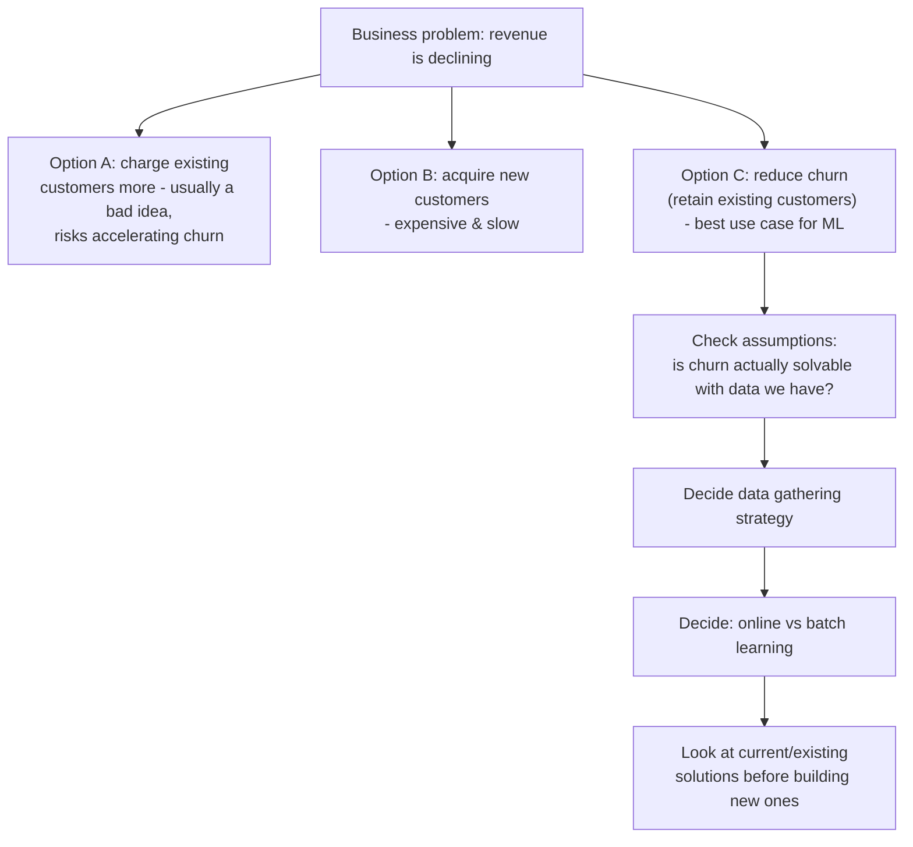

The general checklist when framing _any_ ML problem:

1. What is the actual objective, in business terms?
2. Is this genuinely an ML problem, or can simpler rules solve it?
3. What data do we have / can we get, and what are its limitations?
4. Should the system be batch or online?
5. What already exists (in-house or off-the-shelf) that solves this, even partially?

### 3.2 Practical Tools - Bird's-Eye View

| Purpose                                                                       | Tool                                                        |
| ----------------------------------------------------------------------------- | ----------------------------------------------------------- |
| Datasets + notebooks + competitions                                           | **Kaggle**                                                  |
| Free/cheap cloud notebooks with GPU/TPU (can pull Kaggle data via API)        | **Google Colab**                                            |
| Local Python environment & package management                                 | **Anaconda**                                                |
| Visualizing ML decision boundaries, association rule mining, stacking helpers | **mlxtend**                                                 |
| Deployment                                                                    | **Heroku**, **AWS**, **Google Cloud Platform (GCP)**, Azure |

---

## 4. Data Types, Tensors and Data Gathering

> [!info] See also
> Basic numerical/categorical data types are covered in §1.3; tensor rank/shape/size math is covered in §2.1. This section focuses on **how you actually get data** into a project.

### 4.1 Gathering Data From CSV Files

The most common starting point - a flat, delimited tabular file loaded directly into a DataFrame (`pandas.read_csv`). Things to check immediately after loading:

- Column data types (numeric parsed correctly? dates as strings?)
- Delimiter/encoding issues (e.g. `;` vs `,`, UTF-8 vs Latin-1)
- Header row present/absent
- File size - for huge CSVs, read in chunks (`chunksize` parameter) to avoid memory blowups

### 4.2 Gathering Data via JSON and APIs

- **JSON (JavaScript Object Notation)**: a nested key-value text format, common for API responses; `pandas.json_normalize` flattens nested JSON into tabular form.
- **APIs**: many organizations expose data via REST APIs (auth via API keys/OAuth). [RapidAPI](https://rapidapi.com/) is a marketplace/directory for discovering and testing thousands of public APIs.
- A common resume-building exercise: scrape or pull data via an API, package it into a clean dataset, and publish it on Kaggle as a public dataset.

### 4.3 Other Common Sources

- **Data warehouses** via **ETL** (Extract–Transform–Load) pipelines
- **SQL / relational databases**
- **Web scraping** (BeautifulSoup, Scrapy, Selenium) - respecting a site's terms of service and `robots.txt`
- **Hugging Face Datasets** - especially for NLP/vision data
- **Public data archives / government open-data portals**

---

## 5. Exploratory Data Analysis (EDA)

EDA is where you build intuition about your data _before_ modeling - "sharpen the axe before cutting the tree."

### 5.1 Univariate Analysis (one column at a time)

**Categorical data**

- **Count plot** (seaborn) - bar chart of frequency per category.
- **Pie chart** - proportion of each category.

**Numerical data**

- **Histogram** - bins continuous values into ranges/classes (effectively converting numerical → categorical for visualization), then plots counts per bin.
- **Distribution plot (distplot)** - like a histogram but overlaid with a smooth **KDE (Kernel Density Estimate)** curve, which approximates the **PDF (Probability Density Function)** as a continuous curve rather than discrete bins.
- **Box plot** - five-number summary visualized (min, Q1, median, Q3, max) plus outliers as individual points.

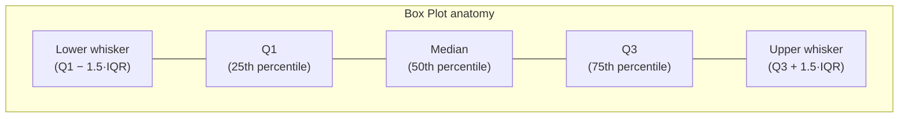

- Summary statistics: **min, max, mean, median, mode**.
- **Skew** - checks whether the distribution is symmetrical (skew ≈ 0) or lopsided (see §2.2).

### 5.2 Bivariate / Multivariate Analysis (relationships between columns)

| Plot             | Relationship type                                                                                                                             |
| ---------------- | --------------------------------------------------------------------------------------------------------------------------------------------- |
| Scatter plot     | Numerical – Numerical (can encode up to 4 dimensions at once: x/y position, `hue` for color, `style` for marker shape, `size` for point size) |
| Bar plot         | Numerical – Categorical                                                                                                                       |
| Box plot         | Numerical – Categorical                                                                                                                       |
| Dist/violin plot | Numerical – Categorical                                                                                                                       |
| Heatmap          | Categorical – Categorical (or correlation matrix for Numerical–Numerical)                                                                     |
| Cluster map      | Categorical – Categorical, with hierarchical clustering of rows/columns                                                                       |
| Pair plot        | Multiple Numerical columns pairwise at once                                                                                                   |
| Line plot        | Numerical – Numerical, especially time-ordered data                                                                                           |

### 5.3 Automated EDA

Libraries like **`pandas-profiling`** (a.k.a. `ydata-profiling`) auto-generate a full report - types, missing values, distributions, correlations, and warnings - from a single command, useful as a fast first pass before manual EDA.

---

## 6. Feature Engineering

> If feature scaling isn't done, variables with larger numeric ranges dominate the learning process and variables with small ranges get effectively ignored, even if they're important.

### 6.1 Feature Scaling

#### Standardization (Z-score scaling)

$$
x' = \frac{x - \mu}{\sigma}
$$

Re-centers data to **mean = 0** and **standard deviation = 1**. This only _rescales_ the plot - it does **not** change the shape of the distribution. Whether scaling helps or hurts accuracy depends on the model; sometimes scaling up/down changes results in surprising directions, so it's worth testing both ways. Outliers are **not** removed or reduced by scaling/standardization - that must be handled separately (§8). Tree-based models (Decision Trees, Random Forest, Gradient Boosting, CatBoost, etc.) generally **do not need** feature scaling, since they split on thresholds rather than distances.

#### Normalization

Squeezes all values into a fixed range, typically $[0,1]$, so the entire feature's "shape" fits inside a unit square.

**1. Min-Max Scaling**

$$
x' = \frac{x - x_{min}}{x_{max} - x_{min}}
$$

**2. Mean Normalization**

$$
x' = \frac{x - \bar{x}}{x_{max} - x_{min}}
$$

**3. Max-Absolute Scaling**

$$
x' = \frac{x}{\max(|x|)}
$$

**4. Robust Scaling** (robust to outliers - uses median & IQR instead of mean & min/max)

$$
x' = \frac{x - \text{median}(x)}{IQR} = \frac{x - Q_2}{Q_3 - Q_1}
$$

#### Choosing Between Them

| Situation                                             | Preferred method                                                      |
| ----------------------------------------------------- | --------------------------------------------------------------------- |
| Feature scale required, distribution roughly Gaussian | Standardization (most common default)                                 |
| Known, fixed min/max bounds (e.g. pixel values 0–255) | Min-Max scaling                                                       |
| Data has significant outliers                         | Robust scaling                                                        |
| Data is sparse (lots of zeros)                        | Max-Absolute scaling (preserves sparsity, doesn't shift zero entries) |

### 6.2 Encoding Categorical Data

Recall (§1.3): **Nominal** categories have no inherent order (gender, color); **Ordinal** categories do (bad < average < good).

- **Ordinal Encoding**: used on **input** ordinal features - assign integers (0, 1, 2 …) according to the natural rank, since the model can't infer the order on its own; you must specify the category order explicitly.
- **Label Encoding**: same integer-assignment idea, but reserved specifically for the **output/target** column in classification.
- **One-Hot Encoding**: for **nominal** input features - create a new binary column per category (1 if the row belongs to that category, 0 otherwise).

#### The Dummy Variable Trap

If you one-hot encode $n$ categories into $n$ columns, those columns are **perfectly multicollinear** - any one of them can be derived from the rest (since exactly one of the $n$ columns is always 1 and the rest 0, they always sum to 1 row-wise). This breaks assumptions of linear models (and wastes a column). **Fix**: keep only $n-1$ columns, dropping one category as the implicit "reference" category.

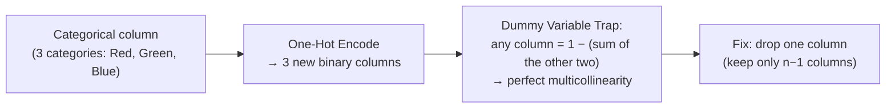

- In pandas: `pd.get_dummies(df, drop_first=True)` - `drop_first=True` removes the trap column. Caveat: pandas doesn't "remember" the encoding scheme between runs (fit once, transform later), so results can be inconsistent across different datasets/order - for that reason, prefer **scikit-learn's `OneHotEncoder`**, which persists the fitted category mapping via `.fit()`/`.transform()`, and can be composed cleanly with `ColumnTransformer` for a one-line, reusable pipeline step.
- For high-cardinality categorical columns, one-hot encoding can be reduced by only encoding the **most frequent** categories and grouping the rest as "other."
- **Not covered in the original notes but standard practice - additional encoding schemes:**
  - **Target/Mean Encoding**: replace each category with the mean of the target variable for that category (powerful, but must be done carefully within cross-validation folds to avoid leakage).
  - **Frequency Encoding**: replace each category with how often it appears in the dataset.
  - **Binary Encoding**: encode category ranks as binary digits split across multiple columns - a middle ground between one-hot (many columns) and label encoding (implies false order).

### 6.3 Function Transformers (Mathematical Transforms)

Used to make a feature's distribution closer to Normal, which helps linear models and reduces the effect of skew.

| Transform     | Formula                            | When to use                                                                                                                                  |
| ------------- | ---------------------------------- | -------------------------------------------------------------------------------------------------------------------------------------------- |
| Log transform | $x' = \log(x)$ or $x' = \log(1+x)$ | Right-skewed, strictly positive data. Use `log1p` (`\log(1+x)`) instead of plain `log` when some values are 0, since $\log(0)$ is undefined. |
| Reciprocal    | $x' = 1/x$                         | Strongly right-skewed, no zero values                                                                                                        |
| Square        | $x' = x^2$                         | Left-skewed data                                                                                                                             |
| Square root   | $x' = \sqrt{x}$                    | Mildly right-skewed, non-negative data                                                                                                       |

#### Power Transforms

**Box-Cox Transform** (requires strictly positive $x$):

$$
x'(\lambda) =
\begin{cases}
\dfrac{x^{\lambda} - 1}{\lambda}, & \lambda \neq 0 \\[6pt]
\ln(x), & \lambda = 0
\end{cases}
$$

**Yeo-Johnson Transform** (generalizes Box-Cox to handle zero and negative values too):

$$
x'(\lambda) =
\begin{cases}
\dfrac{(x+1)^{\lambda}-1}{\lambda}, & \lambda \neq 0,\; x \ge 0 \\[6pt]
\ln(x+1), & \lambda = 0,\; x \ge 0 \\[6pt]
-\dfrac{(-x+1)^{2-\lambda}-1}{2-\lambda}, & \lambda \neq 2,\; x < 0 \\[6pt]
-\ln(-x+1), & \lambda = 2,\; x < 0
\end{cases}
$$

In both cases, $\lambda$ is chosen automatically (typically via maximum likelihood) to make the transformed distribution as close to Normal as possible. A **Quantile Transformer** is a third, non-parametric alternative that directly maps a feature's quantiles onto a uniform or Normal distribution.

> [!tip] Checking normality
> A **Q-Q (quantile-quantile) plot** is the standard visual check for whether a distribution is approximately Normal - points falling on the 45° diagonal indicate normality.

### 6.4 Numerical → Categorical Transforms

#### Binning / Discretization

Converts a continuous variable into discrete intervals ("bins"). Useful for handling outliers and improving value spread.

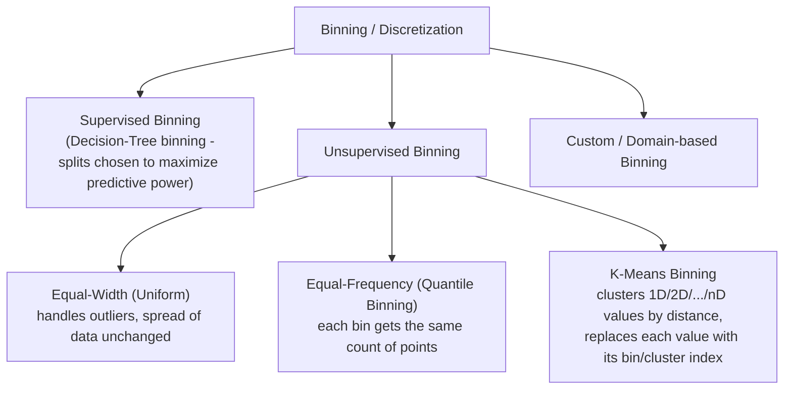

#### Binarization

Splits a feature into strictly two values - 0/1, true/false - based on a threshold.

### 6.5 Handling Mixed Variables

When a single column contains both numeric and categorical/text content (e.g. `"A34"`, `"120"`), split it into two separate, clean columns - one purely numeric, one purely categorical - before feeding it to any model.

### 6.6 Handling Date-Time Features

Raw date-time strings aren't directly usable by most ML models. Extract meaningful numeric/categorical components instead: year, month, day, day-of-week, is-weekend, quarter, hour, and (for time differences) elapsed-time-since-event features.

### 6.7 Feature Construction and Feature Splitting

- **Feature Construction**: building a brand-new, more informative feature out of existing ones. Classic example: from a Titanic-style dataset with `SibSp` (siblings/spouses aboard) and `Parch` (parents/children aboard), construct `FamilySize = SibSp + Parch + 1`, which turns out to be more predictive than either raw column alone.
- **Feature Splitting**: the reverse - breaking one messy column into multiple clean, useful ones. Classic example: extracting the **Title** (Mr./Mrs./Miss/Master) out of a passenger's `Name` field, which correlates strongly with age, gender and social class - more predictive than the raw name string.

---

## 7. Handling Missing Data

### 7.1 Types of Missingness (important - determines which technique is valid)

| Type                                    | Meaning                                                                                                                             |
| --------------------------------------- | ----------------------------------------------------------------------------------------------------------------------------------- |
| **MCAR** - Missing Completely At Random | The chance of a value being missing is unrelated to any data, observed or not (e.g. a sensor randomly drops readings)               |
| **MAR** - Missing At Random             | The chance of missingness depends on _other observed_ columns (e.g. income missing more often for a certain age group)              |
| **MNAR** - Missing Not At Random        | The chance of missingness depends on the _missing value itself_ (e.g. people with very high income intentionally not disclosing it) |

### 7.2 Complete Case Analysis (CCA)

Also called **list-wise deletion** - simply drop every row that has _any_ missing value.

- **Assumptions**: data is MCAR, and the fraction missing is small (rule of thumb: under ~5%).
- **Advantages**: trivially easy to implement; if data really is MCAR, the reduced dataset's distribution still matches the original.
- **Disadvantages**: can discard a large chunk of the dataset if missingness is common; may discard genuinely informative rows if the data is _not_ actually MCAR; and a production model built this way has no idea how to handle missing values it will inevitably see live.

### 7.3 Univariate Imputation (uses only the same column's other values)

**Numerical columns**

- **Mean / Median imputation** - fill with the column's mean (if roughly symmetric) or median (if skewed/has outliers). Simple and library-supported (pandas, scikit-learn - `SimpleImputer` is preferred over manual pandas since it persists the fitted value for use on new/test data). Downsides: shrinks variance, distorts the distribution, and shifts covariance/correlation with other columns.
- **Arbitrary value imputation** - fill with an arbitrary fixed sentinel value (e.g. -1, 999); appropriate signal when missingness itself is _not_ random (MNAR/MAR), since it flags "this was missing" rather than pretending it was an average value.
- **End-of-distribution imputation** - an extension of arbitrary imputation: fill using a value far out in the tail of the distribution:
  $$
  \text{value} = \bar{x} \pm 3\sigma
  $$
  or, if the data is skewed, using the IQR rule instead:
  $$
  \text{lower} = Q_1 - 1.5\cdot IQR, \qquad \text{upper} = Q_3 + 1.5\cdot IQR
  $$
- **Random sample imputation** - fill missing slots by randomly sampling from the column's own existing (non-missing) values; works for both numerical and categorical columns, and preserves the original variance better than mean/median imputation (at the cost of extra memory to store the pool of values to sample from at inference time).
- **Automatic best-imputer selection** - try several strategies and pick whichever gives the best downstream model performance (often via `GridSearchCV` over the imputation step itself).

**Categorical columns**

- **Mode imputation** - fill with the most frequent category; simple, but distorts the category distribution (over-represents the mode).
- **"Missing" category** - create a brand-new category literally called `"Missing"` - useful when missingness itself might be informative.

### 7.4 Multivariate Imputation (uses other columns too)

- **KNN Imputer** - for each row with a missing value, find its $k$ nearest neighbour rows (by distance on the other, non-missing features) and fill the missing value based on those neighbours (mean, or weighted by distance).
  - Distance with missing values uses a **NaN-Euclidean distance**: compute the normal Euclidean distance over only the _available_ (non-missing) coordinates, then scale it up to account for the missing ones -
    $$
    d(x,y) = \sqrt{\frac{n_{available}}{n_{total}}\sum_{i \in available}(x_i-y_i)^2}
    $$
  - **Pros**: generally the most accurate imputation approach. **Cons**: computationally slow (distance to every other row), and the entire training set must be stored/shipped with the deployed model to compute distances against new incoming data.
  - Can be _weighted_: instead of a plain average of neighbours, weight each neighbour's contribution inversely by its distance.

- **Iterative Imputer (MICE - Multivariate Imputation by Chained Equations)**
  - Valid strictly under the **MAR** assumption.
  - **Algorithm**:

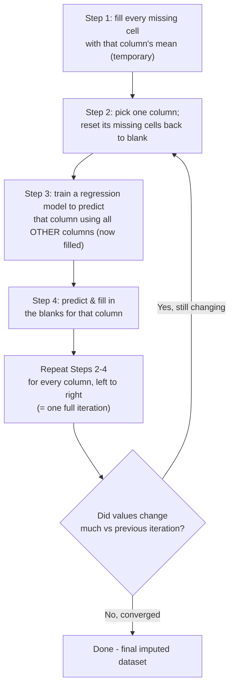

- **Pros**: typically very accurate. **Cons**: slow, and (like KNN Imputer) needs the training set kept around for future inference.

- **Missing Indicator**: alongside any of the above, add a new binary column flagging _"was this value originally missing?"_ - lets the model use the fact of missingness itself as a signal, which matters especially under MAR/MNAR.

---

## 8. Outlier Detection and Treatment

An **outlier** is a data point that behaves very differently from the rest of the dataset. Outliers badly distort algorithms that rely on distance/weight calculations - Linear Regression, Logistic Regression, AdaBoost, deep learning, KNN, K-Means, PCA - since a single extreme value can dominate a mean, a variance, or a gradient update.

### 8.1 Detecting Outliers

**Normal-distribution rule (Z-score based)**: a point is an outlier if

$$
x > \bar{x} + 3\sigma \quad \text{or} \quad x < \bar{x} - 3\sigma
$$

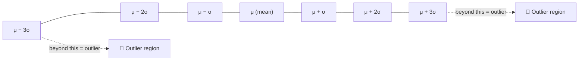

### 8.2 Z-Score Treatment

Only valid when the feature is approximately **normally distributed**.

$$
z = \frac{x - \bar{x}}{\sigma}
$$

Compute $z$ for every row; keep only rows with $-3 \le z \le 3$ (trim), or cap them at that boundary.

### 8.3 IQR (Interquartile Range) Method

Used when data is **skewed** (not normally distributed).

$$
IQR = Q_3 - Q_1 \qquad (Q_2 = \text{median})
$$

$$
\text{Lower whisker} = Q_1 - 1.5\times IQR \qquad \text{Upper whisker} = Q_3 + 1.5\times IQR
$$

Any point beyond the whiskers is flagged as an outlier.

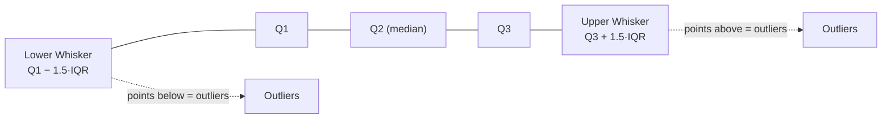

### 8.4 Percentile-based Winsorization

Cap (not remove) values beyond chosen percentile boundaries - e.g. cap everything below the 1st percentile up to the 1st-percentile value, and everything above the 99th percentile down to the 99th-percentile value.

- Lower and upper percentile cutoffs should typically be kept **symmetrical** around the median (e.g. 1st & 99th, or 5th & 95th) so the "squeeze" is balanced on both sides.
- Note the terminology distinction: **capping** values at the percentile boundary _is_ Winsorization; simply **deleting/trimming** those rows is not - Winsorization specifically refers to the capping/limiting approach.

### 8.5 Treatment Strategies (Summary)

| Strategy               | Description                                                                                     | Tradeoff                                                                  |
| ---------------------- | ----------------------------------------------------------------------------------------------- | ------------------------------------------------------------------------- |
| Trimming (removal)     | Delete outlier rows outright                                                                    | Fast, but shrinks the dataset - risky if outliers are common              |
| Capping                | Clip outliers to a boundary value (Winsorization)                                               | Keeps all rows, less data loss, but slightly distorts the boundary values |
| Treat as missing       | Mark outliers as missing, then impute (§7)                                                      | Leverages robust imputation methods                                       |
| Discretization/Binning | Bin the values so extreme values fall into an "edge" bin rather than skewing a continuous scale | Naturally absorbs outliers                                                |

### 8.6 Model-based Outlier Detection _(not in the original notes - standard additions)_

- **Isolation Forest** - builds random trees that isolate points via random splits; outliers get isolated in fewer splits (shorter path length) than normal points, since they're "easier to separate."
- **Local Outlier Factor (LOF)** - compares the local density around a point to the density around its neighbours; points in a much sparser neighbourhood than their neighbours are flagged as outliers. Good for detecting _local_ outliers that a global Z-score/IQR rule would miss.

---

## 9. Feature Selection, Curse of Dimensionality and PCA

### 9.1 The Curse of Dimensionality

There's an optimal number of features, $f_n$. Push **past** it and:

- prediction accuracy _decreases_ (the extra features add noise, not signal),
- computation cost _increases_,
- data becomes **sparse** - in high dimensions, points spread out so much that "nearest neighbour" distances stop being meaningful.

Push **below** the optimal number (removing too many features) and accuracy suffers from the opposite direction - not enough signal left. High-dimensional data is especially common with images and text, where every pixel/token can become a feature.

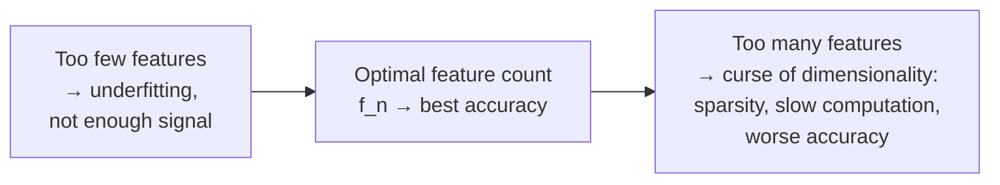

The general fix is **dimensionality reduction**, via two families of approaches:

1. **Feature Selection** - keep a subset of the _original_ columns, drop the rest.
2. **Feature Extraction** - build brand-new columns as combinations (typically linear combinations) of the old ones, then discard the originals.

### 9.2 Feature Selection Methods _(expanded - original notes only named two)_

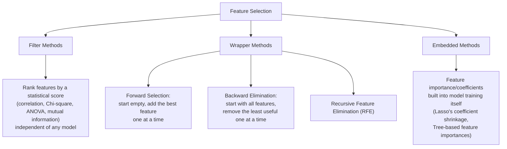

| Family       | How it decides                                                                                    | Cost                             | Examples                                                                                                                      |
| ------------ | ------------------------------------------------------------------------------------------------- | -------------------------------- | ----------------------------------------------------------------------------------------------------------------------------- |
| **Filter**   | Statistical relationship between each feature and the target, computed independently of any model | Cheapest, fastest                | Correlation coefficient, Chi-square test, ANOVA F-test, Mutual Information                                                    |
| **Wrapper**  | Repeatedly train a real model on different feature subsets and keep whichever subset scores best  | Most expensive (many model fits) | Forward Selection, Backward Elimination, Recursive Feature Elimination (RFE)                                                  |
| **Embedded** | Feature importance emerges as a _byproduct_ of training a single model                            | Middle ground                    | Lasso regression (coefficients shrink to exactly 0 for unimportant features), Decision Tree/Random Forest feature importances |

### 9.3 Feature Extraction

Instead of keeping/discarding whole columns, **combine** columns (typically as a weighted/linear sum) into new axes that capture more information per column than any original column did alone.

Rule of thumb for deciding selection vs extraction: compare the **variance/spread** each original column carries.

- If one column has clearly more spread than another, prefer plain **feature selection** (keep the high-spread one).
- If two columns have roughly **equal spread**, prefer **feature extraction** - create a new column via their sum/difference (geometrically, this rotates the coordinate axes to align with the direction of maximum combined variance).

$$
(\text{number of new components}) \le (\text{number of original features})
$$

The two classic feature-extraction techniques: **PCA** (unsupervised) and **LDA** (supervised) - plus **t-SNE** for visualization.

### 9.4 Principal Component Analysis (PCA)

- **Unsupervised** technique (doesn't use the target label at all).
- One of the oldest, most reliable feature-extraction methods (dating to foundational work over a century old, though its modern statistical form was formalized in the 20th century).
- Mathematically involved, but conceptually simple: find the direction(s) of maximum spread in the data, and re-express the data along those directions.

**Benefits**

- Enables visualization of high-dimensional data in 2D/3D.
- Speeds up downstream algorithms (fewer dimensions to process).
- Can improve accuracy (removes redundant/noisy dimensions).
- Reduces memory/compute footprint.

**Why variance, not "spread"?** As covered in §2.2 - spread (mean absolute deviation) uses a non-differentiable absolute-value function; variance is smooth everywhere, which matters since PCA is fundamentally an optimization problem (maximize variance along a chosen direction).

#### The actual working of PCA

**Goal**: find a new unit vector (direction) $\mathbf{u}$ such that projecting the data onto it maximizes variance:

$$
\max_{\|\mathbf{u}\|=1} \; \text{Var}(X\mathbf{u})
$$

**Covariance matrix**: describes the spread of the data along every axis _and_ the relationship (orientation) between every pair of axes. For an $n$-dimensional dataset it's an $n\times n$ symmetric matrix:

$$
\Sigma = \begin{bmatrix}
\text{Var}(X_1) & \text{Cov}(X_1,X_2) & \cdots & \text{Cov}(X_1,X_n) \\
\text{Cov}(X_2,X_1) & \text{Var}(X_2) & \cdots & \text{Cov}(X_2,X_n) \\
\vdots & \vdots & \ddots & \vdots \\
\text{Cov}(X_n,X_1) & \text{Cov}(X_n,X_2) & \cdots & \text{Var}(X_n)
\end{bmatrix}
$$

The diagonal holds each feature's own variance; the off-diagonal entries hold pairwise covariances (this generalizes cleanly to any number of dimensions - 2×2, 3×3, or higher).

**Eigen decomposition**: solve

$$
\Sigma \mathbf{v} = \lambda \mathbf{v}
$$

where $\Sigma$ is the covariance matrix, $\mathbf{v}$ are its **eigenvectors** (candidate new axes - the **Principal Components**) and $\lambda$ are the corresponding **eigenvalues**. Geometrically: an eigenvector is a direction whose _orientation_ doesn't change under the transformation $\Sigma$, only its _magnitude_ - scaled by $\lambda$. **The eigenvector with the largest eigenvalue captures the most variance** and becomes **PC1**; the next-largest becomes **PC2**, and so on - all principal components come out mutually orthogonal (uncorrelated) by construction.

> A free interactive tool for building geometric intuition about vectors/matrix transformations: [GeoGebra](https://www.geogebra.org/).

#### PCA - Step by Step

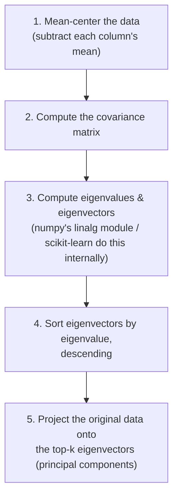

In short: PCA takes a "snapshot" that represents $n$-dimensional data faithfully in a much smaller $m$-dimensional space ($m < n$). Increasing the number of retained principal components increases how much of the original information (variance) is preserved.

#### Explained Variance

**Explained variance** quantifies how much of the total variability in the original data is captured by keeping a given number of principal components:

$$
\text{Explained Variance Ratio of } PC_i = \frac{\lambda_i}{\sum_{j=1}^{n}\lambda_j}
$$

To choose how many components to keep, plot the **cumulative explained variance** against the number of components and pick the smallest number that clears a target threshold - commonly **95%** of total variance retained. (E.g., if the first 3 components only cover ~12% of variance, that's usually far too few - most practitioners target that ~95% cumulative line.)

#### When PCA Doesn't Work Well

- When the data's true structure is **non-linear** (e.g. concentric circles, or a Swiss-roll shape) - PCA only finds _linear_ combinations of features, so it can't "unroll" non-linear manifolds. (Kernel PCA or manifold methods like t-SNE/UMAP are needed instead.)
- When all directions have roughly **equal variance** (e.g. perfectly spherical data) - there's no dominant direction to project onto, so dimensionality reduction doesn't gain much.
- When features have very different scales and haven't been standardized first - PCA will be dominated by whichever feature happens to have the largest raw numeric range, not the most _informative_ one. (**Always standardize before PCA.**)

### 9.5 Linear Discriminant Analysis (LDA) _(new - was only named in original notes)_

Unlike PCA, **LDA is supervised** - it uses the class labels. Instead of maximizing overall variance, LDA finds the projection axis that best **separates known classes**:

$$
J(\mathbf{w}) = \frac{\mathbf{w}^\top S_B \mathbf{w}}{\mathbf{w}^\top S_W \mathbf{w}}
$$

where $S_B$ is the **between-class scatter** (how far apart the class means are) and $S_W$ is the **within-class scatter** (how spread out each individual class is). LDA picks the direction that **maximizes the ratio** of between-class spread to within-class spread - i.e., it pushes different classes' clusters apart while keeping each class's own cluster tight. Since it needs $\ge 2$ classes to define "between-class" spread, LDA can extract at most $(\text{number of classes} - 1)$ components, unlike PCA which can extract up to (number of original features) components.

|                | PCA                                                              | LDA                                                               |
| -------------- | ---------------------------------------------------------------- | ----------------------------------------------------------------- |
| Supervision    | Unsupervised                                                     | Supervised (needs labels)                                         |
| Optimizes      | Total variance in the data                                       | Class separability                                                |
| Max components | Up to $n$ features                                               | Up to (classes − 1)                                               |
| Typical use    | General dimensionality reduction, visualization, noise reduction | Dimensionality reduction _specifically_ to improve classification |

### 9.6 t-SNE (t-Distributed Stochastic Neighbor Embedding) _(new)_

A **non-linear**, visualization-focused dimensionality reduction technique (almost always reducing to 2D or 3D for plotting, rather than as a general preprocessing step for other models).

- Converts pairwise distances between points in high-dimensional space into **probabilities** of one point picking another as its "neighbor" (using a Gaussian kernel in the original space, and a heavier-tailed **Student's t-distribution** in the low-dimensional embedding - hence the name).
- Then arranges points in low-dimensional space to make the _low-dimensional_ neighbor probabilities match the _high-dimensional_ ones as closely as possible, measured via **KL divergence** and optimized with gradient descent.
- Excellent at preserving **local structure** (clusters/neighborhoods look right) but **does not preserve global distances** well - the distance _between_ separate clusters in a t-SNE plot isn't meaningful, only the clustering itself is.
- Much slower than PCA, and non-deterministic (different runs can look different) unless the random seed and **perplexity** hyperparameter (roughly, "how many neighbours to consider") are fixed.

---

## 10. Linear Regression and Regression Metrics

Linear Regression is a **supervised** technique for **regression** problems (numerical output). It's simple, interpretable, and often the first model tried on tabular numeric data.

### 10.1 Types of Linear Regression

| Type                           | Inputs                           | Notes                                                                                      |
| ------------------------------ | -------------------------------- | ------------------------------------------------------------------------------------------ |
| **Simple Linear Regression**   | 1 input column, 1 output         | $y = mx + b$                                                                               |
| **Multiple Linear Regression** | Multiple input columns, 1 output | $y = \beta_0 + \beta_1x_1 + \beta_2x_2 + \dots + \beta_nx_n$                               |
| **Polynomial Regression**      | Handles non-linear relationships | Fits curves, not just straight lines, by adding polynomial terms of the inputs (see §10.5) |

Real-world data is rarely _perfectly_ linear - some variation is just **stochastic/environmental noise**: real-world factors that can't be individually measured or explained, bundled together into a single "error" term that's simply accepted as unavoidable.

### 10.2 Simple Linear Regression - Ordinary Least Squares (OLS)

We choose the **best-fit line** - the one line that minimizes total prediction error across all points. Two ways to find it:

- **Closed-form solution (OLS)** - a direct formula; fast when the number of dimensions is small, but becomes computationally expensive as dimensions grow (matrix inversion cost grows quickly with the number of features) - for high dimensions, use Gradient Descent instead. (Note: scikit-learn's `SGDRegressor` uses Gradient Descent internally, and its ordinary `LinearRegression` class uses the OLS closed form internally.)
- **Non-closed-form solution (Gradient Descent)** - iterative, scales much better to high dimensions (§11).

**OLS derivation (simple linear regression, minimizing squared error):**

$$
\hat{y}_i = mx_i + b
$$

Minimize the sum of squared residuals:

$$
E = \sum_{i=1}^{n}(y_i - mx_i - b)^2
$$

Taking partial derivatives with respect to $m$ and $b$ and setting them to zero gives the closed-form solution:

$$
m = \frac{\sum_{i=1}^n (x_i-\bar{x})(y_i-\bar{y})}{\sum_{i=1}^n (x_i-\bar{x})^2}, \qquad b = \bar{y} - m\bar{x}
$$

### 10.3 Multiple Linear Regression

In matrix form, with $X$ the feature matrix (with a leading column of 1's for the intercept) and $\boldsymbol\beta$ the coefficient vector:

$$
\hat{Y} = X\boldsymbol\beta
$$

Minimizing squared error $\|Y - X\boldsymbol\beta\|^2$ gives the **Normal Equation**:

$$
\boldsymbol\beta = (X^\top X)^{-1}X^\top Y
$$

This requires inverting $X^\top X$, an $n\times n$ matrix - the inversion cost grows roughly cubically with the number of features, which is precisely why this **inverse-matrix (OLS) method becomes impractical as the number of features grows**, and Gradient Descent (§11) is preferred in practice for anything beyond a small number of features.

### 10.4 Assumptions of Linear Regression _(new - standard but missing from original notes)_

1. **Linearity** - the relationship between features and target is genuinely linear.
2. **Independence of errors** - residuals aren't correlated with each other (important for time-series data).
3. **Homoscedasticity** - residuals have constant variance across all predicted values (no "funnel" shape when plotting residuals vs. predictions).
4. **Normality of residuals** - residuals are approximately normally distributed (mostly matters for the _validity of statistical inference_, like confidence intervals - the point predictions themselves don't strictly require it).
5. **No/low multicollinearity** - input features shouldn't be too strongly correlated with each other (checked via **VIF - Variance Inflation Factor**), otherwise coefficient estimates become unstable and hard to interpret.

### 10.5 Polynomial Regression

Instead of fitting a straight line, fit a curve by expanding each feature into powers of itself: $x, x^2, x^3, \dots, x^d$ for a chosen degree $d$. A single column becomes $d$ engineered columns, each getting its own coefficient - as degree increases, the fit gets more flexible (and more prone to overfitting if pushed too far).

$$
\hat{y} = \beta_0 + \beta_1 x + \beta_2 x^2 + \dots + \beta_d x^d
$$

### 10.6 Regression Error Metrics

| Metric                                      | Formula                                                                               | Notes                                                                                                                                                                                                                                                                                                   |
| ------------------------------------------- | ------------------------------------------------------------------------------------- | ------------------------------------------------------------------------------------------------------------------------------------------------------------------------------------------------------------------------------------------------------------------------------------------------------- |
| **MAE** (Mean Absolute Error)               | $\dfrac{1}{n}\sum\lvert y_i-\hat y_i\rvert$                                           | Robust to outliers, but not differentiable at 0 - harder to optimize directly                                                                                                                                                                                                                           |
| **MSE** (Mean Squared Error)                | $\dfrac{1}{n}\sum (y_i-\hat y_i)^2$                                                   | Smooth & differentiable everywhere (why it's used as the optimization objective); penalizes large errors much more heavily                                                                                                                                                                              |
| **RMSE** (Root Mean Squared Error)          | $\sqrt{\text{MSE}}$                                                                   | Same unit as the target, easier to interpret than MSE                                                                                                                                                                                                                                                   |
| **R² Score (Coefficient of Determination)** | $1 - \dfrac{SS_{res}}{SS_{tot}} = 1-\dfrac{\sum(y_i-\hat y_i)^2}{\sum(y_i-\bar y)^2}$ | Fraction of variance in the target explained by the model; a common rule of thumb treats **~80%** explained variance as a solid result, though this is domain-dependent                                                                                                                                 |
| **Adjusted R²**                             | $1-\left[\dfrac{(1-R^2)(n-1)}{n-p-1}\right]$                                          | Penalizes R² for adding columns that don't genuinely help - adding a truly useful column raises Adjusted R²; adding a useless/irrelevant one lowers it (plain R² can never decrease from adding columns, which is why it's an unreliable comparison metric across models with different feature counts) |

Where $n$ = number of observations, $p$ = number of input features.

---

## 11. Gradient Descent

Gradient Descent is the general-purpose, iterative optimization algorithm used whenever a closed-form solution is too expensive or doesn't exist (used across Linear Regression, Logistic Regression, Neural Networks, and more).

### 11.1 The Core Idea

$$
\theta_{new} = \theta_{old} - \alpha \cdot \frac{\partial J(\theta)}{\partial \theta}
$$

- $\theta$ - the model's parameters (coefficients/weights) being learned.
- $J(\theta)$ - the **loss/cost function** (e.g. MSE for Linear Regression).
- $\dfrac{\partial J}{\partial \theta}$ - the **gradient**: which direction increases loss the fastest.
- $\alpha$ - the **learning rate**: how big a step to take on each update.

We move in the _opposite_ direction of the gradient because the gradient points toward steepest **increase** - moving against it decreases the loss.

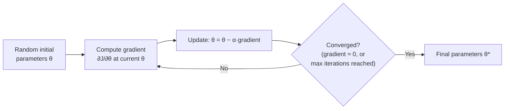

- In 2D, the derivative is casually called the **slope**.
- In 3D+ (multiple parameters), the vector of partial derivatives is called the **gradient**.
- If steps are taken with a fixed, poorly-chosen step size, the path can **zig-zag** inefficiently across the loss surface and take far longer to converge - this is exactly why the **learning rate** coefficient (commonly started around **0.01**) is introduced: it smooths and controls the step size, moving gradually along the slope in every dimension.
- **Local minima vs. global minima**: for non-convex loss surfaces, gradient descent can get stuck in a **local minimum** - a dip that looks like the bottom locally, but isn't the true lowest point (the **global minimum**) overall.

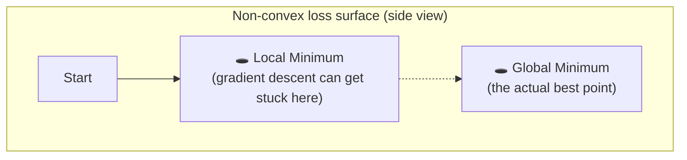

### 11.2 Types of Gradient Descent

| Type                                  | Update rule                                                               | Rows used per update                                                                                                            | Best for                                                   |
| ------------------------------------- | ------------------------------------------------------------------------- | ------------------------------------------------------------------------------------------------------------------------------- | ---------------------------------------------------------- |
| **Batch Gradient Descent**            | Uses **all** $M$ rows to compute one gradient update                      | $M \times N$ operations per single update (where $N$ = number of coefficients) - least used in practice due to cost             | Small, convex datasets; one update per epoch               |
| **Stochastic Gradient Descent (SGD)** | Uses **just one row** at a time to update                                 | $N$ operations per update, $M$ updates per epoch (so $M \times N$ total per epoch, but spread across many small, cheap updates) | Large, non-convex datasets - most used in practice         |
| **Mini-Batch Gradient Descent**       | Uses a **batch** (a fixed-size subset of rows, e.g. 32/64/128) per update | Between the two extremes above                                                                                                  | Medium-sized datasets - practical default in deep learning |

**Batch Gradient Descent** - for $M$ rows and $N$ coefficients, one full iteration needs $M \times N$ computations; multiplied further by learning rate/epoch count $O$, giving $M \times N \times O$ total operations across training.

- _Problems_: heavy computation time, and hardware may not even be able to fit all $M$ rows in memory at once for one calculation.

**Stochastic Gradient Descent** - updates row by row; each single-row update only needs $N$ derivative computations, and $M$ such updates happen per epoch (so still $M \times N$ total per epoch, but delivered as many small, cheap steps instead of one giant one).

- _Advantages_: never blocked by hardware/memory limits; faster in practice; the inherent randomness can actually help escape shallow local minima and reach a better (closer to global) minimum. Typically paired with a **learning schedule** - gradually shrinking the learning rate as training progresses, so steps get finer as the solution is approached.
- _Disadvantages_: the path to convergence is noisy/random - re-running training doesn't give the exact same result every time, just a similar one, since randomness is inherent to the row-sampling order.

**Mini-Batch Gradient Descent** - a practical middle ground, mixing the stability of batch GD with the speed/escape-ability of SGD; the standard choice for training deep learning models.

---

## 12. Bias–Variance Tradeoff and Regularization

### 12.1 Bias and Variance

- **Bias** - error from an algorithm being too simple to capture the true underlying pattern (systematic error even on training data).
- **Variance** - how much the model's predictions change if trained on a different sample of data (the gap between training-error behavior and testing-error behavior).

| Regime                  | Bias            | Variance | Description                                                                   |
| ----------------------- | --------------- | -------- | ----------------------------------------------------------------------------- |
| **Underfitting**        | High            | Low      | Model is too simple; performs poorly even on training data                    |
| **Good fit** (the goal) | Low             | Low      | Generalizes well - performs well on both training and unseen data             |
| **Overfitting**         | Low (near zero) | High     | Memorizes training data (including its noise); performs poorly on unseen data |

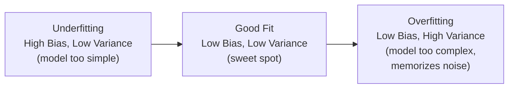

Fixes for overfitting/high variance: **regularization**, **bagging**, **boosting** (§19–22).

### 12.2 Why Regularization?

Regularization adds a **penalty term** to the loss function that discourages the model from assigning too much importance (too large a coefficient) to any single feature. A large coefficient on a feature means the prediction depends heavily on that one feature relative to the intercept/other features - which is exactly the signature of an overfit model. Regularization trades a small increase in bias for a larger decrease in variance - generally a good trade, and there's essentially no downside to including it as a safeguard.

Three standard flavors:

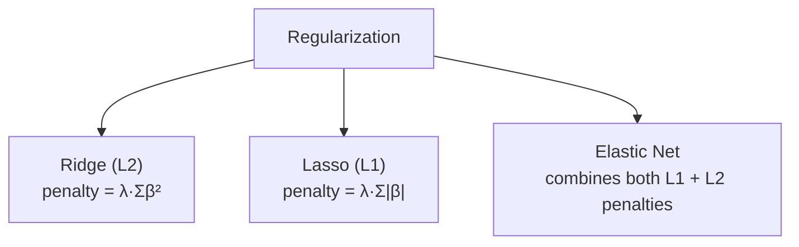

### 12.3 Ridge Regression (L2 Regularization)

$$
J(\boldsymbol\beta) = \sum_{i=1}^{n}(y_i-\hat y_i)^2 \;+\; \lambda\sum_{j=1}^{p}\beta_j^2
$$

- Adds the **sum of squared coefficients** to the loss.
- $\lambda$ (sometimes written $\alpha$ in scikit-learn) controls the regularization strength: $\lambda = 0$ recovers plain OLS; larger $\lambda$ shrinks coefficients more aggressively toward (but not exactly to) zero.
- Effect: **increases bias slightly, decreases variance** - a large coefficient (steep slope $m$) is characteristic of an overfit line; Ridge shrinks that slope toward a smaller, more conservative value compared to plain linear regression, trading a small amount of training fit for much better generalization. This generalizes cleanly to $n$-dimensional data (one $\beta_j^2$ penalty term per coefficient).

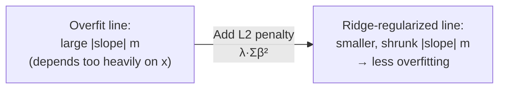

### 12.4 Lasso Regression (L1 Regularization)

$$
J(\boldsymbol\beta) = \sum_{i=1}^{n}(y_i-\hat y_i)^2 \;+\; \lambda\sum_{j=1}^{p}\lvert\beta_j\rvert
$$

- Adds the **sum of absolute coefficients** instead of squared coefficients.
- Key practical difference from Ridge: Lasso can shrink coefficients **all the way to exactly zero**, effectively performing automatic **feature selection** as a side effect of regularization (Ridge shrinks coefficients close to zero but essentially never exactly to zero).
- **Geometric intuition**: the L1 constraint region is a diamond (with sharp corners sitting exactly on the coordinate axes), while the L2 constraint region is a smooth circle/sphere. The loss function's contours are much more likely to first touch the L1 diamond exactly at one of its corners - i.e., where one coefficient is exactly zero - which is why Lasso naturally produces **sparse** solutions and Ridge does not.

### 12.5 Elastic Net Regression

$$
J(\boldsymbol\beta) = \sum_{i=1}^{n}(y_i-\hat y_i)^2 \;+\; \lambda_1\sum_{j=1}^{p}\lvert\beta_j\rvert \;+\; \lambda_2\sum_{j=1}^{p}\beta_j^2
$$

- Combines both penalties, giving a tunable blend of Ridge's stability and Lasso's automatic feature selection.
- Particularly useful when features are highly correlated with each other - plain Lasso tends to arbitrarily pick just one of a group of correlated features and zero out the rest, while Elastic Net tends to keep or drop correlated features together in a more stable way.

---

## 13. Logistic Regression

Despite the name, Logistic Regression is a **classification** algorithm - conceptually related to a single neuron in deep learning (it's literally the building block of a neural network layer). It can be understood from two angles: **geometric** (a separating line/hyperplane) and **probabilistic** (predicting class probability via the sigmoid function).

### 13.1 The Geometric Perspective - Perceptron Trick

We start with a **random line**: $ax + by + c = 0$ (not the $y = mx+c$ form - using the general form makes the "which side is a point on" test simple).

- Plug a point's $(x,y)$ into $ax+by+c$:
  - Result $> 0$ → point lies **above** the line
  - Result $< 0$ → point lies **below** the line
  - Result $= 0$ → point lies **on** the line
- Changing $c$ shifts the line **parallel** to itself (increasing $c$ shifts it down-left; decreasing $c$ shifts it up-right).
- Changing $a$ rotates the line about its intersection point with the y-axis; changing $b$ rotates it about its intersection point with the x-axis.

**Training loop (the Perceptron Trick):** in every epoch, pick a random point, check whether the current line classifies it correctly. If **not**, update the line's coefficients - using the _homogeneous_ point representation $(x, y, 1)$ - by simply subtracting (or adding, depending on the misclassification direction) that point's coordinates from the coefficient vector:

$$
(a,b,c)_{new} = (a,b,c)_{old} - (x, y, 1)
$$

or

$$
(a,b,c)_{new} = (a,b,c)_{old} + (x, y, 1)
$$

If correctly classified, leave the line as-is and move to the next random point.

**Disadvantage**: this stops the moment _every_ point is classified correctly - even if the line found isn't really the _best-separating_ line (it might sit awkwardly close to one class with almost no margin). It doesn't optimize for a proper margin between classes the way, say, an SVM does - this is one reason a properly regularized/optimized logistic regression, or an SVM, tends to outperform the naive perceptron trick.

### 13.2 Fixing the Perceptron Trick - Toward Proper Logistic Regression

Two upgrades are needed:

**1. Weight updates by "how wrong," not just "wrong or not."** Instead of a fixed-size nudge for every misclassified point, badly-misclassified points should pull the line more strongly, and only-slightly-misclassified points should pull it gently ("pull"); correctly classified points should still get a small "push" away, scaled by how confidently correct they are. This requires replacing the hard $+1/-1$ prediction with something continuous - a **probability**.

**2. Replace the step function with the Sigmoid function.**

$$
\sigma(z) = \frac{1}{1+e^{-z}}, \qquad z = ax+by+c
$$

The sigmoid squashes any real number $z$ into the range $(0,1)$ - interpretable as a **probability of belonging to the positive class**. The original decision line now represents the **0.5 probability contour**: points where $\sigma(z) = 0.5$; points above/on the positive side get probability $>0.5$, points on the other side get $<0.5$.

### 13.3 Maximum Likelihood Estimation and Cross-Entropy

A remaining problem: no matter how many epochs of random-point updates run, there's no guarantee every point in the dataset has actually been "seen" and correctly accounted for - random sampling doesn't guarantee full coverage. The fix: define an explicit **loss function** that scores an entire candidate line against the _whole_ dataset at once, and optimize that loss directly (rather than reacting point-by-point).

**Maximum Likelihood (ML)**: for every point, take the model's predicted probability of its **true** class (i.e., use $\hat p$ if the true label is positive, $1-\hat p$ if the true label is negative), and multiply all of these probabilities together across the whole dataset:

$$
L(\boldsymbol\beta) = \prod_{i=1}^{n} \hat{p}_i^{\,y_i}(1-\hat{p}_i)^{1-y_i}
$$

A **larger** product means a more accurate line overall - so training means finding the line that **maximizes** $L$.

**The numerical problem**: with potentially millions of rows, multiplying that many probabilities (each $<1$) together underflows to essentially zero. **Fix**: take the logarithm of everything, which turns the product into a sum:

$$
\log L(\boldsymbol\beta) = \sum_{i=1}^{n}\Big[y_i\log(\hat p_i) + (1-y_i)\log(1-\hat p_i)\Big]
$$

Since $\log$ of a value between 0 and 1 is always negative (and gets more negative the smaller the value), we flip the sign to get a positive quantity to **minimize** instead of a negative one to maximize - this negative-log-likelihood, summed over all points, is exactly the **Cross-Entropy / Log Loss**:

$$
J(\boldsymbol\beta) = -\sum_{i=1}^{n}\Big[y_i\log(\hat p_i) + (1-y_i)\log(1-\hat p_i)\Big]
$$

So: **maximizing likelihood** $\equiv$ **minimizing cross-entropy** - they're the same optimization, viewed from opposite signs.

### 13.4 Gradient Descent for Logistic Regression

There's no closed-form solution for logistic regression (unlike OLS for linear regression) - it must be solved with Gradient Descent. Using the chain rule, and the convenient fact that the sigmoid's own derivative is:

$$
\sigma'(z) = \sigma(z)\big(1-\sigma(z)\big)
$$

the gradient of the cross-entropy loss with respect to the coefficients works out to a strikingly clean matrix form:

$$
\nabla J(\boldsymbol\beta) = X^\top(\hat{\mathbf{y}} - \mathbf{y})
$$

giving the update rule:

$$
\boldsymbol\beta_{new} = \boldsymbol\beta_{old} - \alpha \cdot X^\top\big(\sigma(X\boldsymbol\beta_{old}) - \mathbf{y}\big)
$$

This is applied iteratively (batch/stochastic/mini-batch, exactly as in §11) until the cross-entropy loss stops decreasing meaningfully.

### 13.5 Softmax Regression (Multinomial Logistic Regression)

Generalizes logistic regression from 2 classes to $K > 2$ classes.

- **Conceptual (One-vs-Rest) view**: train one logistic regression classifier per class (each treating "this class" vs "all other classes" as a binary problem), compute a raw score $z_k$ for each class independently, then compare them. (Real softmax regression trains all classes' parameters jointly, but the one-vs-rest framing is a useful way to _think_ about what's happening.)
- **Softmax function** - converts a vector of raw class scores $z_1,\dots,z_K$ into a proper probability distribution over classes:

$$
P(y=k) = \frac{e^{z_k}}{\sum_{j=1}^{K}e^{z_j}}
$$

- The predicted class is simply the one with the highest resulting probability.
- **Loss function** - **Categorical Cross-Entropy**, the natural multi-class generalization of binary cross-entropy:

$$
J(\boldsymbol\beta) = -\sum_{i=1}^{n}\sum_{k=1}^{K} y_{i,k}\,\log(\hat p_{i,k})
$$

where $y_{i,k}=1$ if sample $i$'s true class is $k$, else $0$.

### 13.6 Polynomial Logistic Regression

Just as Polynomial Regression extends Linear Regression to curved _fits_, Polynomial Logistic Regression extends the (linear) decision _boundary_ into a curved one - by feeding polynomial-expanded features ($x, x^2, xy, y^2, \dots$) into the same sigmoid/softmax machinery, allowing non-linear decision boundaries.

### 13.7 Key Hyperparameters (scikit-learn `LogisticRegression`)

- `penalty` - `l1`, `l2`, `elasticnet`, or `none` (regularization type - same math as §12, applied to the log-loss instead of MSE)
- `C` - inverse of regularization strength (smaller `C` = stronger regularization)
- `solver` - the underlying optimization algorithm (`lbfgs`, `saga`, `liblinear`, etc.)
- `multi_class` - `ovr` (one-vs-rest) or `multinomial` (true softmax)

---

## 14. Classification Metrics

### 14.1 Accuracy

$$
\text{Accuracy} = \frac{\text{number of correct predictions}}{\text{total number of predictions}}
$$

**How much accuracy is "good"?** It's entirely context-dependent. A 99% accurate cancer-detection model can still be unacceptable, since even a 1% miss rate risks lives - near-100% may be the real bar. Conversely, an 80% accurate recommendation model (what to watch next, what meal to suggest) may be perfectly fine, since the cost of a wrong prediction is low.

**When accuracy is misleading**: on **imbalanced** datasets (§24) - a model that just always predicts the majority class can still score a high accuracy while being completely useless for the minority class.

### 14.2 Confusion Matrix

The confusion matrix breaks down _what kind_ of mistakes a classifier makes, not just how many - accuracy alone only reports a mistake **count**, not their **nature**.

|                     | Predicted Negative                      | Predicted Positive                     |
| ------------------- | --------------------------------------- | -------------------------------------- |
| **Actual Negative** | True Negative (TN)                      | False Positive (FP) - **Type I error** |
| **Actual Positive** | False Negative (FN) - **Type II error** | True Positive (TP)                     |

> Convention: in a cell label like "Actual, Predicted," the **first** word is the real/actual class, and the **second** word is the model's prediction.

$$
\text{Accuracy} = \frac{TP+TN}{TP+TN+FP+FN}
$$

For **multi-class** problems, the confusion matrix generalizes to an $K \times K$ grid (K = number of classes), with the diagonal holding correct predictions and every off-diagonal cell showing a specific confusion between two particular classes.

```mermaid
flowchart TD
    CM["Confusion Matrix"] --> TP["True Positive (TP)\nactual positive, predicted positive"]
    CM --> TN["True Negative (TN)\nactual negative, predicted negative"]
    CM --> FP["False Positive (FP) - Type I error\nactual negative, predicted positive"]
    CM --> FN["False Negative (FN) - Type II error\nactual positive, predicted negative"]
```

### 14.3 Precision, Recall and F1 Score

$$
\text{Precision} = \frac{TP}{TP+FP} \qquad \text{("Of everything I predicted positive, how much was actually positive?")}
$$

$$
\text{Recall (Sensitivity)} = \frac{TP}{TP+FN} \qquad \text{("Of everything actually positive, how much did I catch?")}
$$

There is an inherent **tradeoff**: pushing a model to catch more true positives (higher recall) typically also lets in more false positives (lower precision), and vice versa. Some problems (e.g. distinguishing cats from dogs, where both error types matter similarly) can't be judged well using precision or recall alone - this motivates a single combined score:

$$
\text{F1 Score} = 2\cdot\frac{\text{Precision}\times\text{Recall}}{\text{Precision}+\text{Recall}} \quad (\text{harmonic mean of Precision and Recall})
$$

The **harmonic mean** (rather than a simple arithmetic mean) is used deliberately - it punishes a large imbalance between precision and recall much more than a simple average would, so F1 stays low unless _both_ are reasonably good.

### 14.4 Multi-Class Precision, Recall and F1

Precision and Recall can be computed **per class** (treating that class as "positive" and all others as "negative"), then aggregated:

| Aggregation  | Formula intuition                                                                                                       |
| ------------ | ----------------------------------------------------------------------------------------------------------------------- |
| **Macro**    | Simple average of the per-class scores - treats every class equally regardless of how many samples it has               |
| **Weighted** | Average of per-class scores, weighted by each class's support (number of true instances) - accounts for class imbalance |

> Use **Macro** when classes are roughly balanced; use **Weighted** when classes are imbalanced, so a tiny minority class's poor score doesn't get equal billing with the majority class's excellent score (or vice versa, depending on what you want to emphasize).

Per-class F1 scores are then computed the same way, from each class's own precision/recall.

### 14.5 ROC Curve and AUC _(new - not present in the original notes)_

The **ROC (Receiver Operating Characteristic) curve** plots, at every possible probability decision threshold, the:

- **True Positive Rate (TPR)** = Recall = $\dfrac{TP}{TP+FN}$ (y-axis)
- **False Positive Rate (FPR)** = $\dfrac{FP}{FP+TN}$ (x-axis)

```mermaid
flowchart LR
    A["Threshold = 1.0\n(classify nothing as positive)\nTPR=0, FPR=0"] --> B["...sweep threshold\ndown to 0..."] --> C["Threshold = 0.0\n(classify everything as positive)\nTPR=1, FPR=1"]
```

- **AUC (Area Under the Curve)**: the area under the ROC curve, summarizing performance across _all_ thresholds into one number.
  - AUC = 1.0 → perfect classifier (always ranks a random positive higher than a random negative)
  - AUC = 0.5 → no better than random guessing (the diagonal line)
  - AUC < 0.5 → worse than random (predictions are inverted)
- Especially useful for **imbalanced datasets** and for choosing an optimal classification threshold rather than defaulting to 0.5 - e.g., moving the threshold to favor recall (catch more true positives) at some cost to precision, or vice versa, depending on which error type is more costly for the specific problem.

### 14.6 Log Loss (Cross-Entropy) as a Metric

Already derived in §13.3 as the _training_ loss for Logistic Regression - it also doubles as an **evaluation metric**, and unlike accuracy/F1, it directly rewards **well-calibrated probabilities** (being confidently right is rewarded more than being barely right; being confidently wrong is punished heavily), rather than just the final hard 0/1 decision.

---

## 15. Naive Bayes

_(Not present in the original notes at all - added in full, since it's a standard, exam-and-interview-essential classical ML algorithm.)_

A **probabilistic classifier** built directly on **Bayes' Theorem** (§2.2), with one simplifying ("naive") assumption that makes it extremely fast and surprisingly effective, especially for text classification.

### 15.1 Bayes' Theorem Recap

$$
P(y\mid x_1,\dots,x_n) = \frac{P(x_1,\dots,x_n\mid y)\,P(y)}{P(x_1,\dots,x_n)}
$$

We want $P(y \mid \text{features})$ - the probability of a class given the observed features - but that joint conditional is hard to estimate directly from data (there could be an enormous number of feature combinations). Bayes' theorem flips it around into quantities that are much easier to estimate from training data: $P(y)$ (how common is this class overall) and $P(x_i \mid y)$ (how likely is each individual feature, given the class).

### 15.2 The "Naive" Assumption

Naive Bayes assumes every feature is **conditionally independent** of every other feature, given the class label:

$$
P(x_1,\dots,x_n\mid y) \approx \prod_{i=1}^{n} P(x_i\mid y)
$$

This is almost never _exactly_ true in real data (features usually have some interdependence), but the approximation works remarkably well in practice - especially for text, where treating each word's presence as independent of the others (given the topic/class) still captures most of the useful signal.

Combining, the classifier picks the class $y$ that maximizes:

$$
\hat y = \arg\max_{y}\; P(y)\prod_{i=1}^{n}P(x_i\mid y)
$$

(The denominator $P(x_1,\dots,x_n)$ is dropped since it's the same constant for every candidate class, so it doesn't affect which class wins.)

```mermaid
flowchart TD
    In["New email with words:\n'win', 'free', 'prize'"] --> P1["Compute P(spam) × P('win'|spam)\n× P('free'|spam) × P('prize'|spam)"]
    In --> P2["Compute P(not-spam) × P('win'|not-spam)\n× P('free'|not-spam) × P('prize'|not-spam)"]
    P1 --> Compare{"Which product\nis bigger?"}
    P2 --> Compare
    Compare -- P1 bigger --> Spam["Classify: SPAM"]
    Compare -- P2 bigger --> NotSpam["Classify: NOT SPAM"]
```

### 15.3 Variants (by feature type)

| Variant                     | Assumes features are...            | Typical use                                            |
| --------------------------- | ---------------------------------- | ------------------------------------------------------ |
| **Gaussian Naive Bayes**    | Continuous, normally distributed   | General numeric tabular data                           |
| **Multinomial Naive Bayes** | Discrete counts (e.g. word counts) | Text classification (spam filtering, sentiment)        |
| **Bernoulli Naive Bayes**   | Binary (feature present/absent)    | Text classification with binary word-presence features |

### 15.4 Laplace (Additive) Smoothing

If a feature value/word never appeared with a given class in the training data, its estimated probability $P(x_i\mid y)$ would be exactly **zero** - which would zero out the _entire_ product no matter how strong the other evidence is. **Laplace smoothing** adds a small constant (commonly 1) to every count so no probability is ever exactly zero:

$$
P(x_i\mid y) = \frac{\text{count}(x_i, y) + \alpha}{\text{count}(y) + \alpha\cdot k}
$$

where $k$ is the number of possible values of $x_i$, and $\alpha$ (typically 1) is the smoothing strength.

### 15.5 Pros and Cons

**Advantages**

- Extremely fast to train and predict (just counting/averaging - no iterative optimization needed).
- Works well even with relatively little training data.
- Handles high-dimensional data well (e.g., thousands of word-features in text classification), where many other algorithms would struggle with the curse of dimensionality.
- A strong, cheap baseline for text classification (spam detection, sentiment analysis, topic classification).

**Disadvantages**

- The independence assumption is usually false in reality, which can hurt accuracy when features are strongly correlated.
- Can be outperformed by more flexible models (SVM, ensembles, deep learning) when enough data and compute are available.
- Estimated probabilities themselves aren't always well-calibrated (even when the final class _ranking_/prediction is correct).

---

## 16. K-Nearest Neighbours (KNN)

> "You are the average of the $k$ people you spend the most time with."

An **instance-based / lazy learning** algorithm (§1.6) - used for both classification and regression. To classify a new point, simply look at its $k$ nearest neighbours (by distance) in the training data and let them "vote" (classification: majority class; regression: mean/weighted mean of their values).

### 16.1 Algorithm

```mermaid
flowchart TD
    A["New query point arrives"] --> B["Compute distance from query point\nto every training point\n(commonly Euclidean distance)"]
    B --> C["Sort training points\nby distance, ascending"]
    C --> D["Take the k closest points"]
    D --> E{"Classification\nor Regression?"}
    E -- Classification --> F["Predict the majority class\namong the k neighbours"]
    E -- Regression --> G["Predict the mean (or distance-weighted mean)\nof the k neighbours' values"]
```

### 16.2 Choosing $k$

| Approach             | How                                                                                                                         | Tradeoff                                                               |
| -------------------- | --------------------------------------------------------------------------------------------------------------------------- | ---------------------------------------------------------------------- |
| **Heuristic**        | $k \approx \sqrt{n}$ (n = number of training rows); avoid even values of $k$ to prevent tie votes in binary classification  | Fast, simple, no guarantee of being optimal                            |
| **Cross-validation** | Try several candidate $k$ values, evaluate each via cross-validation, keep whichever $k$ gives the best validation accuracy | More reliable, but computationally expensive - essentially brute force |

### 16.3 Decision Surface

The **decision surface/boundary** of a KNN model can be visualized by overlaying a fine grid ("mesh grid") of points across feature space, classifying each grid point, and coloring the plot accordingly (the `mlxtend` library provides ready-made helpers for this) - this automatically reveals the shape of the boundary the model has implicitly learned.

### 16.4 Overfitting and Underfitting in KNN

- **Small $k$** (e.g. $k=1$) → the model follows the training data extremely closely, including its noise → **overfitting** (a single mislabeled or noisy point can flip predictions of everything near it - a jagged, overly-specific decision boundary).
- **Large $k$** → the model averages over a wide neighbourhood, smoothing out detail → **underfitting** if $k$ is too large (can even wash out real class boundaries entirely).

### 16.5 Limitations of KNN

- **Lazy learning** - all the computational work happens at prediction time (distance to every stored point), not training time; so _training_ is essentially instant, but _prediction_ is slow, especially for large datasets.
- **Curse of dimensionality** (§9.1) - distance metrics become less meaningful in high-dimensional space, so KNN's core assumption (nearby points are similar) can break down badly.
- **Sensitive to outliers** - a single odd neighbour can flip a prediction.
- **Requires comparable feature scales** - since it relies purely on distance, one feature with a much larger numeric range will dominate the distance calculation unless features are scaled first (§6.1).
- **Sensitive to imbalanced datasets** - majority-class points will simply dominate most neighbourhoods.
- **Poor for inference/interpretation** - KNN is a "black box" in the sense that it can't tell you _how_ or _why_ a feature influences the prediction (unlike, say, a linear model's coefficients or a decision tree's splits) - it only tells you a final prediction.

> To address KNN's weaknesses around scale-sensitivity, arbitrary cluster shapes and interpretability, two natural next algorithms to study are **Hierarchical Clustering** and **DBSCAN** (§23) - both take a different, density/structure-based approach to grouping similar points.

---

## 17. Support Vector Machines (SVM)

_(Not present in the original notes - added in full, since SVM is one of the core classical classification/regression algorithms.)_

### 17.1 The Core Idea - Maximum Margin Classifier

Where the Perceptron Trick (§13.1) stops as soon as _any_ separating line is found, SVM explicitly searches for the **one line/hyperplane that maximizes the margin** - the distance between the decision boundary and the nearest point of _either_ class.

```mermaid
flowchart TD
    subgraph SVM["SVM decision boundary"]
        direction TB
        Pos["Positive class points"]
        Neg["Negative class points"]
        H["Hyperplane: w·x + b = 0"]
        M1["Margin boundary +1:\nw·x + b = 1"]
        M2["Margin boundary −1:\nw·x + b = −1"]
    end
    Pos -.closest points define margin.-> M1
    Neg -.closest points define margin.-> M2
    H -.equidistant between.-> M1
    H -.equidistant between.-> M2
```

- The hyperplane: $\mathbf{w}\cdot\mathbf{x} + b = 0$.
- The points closest to the boundary - the ones that actually "support"/define the margin - are called **Support Vectors**; every other point could be removed without changing the boundary at all.
- The width of the margin is $\dfrac{2}{\|\mathbf{w}\|}$, so **maximizing the margin = minimizing $\|\mathbf{w}\|$** (equivalently, minimizing $\frac{1}{2}\|\mathbf{w}\|^2$, which is smoother for optimization), subject to every point being correctly classified with margin at least 1:

$$
\min_{\mathbf{w}, b} \; \frac{1}{2}\|\mathbf{w}\|^2 \qquad \text{subject to} \quad y_i(\mathbf{w}\cdot\mathbf{x}_i + b) \ge 1 \;\; \forall i
$$

### 17.2 Soft Margin - Handling Non-Perfectly-Separable Data

Real data is rarely perfectly linearly separable. **Soft margin SVM** introduces slack variables $\xi_i \ge 0$ that allow some points to violate the margin (or even be misclassified), penalized by a regularization parameter $C$:

$$
\min_{\mathbf{w},b,\xi}\; \frac{1}{2}\|\mathbf{w}\|^2 + C\sum_{i=1}^n \xi_i \qquad \text{subject to} \quad y_i(\mathbf{w}\cdot\mathbf{x}_i+b)\ge 1-\xi_i,\;\; \xi_i \ge 0
$$

- **Large $C$**: heavily penalizes margin violations → narrower margin, fits training data closely → risk of **overfitting**.
- **Small $C$**: tolerates more violations → wider margin, smoother boundary → risk of **underfitting**.

This is directly analogous to the bias–variance tradeoff (§12): $C$ plays a role similar to an inverse regularization strength.

### 17.3 The Kernel Trick - Handling Non-Linear Data

When classes aren't linearly separable in the original feature space, SVM can implicitly map data into a **higher-dimensional space** where a linear separator _does_ exist - without ever explicitly computing that expensive high-dimensional transformation. This is the **kernel trick**: replace the plain dot product $\mathbf{x}_i \cdot \mathbf{x}_j$ with a **kernel function** $K(\mathbf{x}_i, \mathbf{x}_j)$ that computes the equivalent of a dot product _as if_ the data had been transformed, at a fraction of the cost.

```mermaid
flowchart LR
    Low["Data not linearly separable\nin original (low-D) space"] -->|"Kernel function K(xᵢ, xⱼ)\n(implicit mapping φ)"| High["Effectively separable\nby a hyperplane\nin a higher-dimensional space"]
```

| Kernel                                     | Formula                                                                     | Use case                                                            |
| ------------------------------------------ | --------------------------------------------------------------------------- | ------------------------------------------------------------------- |
| **Linear**                                 | $K(\mathbf{x}_i,\mathbf{x}_j)=\mathbf{x}_i\cdot\mathbf{x}_j$                | Data is already (roughly) linearly separable                        |
| **Polynomial**                             | $K(\mathbf{x}_i,\mathbf{x}_j)=(\mathbf{x}_i\cdot\mathbf{x}_j + c)^d$        | Curved, polynomial-shaped boundaries                                |
| **RBF (Radial Basis Function / Gaussian)** | $K(\mathbf{x}_i,\mathbf{x}_j)=\exp(-\gamma\|\mathbf{x}_i-\mathbf{x}_j\|^2)$ | Most common default; handles complex, arbitrarily-shaped boundaries |

- `gamma` (RBF kernel): controls how far the influence of a single training point reaches - high gamma → only very close points matter (tighter, more complex boundary, overfitting risk); low gamma → far-away points matter too (smoother boundary, underfitting risk).

### 17.4 SVM for Regression (SVR)

The same margin idea flips for regression: instead of maximizing separation between classes, **SVR** tries to fit as many points as possible **within** a margin of width $\epsilon$ around the predicted function, only penalizing points that fall _outside_ that tolerance tube.

### 17.5 Pros and Cons

**Advantages**

- Effective in high-dimensional spaces, even when the number of features exceeds the number of samples.
- The kernel trick lets it capture complex, non-linear boundaries.
- Memory-efficient at prediction time (decision depends only on the support vectors, not the whole training set).

**Disadvantages**

- Doesn't scale well to very large datasets (training complexity grows faster than linearly with sample count).
- Choosing the right kernel and tuning `C`/`gamma` requires careful hyperparameter search (§25).
- Doesn't directly output class probabilities (though scikit-learn can approximate them via extra internal calibration).
- Less interpretable than a linear model or a single decision tree.

---

## 18. Decision Trees

A Decision Tree is essentially a **nested if-else statement** that the algorithm learns on its own - rather than a human hand-coding every branching rule, the ML algorithm decides which feature to split on and at what threshold, at every step.

```mermaid
flowchart TD
    Root["Root Node\n(all training data)"] -->|condition A true| N1["Internal Node"]
    Root -->|condition A false| N2["Internal Node"]
    N1 -->|condition B true| L1["Leaf: Class 1"]
    N1 -->|condition B false| L2["Leaf: Class 2"]
    N2 -->|condition C true| L3["Leaf: Class 1"]
    N2 -->|condition C false| L4["Leaf: Class 2"]
```

- The topmost node is the **root**; terminal nodes (with no further splits) are **leaves**.
- A fun, intuitive real-world analogy: the "Akinator" character-guessing game, which narrows down a character purely through a sequence of yes/no questions - exactly the same structure as a decision tree.

### 18.1 How Splits Are Chosen - Entropy and Information Gain

**Entropy** measures the "impurity"/disorder of a set of labels - how mixed-up the classes are:

$$
H(S) = -\sum_{i=1}^{c} p_i \log_2(p_i)
$$

where $p_i$ is the proportion of class $i$ in set $S$.

- $H(S) = 0$ → the node is perfectly pure (only one class present).
- $H(S) = 1$ (for binary classification, log base 2) → maximum impurity - classes are perfectly 50/50 mixed.
- **More knowledge (about the class, from a split) → less entropy.** A good split is one that reduces entropy the most.

**Information Gain** - the actual quantity used to _choose_ which feature/threshold to split on: the reduction in entropy achieved by a split.

$$
IG(S, A) = H(S) - \sum_{v \in \text{values}(A)} \frac{|S_v|}{|S|}H(S_v)
$$

The tree picks, at every node, the feature and threshold that **maximizes information gain** - i.e., produces the purest possible child nodes.

### 18.2 Gini Impurity

A computationally cheaper alternative to entropy (no logarithms needed), used by default in many implementations (including scikit-learn's default):

$$
\text{Gini}(S) = 1 - \sum_{i=1}^{c} p_i^2
$$

- Behaves almost identically to entropy in practice - both are 0 for a pure node and peak at maximum impurity, and both lead trees to make very similar splitting decisions.
- Gini is slightly faster to compute (no logarithm), which is why it's the more common default.

```mermaid
flowchart LR
    A["Node with class proportions p"] --> B["Entropy: −Σp·log₂(p)\n(peaks at 1.0 for binary, 50/50 split)"]
    A --> C["Gini: 1 − Σp²\n(peaks at 0.5 for binary, 50/50 split)"]
    B -.both measure impurity,\nboth minimized by tree splits.-> C
```

### 18.3 Hyperparameters and Overfitting/Underfitting

Decision Trees split the feature space using cuts **parallel to the axes** (in 2D, straight vertical/horizontal cuts; in 3D+, these become axis-aligned "hyperplanes").

- **`max_depth` = None (unlimited)** → the tree keeps splitting until every leaf is pure (or has just one point) - this **overfits** badly: it will carve out a tiny region around a single noisy/mislabeled point just to classify it "correctly," even though every neighbouring point around it belongs to a different class (the same overfitting failure mode seen in KNN with $k=1$).
- **`max_depth` too small** → the tree stops splitting too early, before it's captured the real structure in the data → **underfitting**.
- Other common hyperparameters that control this same tradeoff: `min_samples_split`, `min_samples_leaf`, `max_leaf_nodes`, `max_features`.

```mermaid
flowchart LR
    Under["max_depth too small\n→ Underfitting\n(boundary too simple)"] --> Good["max_depth tuned well\n→ Good generalization"] --> Over["max_depth = None\n→ Overfitting\n(boundary chases every noisy point)"]
```

### 18.4 Decision Tree Regressor (CART)

Decision Trees aren't limited to classification - a **Decision Tree Regressor** predicts a _numerical_ value at each leaf (typically the **mean** of the target values of training points that land in that leaf), and chooses splits to minimize **variance** (rather than entropy/Gini) within each resulting child node. This general "Classification And Regression Tree" framework is commonly abbreviated **CART**.

### 18.5 Visualizing Decision Trees

The **`dtreeviz`** library produces rich, readable visualizations of a trained decision tree - showing the actual splits, class distributions at each node, and the decision path for an individual prediction - far more informative than scikit-learn's default plain tree diagram.

### 18.6 Feature Importance

Scikit-learn's decision tree exposes a `feature_importances_` array - how much each feature contributed to reducing impurity across all its splits, normalized to sum to 1. This becomes especially useful (and more stable) when averaged across many trees, as in Random Forest (§20.4).

### 18.7 Pros and Cons

**Advantages**

- Highly interpretable - the decision path can be read and explained directly.
- No feature scaling required.
- Naturally handles both numerical and categorical features, and non-linear relationships.

**Disadvantages**

- Prone to overfitting if left unconstrained.
- Unstable - small changes in training data can produce a very different tree (high variance) - this instability is exactly what motivates **ensembling** many trees together (§19–21).
- Biased toward features with many distinct values/splits if not handled carefully.

---

## 19. Ensemble Learning

**Ensemble Learning** combines predictions from more than one model to produce a single, usually more accurate and more robust, final prediction.

> "Wisdom of the crowd" - a large enough, sufficiently varied group of guesses tends to approximate the right answer even if no individual guess is perfect. (Analogy from the notes: this is conceptually similar to how a system like Grok blending multiple underlying models - OpenAI's, DeepSeek's, and others - can produce a better aggregate answer than any single one alone.) The more **variety** in the underlying models and/or the data they each see, the more accurate the combined prediction tends to be - there should be genuine diversity among the base models, not near-duplicates of each other.

### 19.1 Types of Ensemble Learning

```mermaid
flowchart TD
    E["Ensemble Learning"] --> V["Voting Ensemble\ndifferent algorithms,\nsame full dataset"]
    E --> B["Bagging\n(Bootstrap Aggregating)\nsame algorithm,\ndifferent random data subsets"]
    E --> BO["Boosting\nsame (weak) algorithm,\ntrained sequentially,\neach fixing the previous one's errors"]
    E --> S["Stacking\ncombines predictions of base models\nusing a meta-model, weighted by\neach base model's own reliability"]

    B --> RF["Random Forest\n(base model = Decision Tree)"]
    BO --> AB["AdaBoost"]
    BO --> GB["Gradient Boosting"]
    BO --> XGB["XGBoost"]
```

- **Voting Ensemble** - base models can be _different_ algorithms entirely (e.g. SVM, Logistic Regression, Decision Tree), all trained on the **same** data; final prediction by vote/average.
- **Bagging (Bootstrap Aggregating)** - base models are all the **same** algorithm, but each is trained on a different **random subset** of the data (sampled with replacement - "bootstrapping"), so variety comes from the data, not the algorithm. **Random Forest** is the special case where the base model is specifically a Decision Tree.
- **Boosting** - base models are trained **sequentially** (not in parallel like bagging): each new model is trained specifically to fix the mistakes of the previous one(s), and all models see the same full dataset (but weighted differently, or trained on residuals). Examples: **AdaBoost**, **Gradient Boosting**, **XGBoost**.
- **Stacking** - similar to voting, but rather than a simple average/majority vote, the base models' predictions are fed as _inputs_ into a further "meta-model" which learns how to best combine them, effectively learning custom weights for each base model's reliability.

### 19.2 Benefits of Ensembling

- Improved overall performance/accuracy.
- Lower variance **and** lower bias simultaneously - a rare combination most single models can't achieve on their own (see the Bagging/Random Forest discussion in §20 for exactly _why_ this works mathematically).
- Increased robustness - less sensitive to noise/outliers/one model's blind spots.

### 19.3 Voting Ensemble - Why Does Accuracy Improve?

Combining predictions only helps under two conditions:

1. **Each base model must be better than random guessing** - a bare-minimum accuracy threshold (commonly quoted as at least 51% for binary classification) is required, or the ensemble makes things _worse_, not better.
2. **The base models' errors should be reasonably independent of each other** - if all base models tend to make the _same_ mistakes on the _same_ points, voting gains you nothing; the wisdom-of-the-crowd effect specifically relies on different models' errors _not_ being correlated.

If those two conditions hold, combining many slightly-better-than-random, largely-independent models can push accuracy up substantially - mathematically, this is the same intuition behind the **Condorcet Jury Theorem**: as you add more independent "voters" who are each individually more likely right than wrong, the probability that the _majority_ vote is correct increases, approaching 100% as the number of independent voters grows. Conversely, if the base learners are each **worse** than 51% accurate, adding more of them makes the ensemble _systematically_ wrong even more often - the same math working in reverse.

### 19.4 Voting Types

- **Hard voting** (default, and usually the better choice in practice) - each base model casts one vote for its predicted class; the majority class wins.
- **Soft voting** - instead of a hard class vote, each base model outputs a class _probability_; the ensemble averages the probabilities across models for each class, and picks whichever class has the highest averaged probability. This can outperform hard voting when the base models produce well-calibrated probabilities.

---

## 20. Bagging and Random Forest

### 20.1 Bagging (Bootstrap Aggregating)

$$
\text{Bagging} = \text{Bootstrapping} + \text{Aggregating}
$$

```mermaid
flowchart TD
    D["Original Training Data"] -->|random sample\nwith replacement| S1["Bootstrap Sample 1"]
    D -->|random sample\nwith replacement| S2["Bootstrap Sample 2"]
    D -->|random sample\nwith replacement| S3["Bootstrap Sample 3"]
    S1 --> M1["Model 1\n(same algorithm)"]
    S2 --> M2["Model 2\n(same algorithm)"]
    S3 --> M3["Model 3\n(same algorithm)"]
    M1 --> Agg["Aggregate\n(vote / average)"]
    M2 --> Agg
    M3 --> Agg
    Agg --> Final["Final Prediction"]
```

- Take $n$ copies of the **same** type of model. Train each one on a different random subset of the original data (**bootstrapped** - sampled _with replacement_, so some rows may repeat within a sample and some may be left out entirely).
- Since each copy sees slightly different data, each ends up behaving slightly differently - that diversity is exactly what makes the ensemble stronger than any single copy.

**Recall (§12.1)**: bias = poor performance on training data; variance = the gap between training and testing performance (instability across different data samples). Most single ML models can only really achieve one of:

- low variance / high bias, **or**
- high variance / low bias.

**Bagging, when tuned well, can deliver _both_ low bias and low variance simultaneously** - a rare combination - which is why it's such a reliable, consistent ensembling method.

### 20.2 Random Forest

**Random Forest** is bagging specifically with **Decision Trees** as the base model, plus one extra source of randomness.

- "**Forest**" = a group of trees. "**Random**" = the bagging/bootstrapping process.
- One of the most reliable go-to algorithms in classical ML - it typically performs well even with **little to no hyperparameter tuning**.

**Types of sampling used**

- **Row sampling** - bootstrapping rows (as in plain bagging).
- **Column sampling** (a.k.a. feature sampling) - also randomly sampling which _features_ are considered.
- **Combined sampling** - both row and column sampling together (this combination is what Random Forest specifically uses).
- Sampling can be done **with or without replacement**.

**Why does it fix the bias/variance problem?** Any single fully-grown decision tree is low-bias/high-variance (it can fit training data almost perfectly, but is unstable - different data gives a very different tree). Averaging predictions across many such trees, each trained on different random row+column subsets:

- **Reduces variance** - individual trees' noise/instability gets "voted out" once you average over enough of them; each tree's idiosyncratic overfitting gets diluted.
- **Also keeps bias low** - since each individual tree is still a low-bias (fully or near-fully grown) tree.

The net effect: **low bias AND low variance**, which is exactly why Random Forest is so consistently strong.

#### Bagging (with Decision Tree base model) vs. Random Forest - what's actually different?

|                              | Bagging (base model = Decision Tree)                                                                                    | Random Forest                                                                                                        |
| ---------------------------- | ----------------------------------------------------------------------------------------------------------------------- | -------------------------------------------------------------------------------------------------------------------- |
| Base model restriction       | Can be _any_ model type                                                                                                 | Base model is _always_ Decision Tree                                                                                 |
| Feature sampling granularity | **Tree-level** - a fixed random subset of features is chosen once per tree, and used for _every_ split within that tree | **Node-level** - a _new_ random subset of features is drawn again at _every single split_, even within the same tree |

So, even though both might sample the same _number_ of features per split, in plain Bagging a given tree is "locked into" whichever columns it started with; in Random Forest, every node throughout the tree gets its own fresh random draw of candidate features - adding an extra layer of decorrelation between trees (and even between branches of the same tree).

### 20.3 Out-of-Bag (OOB) Evaluation

Because bootstrapping samples **with replacement**, on average only about **63%** of the original rows end up in any given bootstrap sample - meaning roughly **37%** of rows are left out ("out-of-bag") for each individual tree. This ~37% figure is a well-known mathematical result (it converges to $1 - 1/e \approx 0.368$ as sample size grows).

```mermaid
flowchart LR
    D["Original dataset\n(100% of rows)"] --> InBag["~63% of rows\nend up IN this tree's\nbootstrap sample"]
    D --> OOB["~37% of rows\nare OUT-OF-BAG\nfor this tree\n(never sampled)"]
    OOB --> Val["Used as a free\nvalidation set for that tree\n(no separate holdout needed!)"]
```

Since these left-out rows were never seen by that particular tree, they can be used as a **free validation set** for it - the model's **OOB score** aggregates this across all trees, giving a reasonably reliable performance estimate _without_ needing to carve out a separate validation split from the data.

### 20.4 Feature Importance in Random Forest

Every individual decision tree in the forest computes its own feature-importance array (§18.6 - how much each feature reduced impurity across its splits). **Averaging these arrays across all trees in the forest** gives the overall Random Forest feature importance - generally far more stable and trustworthy than the feature importance from any single tree, precisely because it's averaged over many different bootstrapped views of the data.

### 20.5 Grid Search CV and Randomized Search CV

Two standard approaches for **hyperparameter tuning** (choosing things like `max_depth`, `n_estimators`, `max_features`, etc.) - covered in full generality in §25, but introduced here since Random Forest has enough hyperparameters that tuning them matters:

- **Grid Search CV** - exhaustively tries **every** combination of specified hyperparameter values; guaranteed to find the best combination _within the grid you specified_, but the number of combinations (and thus training time) explodes combinatorially - practical mainly for smaller datasets/search spaces.
- **Randomized Search CV** - samples a fixed number of **random** combinations from the hyperparameter space instead of trying all of them; won't guarantee the absolute best combination, but gets close to the best in a small fraction of the time - the practical choice for larger datasets/search spaces.

---

## 21. Boosting - AdaBoost, Gradient Boosting, XGBoost

Unlike bagging (parallel, independent models), **boosting** trains models **sequentially** - each new model is built specifically to correct the mistakes of the ensemble built so far.

```mermaid
flowchart LR
    D["Training Data"] --> M1["Model 1\n(weak learner)"]
    M1 -->|"errors / residuals"| M2["Model 2\n(focuses on Model 1's mistakes)"]
    M2 -->|"errors / residuals"| M3["Model 3\n(focuses on Model 2's mistakes)"]
    M3 --> Sum["Weighted sum of\nall models = Final Prediction"]
```

### 21.1 AdaBoost (Adaptive Boosting)

- Used almost exclusively within classical ML - largely superseded in practice by deep learning and other ensemble methods (like Random Forest/Gradient Boosting) for most modern applications, but foundational for understanding boosting.
- **Weak learners**: models whose accuracy is only _just_ above 50% (chance level) - contrasted with **strong learners** (~85–95%+ accuracy). Weak learners are combined, many at a time, to build a strong overall ensemble.
- **Decision stumps**: the most common type of weak learner used in AdaBoost - a decision tree restricted to just **one single split** (`max_depth=1`).
- **Label convention**: unlike typical binary classification (0/1), AdaBoost uses **+1** for the positive class and **−1** for the negative class (never 0) - this convention makes the weighted-voting math below work out cleanly.

**Algorithm**

```mermaid
flowchart TD
    A["Initialize: give every training point\nan equal weight = 1/n"] --> B["Train a weak learner\n(decision stump) on the weighted data"]
    B --> C["Compute the stump's\nweighted error rate ε"]
    C --> D["Compute the stump's vote weight:\nα = 0.5·ln((1−ε)/ε)"]
    D --> E["Increase the weight of\nmisclassified points,\ndecrease weight of correct ones"]
    E --> F["Normalize weights\nso they sum to 1"]
    F --> G{"More stumps\nto train?"}
    G -- Yes --> B
    G -- No --> H["Final prediction:\nsign( Σ αₜ · hₜ(x) )"]
```

- Every submodel's vote is weighted by its own **alpha** ($\alpha$) - a more accurate stump gets a bigger say in the final vote:
  $$
  \alpha_t = \frac{1}{2}\ln\!\left(\frac{1-\varepsilon_t}{\varepsilon_t}\right)
  $$
  where $\varepsilon_t$ is that stump's weighted misclassification error. A stump with low error gets a **large** $\alpha$ (more voting power); a stump barely better than random gets $\alpha \approx 0$.
- After each stump, misclassified points get their weight **increased** (so the _next_ stump is forced to pay more attention to them), and correctly-classified points get their weight **decreased**. This is the key contrast with bagging: **in bagging, all points matter equally always; in AdaBoost, wrongly-predicted points matter progressively more** as boosting rounds proceed.
- A split is only made when there's genuine **information gain** (entropy reduction) - same splitting principle as regular decision trees (§18.1), just restricted to a single split for a stump.
- The `learning_rate` hyperparameter in scikit-learn's `AdaBoostClassifier` scales each stump's $\alpha$ before combining - smaller values shrink each stump's individual influence, requiring more stumps but often generalizing better.

### 21.2 Bagging vs. Boosting - Side by Side

|                              | Bagging                                                                 | Boosting                                                                  |
| ---------------------------- | ----------------------------------------------------------------------- | ------------------------------------------------------------------------- |
| Base model bias/variance     | **Low bias, high variance** models (e.g. fully-grown decision trees)    | **High bias, low variance** models (e.g. decision stumps - shallow trees) |
| Training                     | **Parallel** - all base models trained independently and simultaneously | **Sequential** - each model depends on the errors of the previous one(s)  |
| Data given to each model     | Different random subset (bootstrapped) per model                        | Same full dataset every time (but re-weighted, or fit to residuals)       |
| Voting weight of base models | **Equal** weight for every submodel                                     | **Unequal** - each submodel's vote is weighted by its own accuracy/alpha  |

### 21.3 Gradient Boosting

Gradient Boosting is a **sequential, stage-wise loss-minimization** boosting algorithm, where the "sub-models" are typically small decision trees.

#### Gradient Boosting for Regression

```mermaid
flowchart TD
    F0["Leaf/Model 0:\npredict the simple MEAN\nof the target for every row"] --> R1["Compute residuals:\nresidual = actual − predicted"]
    R1 --> T1["Train a small tree to predict\nthese residuals (not the original target!)"]
    T1 --> U1["Update prediction:\nF₁ = F₀ + learning_rate × T₁'s prediction"]
    U1 --> R2["Compute NEW residuals\nagainst updated prediction F₁"]
    R2 --> T2["Train another small tree\non these new residuals"]
    T2 --> Loop["...repeat for many stages,\nresiduals shrinking toward zero\nwith each stage..."]
```

- Model 0 (the first "leaf") predicts, for every row, simply the **mean** of the target column.
- Every subsequent leaf/tree doesn't predict the original target - it predicts the **residual** (leftover error) of the model built so far: $r_i = y_i - F_{m-1}(x_i)$.
- Each new tree's prediction is added to the running total, scaled by a **learning rate** $\eta$ (crucial for preventing overfitting - without shrinkage, the model can chase residuals too aggressively):

$$
F_m(x) = F_{m-1}(x) + \eta \cdot h_m(x)
$$

- This continues, stage by stage, until residuals shrink close to zero (or a maximum number of estimators is reached).

#### Gradient Boosting for Classification

Conceptually identical, with two adaptations:

- The starting "Model 0" prediction uses the **log(odds)** of the target class instead of a plain mean:
  $$
  F_0 = \log\left(\frac{p}{1-p}\right)
  $$
- At every stage, log-odds are converted back to a probability via the sigmoid function (§13.2), and the residual used to train the next tree is the difference between the actual label (0 or 1) and this predicted probability.

#### AdaBoost vs. Gradient Boosting

|                      | AdaBoost                                                                                    | Gradient Boosting                                                                                             |
| -------------------- | ------------------------------------------------------------------------------------------- | ------------------------------------------------------------------------------------------------------------- |
| Base learner size    | Decision **stumps** (1 split)                                                               | Slightly deeper trees - typically **8 to 32 leaf nodes**                                                      |
| Learning rate        | Same effective rate applied uniformly                                                       | Different effective contribution per model, via explicit shrinkage - not simply "one learner, one equal vote" |
| Weighting philosophy | Each stump gets an explicit alpha vote weight, driven by reweighting misclassified _points_ | Learns by directly fitting residuals/gradients - not a simple democratic vote at all                          |

### 21.4 Additive Modelling - the Math Underneath Boosting

Real-world target functions are rarely expressible as one simple linear or polynomial function - in reality, they're better approximated as a **sum of many simpler functions**, each correcting for what the sum-so-far still gets wrong:

$$
F(x) = \sum_{m=1}^{M} \eta \cdot h_m(x)
$$

This framework - building up a complex function as an additive combination of many simple ones - is called **Additive Modelling**, and it's the mathematical foundation that boosting (both AdaBoost and Gradient Boosting) is built on.

### 21.5 XGBoost (Extreme Gradient Boosting) _(expanded - only named in original notes)_

XGBoost is an engineered, regularized, and heavily-optimized implementation of the gradient boosting idea, widely used in competitive ML and production systems.

**Key ideas beyond plain Gradient Boosting:**

- **Regularized objective** - the loss function explicitly includes a regularization term penalizing tree complexity (number of leaves, and the magnitude of leaf output values), directly fighting overfitting:
  $$
  \text{Obj} = \sum_{i=1}^n l(y_i, \hat y_i) + \sum_{t} \Omega(h_t), \qquad \Omega(h) = \gamma T + \frac{1}{2}\lambda\sum_{j=1}^{T}w_j^2
  $$
  where $T$ is the number of leaves in a tree, $w_j$ are the leaf output values, and $\gamma,\lambda$ are regularization hyperparameters.
- **Second-order (Newton) approximation** - instead of only using the gradient (first derivative) of the loss like plain Gradient Boosting, XGBoost also uses the **Hessian** (second derivative), giving a more accurate approximation of the loss at each step and enabling closed-form-per-leaf optimal outputs.
- **Similarity Score / Gain** - a closed-form formula (derived from the regularized objective above) scores how good a potential split is, allowing very efficient split-finding:
  $$
  \text{Similarity} = \frac{(\sum \text{residuals})^2}{\sum(\text{Hessian terms}) + \lambda}, \qquad \text{Gain} = \text{Sim}_{left} + \text{Sim}_{right} - \text{Sim}_{parent}
  $$
- **Built-in handling of missing values** - learns a default direction to send missing values at each split, rather than requiring imputation beforehand.
- **System-level optimizations** - histogram-based approximate split-finding (bucketing continuous features for speed), parallelized tree construction, cache-aware access patterns, and out-of-core computation for data too large for memory.
- Generally faster and more accurate than plain Gradient Boosting out-of-the-box, and includes L1/L2 regularization knobs directly (`reg_alpha`, `reg_lambda`), plus its own learning rate (`eta`), max depth, and subsampling controls (row and column subsampling, similar in spirit to Random Forest's sampling).

---

## 22. Stacking and Blending

Both are ways of combining multiple **different** base models via a **meta-model**, rather than a simple vote/average.

```mermaid
flowchart TD
    D["Training Data"] --> M1["Base Model 1\n(e.g. KNN)"]
    D --> M2["Base Model 2\n(e.g. SVM)"]
    D --> M3["Base Model 3\n(e.g. Decision Tree)"]
    M1 --> Preds["Base models' predictions\nbecome new engineered features"]
    M2 --> Preds
    M3 --> Preds
    Preds --> Meta["Meta-Model\n(e.g. Logistic Regression)\nlearns how to best combine them"]
    Meta --> Final["Final Prediction"]
```

### 22.1 Stacking

- Multiple heterogeneous base models (**level-0 models**) are trained on the training data.
- Their **predictions** (not the raw features) become the input features for a second-stage **meta-model** (**level-1 model**), which learns the optimal way to combine them.
- To avoid leakage (the meta-model "cheating" by seeing predictions from models that already saw those exact training rows), stacking is typically done using **k-fold predictions**: each base model's predictions on a given fold come from a version of that model trained on the _other_ folds only - very similar in spirit to cross-validation (§25.1).
- Can be extended to multiple layers (a base layer, then several meta-layers) - though this quickly adds complexity and overfitting risk for diminishing returns.

### 22.2 Blending

A simpler, faster approximation of stacking:

- Split training data into a **train** set and a separate **holdout** set.
- Train the base models only on the **train** set.
- Use the base models to predict on the **holdout** set - these holdout predictions (plus, optionally, the original holdout features) become the training data for the meta-model.
- Faster and simpler than full k-fold stacking, but uses less data overall for training the meta-model (since a chunk of data is "spent" purely as holdout), so it can be less robust with smaller datasets.

### 22.3 When to Use Stacking/Blending

Most valuable when the base models are **meaningfully diverse** (different algorithm families, different assumptions, different error patterns) - e.g., mixing a distance-based model (KNN), a margin-based model (SVM), and a tree-based model together tends to work far better than stacking three very similar tree-based models.

---

## 23. Clustering - K-Means, Hierarchical, DBSCAN

**Clustering** is unsupervised: group similar data points together without any label telling us what the "right" groups are.

### 23.1 K-Means Clustering

**Goal**: partition data into $k$ clusters, where each point belongs to the cluster with the nearest **centroid** (cluster center), minimizing within-cluster variance.

$$
J = \sum_{j=1}^{k}\sum_{x_i \in C_j} \|x_i - \mu_j\|^2 \qquad (\text{this is the WCSS - Within-Cluster Sum of Squares})
$$

**Algorithm (Lloyd's algorithm)**

```mermaid
flowchart TD
    A["1. Choose k\n(number of clusters)"] --> B["2. Randomly initialize\nk centroids"]
    B --> C["3. Assignment step:\nassign every point to its\nnearest centroid"]
    C --> D["4. Update step:\nrecompute each centroid as the\nmean of the points assigned to it"]
    D --> E{"Did centroids\nmove significantly?"}
    E -- Yes --> C
    E -- No, converged --> F["Final cluster assignments"]
```

- **K-Means++** - a smarter centroid initialization strategy (rather than pure random placement) that spreads initial centroids apart from each other, reducing the chance of poor local-minimum convergence and typically requiring fewer iterations. This is scikit-learn's default initialization.
- **Choosing $k$ - the Elbow Method**: plot WCSS against different values of $k$; WCSS always decreases as $k$ increases (more clusters = tighter fit), but the rate of decrease slows sharply after the "true" number of clusters - the plot bends like an elbow at that point, which is the recommended value of $k$.

```mermaid
flowchart LR
    subgraph Elbow["Elbow Method (conceptual)"]
        direction LR
        K1["k=1: high WCSS"] --> K2["k=2: WCSS drops sharply"] --> K3["k=3: WCSS drops sharply"] --> Kbend["k=4 ← ELBOW\n(diminishing returns start here)"] --> K5["k=5: WCSS drops only slightly"] --> K6["k=6: barely any improvement"]
    end
```

- **Limitations**: assumes clusters are roughly spherical/convex and similarly sized; sensitive to centroid initialization and outliers; requires you to specify $k$ upfront; struggles with clusters of very different densities or non-convex (e.g. crescent/ring) shapes - motivating Hierarchical Clustering and DBSCAN below.

### 23.2 Hierarchical Clustering

Builds a full hierarchy of nested clusters rather than one flat partition, visualized as a **dendrogram** (a tree diagram).

```mermaid
flowchart TD
    A["Agglomerative (bottom-up)\n- most common approach"] --> A1["Start: every point\nis its own cluster"]
    A1 --> A2["Repeatedly merge the two\nclosest clusters together"]
    A2 --> A3["Continue until only\none cluster remains"]
    D["Divisive (top-down)\n- less common, more expensive"] --> D1["Start: all points\nin one cluster"]
    D1 --> D2["Repeatedly split the cluster\nthat is most internally dissimilar"]
    D2 --> D3["Continue until every point\nis its own cluster"]
```

**Linkage criteria** - how "distance between two clusters" (not just two points) is defined, used to decide which pair to merge next:

| Linkage      | Definition                                                                                  |
| ------------ | ------------------------------------------------------------------------------------------- |
| **Single**   | Distance between the closest pair of points (one from each cluster)                         |
| **Complete** | Distance between the farthest pair of points (one from each cluster)                        |
| **Average**  | Average distance across all cross-cluster point pairs                                       |
| **Ward's**   | Merges the pair that causes the smallest possible increase in total within-cluster variance |

**Reading a dendrogram to choose the number of clusters**: draw a horizontal line across the dendrogram at the height that crosses the **tallest vertical gap without crossing any horizontal merge line** - the number of vertical lines it crosses is the recommended number of clusters.

```mermaid
flowchart TB
    subgraph Dendrogram["Dendrogram (conceptual)"]
        direction TB
        Top["Longest vertical gap\n→ draw the cut line here"]
        Top --> Br1["Cluster A branch"]
        Top --> Br2["Cluster B branch"]
        Br1 --> L1["points..."]
        Br2 --> L2["points..."]
    end
```

**Pros**: no need to specify the number of clusters upfront (decide later from the dendrogram); produces a full hierarchy, which is informative in its own right (e.g. taxonomies, organizational structures). **Cons**: computationally expensive for large datasets (naively $O(n^3)$ time, $O(n^2)$ memory for the distance matrix); once a merge/split happens, it can't be undone.

### 23.3 DBSCAN (Density-Based Spatial Clustering of Applications with Noise)

A **density-based** clustering algorithm - clusters are regions of high point-density, separated by regions of low density; unlike K-Means, DBSCAN can find **arbitrarily-shaped** clusters and naturally identifies outliers/noise rather than forcing every point into some cluster.

**Key concepts**

- **`eps` (ε)** - the radius defining a point's neighbourhood.
- **`minPts`** - the minimum number of points required within an `eps`-radius for a point to count as "dense."
- **Core point** - has at least `minPts` neighbours within `eps` (including itself).
- **Border point** - has fewer than `minPts` neighbours within `eps`, but lies within the `eps`-neighbourhood of some core point.
- **Noise point** - neither a core point nor a border point (doesn't belong to any cluster).
- **Density-connected** - two points are density-connected if there's a _chain_ of core points linking them, each within `eps` of the next.

**Algorithm**

```mermaid
flowchart TD
    S1["Step 1: classify every point as\nCore, Border, or Noise"] --> S2["Step 2: for every unclustered\nCore point, start a new cluster"]
    S2 --> S3["Step 2b: add every point that is\nunclustered and density-connected\nto this Core point into the cluster"]
    S3 --> S4["Step 3: assign each unclustered\nBorder point to the cluster of\nits nearest Core point"]
    S4 --> S5["Step 4: leave all Noise points\nunclustered, as-is"]
```

**Pros**: doesn't require specifying the number of clusters upfront; finds arbitrarily-shaped clusters; naturally robust to outliers (they just become "noise," rather than distorting a cluster's centroid the way they would in K-Means). **Cons**: sensitive to the `eps`/`minPts` hyperparameters (poor choices can merge everything into one cluster, or fragment everything into noise); struggles when clusters have very different densities from each other.

### 23.4 Evaluating Clustering Quality _(new)_

Since there are no ground-truth labels, clustering needs its own internal evaluation metrics:

$$
\text{Silhouette Score for point } i = \frac{b(i) - a(i)}{\max(a(i), b(i))}
$$

where $a(i)$ is the average distance from point $i$ to other points in its **own** cluster, and $b(i)$ is the average distance from $i$ to points in the **nearest other** cluster. Ranges from $-1$ (likely wrong cluster) to $+1$ (well-clustered); averaged across all points to score an entire clustering result - useful for comparing different values of $k$ alongside (or instead of) the Elbow Method.

---

## 24. Imbalanced Data

A dataset is **imbalanced** when one class vastly outnumbers another (e.g. fraud detection: 99.9% legitimate transactions, 0.1% fraudulent). Plain accuracy becomes misleading here (§14.1) - a model that always predicts "legitimate" scores 99.9% accuracy while being completely useless.

```mermaid
flowchart TD
    Imb["Imbalanced Data\nStrategies"] --> US["Undersampling"]
    Imb --> OS["Oversampling"]
    Imb --> SM["SMOTE"]
    Imb --> EM["Ensemble-based approaches"]
    Imb --> CS["Cost-sensitive learning"]
```

### 24.1 Undersampling

Reduce the **majority** class down to match the minority class's size, by randomly discarding majority-class rows.

- **Pros**: fast, simple, reduces training time (less data overall).
- **Cons**: throws away potentially useful majority-class data - can hurt performance if the majority class isn't fully redundant.

### 24.2 Oversampling (Random)

Duplicate **minority** class rows (randomly, with replacement) until class sizes are balanced.

- **Pros**: doesn't lose any majority-class information.
- **Cons**: exact duplicate rows can cause the model to overfit to those specific minority examples rather than learning generalizable minority-class patterns.

### 24.3 SMOTE (Synthetic Minority Oversampling Technique)

Instead of just duplicating existing minority points, SMOTE creates **new, synthetic** minority points that lie _between_ real minority points - adding diversity rather than exact repeats.

```mermaid
flowchart TD
    A["Pick a minority-class point P"] --> B["Find its k nearest minority-class\nneighbours"]
    B --> C["Randomly pick one neighbour N"]
    C --> D["Create a new synthetic point\nsomewhere along the line segment\nbetween P and N"]
    D --> E["Repeat until minority class\nreaches the desired size"]
```

Mathematically, a synthetic point is generated as:

$$
x_{new} = x_i + \delta \cdot (x_{neighbor} - x_i), \qquad \delta \sim \text{Uniform}(0,1)
$$

- **Pros**: avoids exact-duplicate overfitting; generally outperforms plain random oversampling.
- **Cons**: can generate synthetic points that bleed into the majority class's region if classes overlap significantly (variants like **Borderline-SMOTE** and **ADASYN** address this by focusing synthetic generation near the decision boundary, or on harder-to-learn minority points).
- Implemented in the **`imbalanced-learn`** (`imblearn`) Python library, which plugs directly into scikit-learn pipelines.

### 24.4 Ensemble-based Approaches

Combine ensembling (§19–21) with resampling - e.g. **Balanced Random Forest** (bootstraps each tree from a class-balanced sample rather than a plain random sample), or **EasyEnsemble/RUSBoost** (repeatedly undersample the majority class and boost across the different resulting balanced subsets).

### 24.5 Cost-Sensitive Learning

Instead of changing the data, change the **loss function** - penalize misclassifying the minority class more heavily than misclassifying the majority class. Many scikit-learn classifiers expose a `class_weight='balanced'` parameter that does exactly this automatically, weighting each class inversely proportional to its frequency.

### 24.6 Evaluation for Imbalanced Data

Standard accuracy should be replaced/supplemented with metrics that don't get fooled by class imbalance: **Precision, Recall, F1 (§14.3)**, and especially **ROC-AUC or Precision-Recall AUC (§14.5)**, evaluated with particular attention to the minority class's own precision/recall, not just the overall/macro numbers.

---

## 25. Model Selection, Cross-Validation and Hyperparameter Tuning

_(The original notes mention Grid/Randomized Search briefly under Random Forest - §20.5 - this section generalizes and completes the topic.)_

### 25.1 Why a Simple Train/Test Split Isn't Enough

A single random train/test split gives a performance estimate that depends heavily on _which_ rows happened to land in the test set - an unlucky (or lucky) split can make a model look worse (or better) than it really is. **Cross-validation** fixes this by testing on _every_ row exactly once, across multiple different splits, and averaging the results.

### 25.2 K-Fold Cross-Validation

```mermaid
flowchart TD
    D["Full training data,\nsplit into k equal folds"] --> R1["Round 1: train on folds 2-5,\ntest on fold 1"]
    D --> R2["Round 2: train on folds 1,3-5,\ntest on fold 2"]
    D --> R3["Round 3: train on folds 1,2,4,5,\ntest on fold 3"]
    D --> R4["... continue for all k rounds ..."]
    R1 --> Avg["Average the k\nperformance scores\n→ final CV score"]
    R2 --> Avg
    R3 --> Avg
    R4 --> Avg
```

- Split data into $k$ roughly equal folds (commonly $k=5$ or $k=10$).
- Train $k$ times, each time holding out a different fold as the test set and training on the rest.
- Average the $k$ resulting scores - gives both a more reliable point estimate _and_ a sense of variance (how much the score fluctuates across folds, hinting at model stability).

**Variants**

- **Stratified K-Fold** - preserves the original class proportions in every fold; essential for imbalanced classification (§24) so no fold accidentally ends up with too few/no minority-class examples.
- **Leave-One-Out CV (LOOCV)** - the extreme case where $k = n$ (every single row gets its own fold); maximally thorough but very computationally expensive - practical only for small datasets.
- **Time Series Split** - for time-ordered data, folds must respect chronological order (never train on the future to predict the past) - a plain random K-Fold would leak future information into training.

### 25.3 Hyperparameters vs. Parameters

- **Parameters** - learned automatically from data during training (e.g. linear regression's coefficients $\boldsymbol\beta$).
- **Hyperparameters** - set by the practitioner _before_ training begins, and controls _how_ the model learns (e.g. `max_depth`, `learning_rate`, `k` in KNN, `C` in SVM). Choosing good hyperparameters is exactly what cross-validation-based search automates.

### 25.4 Grid Search CV vs. Randomized Search CV (generalized from §20.5)

```mermaid
flowchart LR
    subgraph Grid["Grid Search CV"]
        direction TB
        G1["Specify exact values\nfor every hyperparameter"] --> G2["Try EVERY combination\n(cross product)"] --> G3["Evaluate each via\nk-fold CV"] --> G4["Pick the best-scoring\ncombination"]
    end
    subgraph Random["Randomized Search CV"]
        direction TB
        R1["Specify a distribution/range\nfor every hyperparameter"] --> R2["Sample a FIXED NUMBER\nof random combinations"] --> R3["Evaluate each via\nk-fold CV"] --> R4["Pick the best-scoring\nsampled combination"]
    end
```

|           | Grid Search                                                 | Randomized Search                                                 |
| --------- | ----------------------------------------------------------- | ----------------------------------------------------------------- |
| Coverage  | Exhaustive - every combination                              | Partial - a random sample of combinations                         |
| Guarantee | Best combination _within the specified grid_                | No guarantee, but usually finds a near-optimal combination        |
| Cost      | Grows combinatorially with number of hyperparameters/values | Fixed, controllable cost (`n_iter` parameter)                     |
| Best for  | Small search spaces, small-to-medium datasets               | Large search spaces, large datasets, limited compute/time budgets |

**Bayesian Optimization** _(new)_ - a smarter search strategy that builds a probabilistic model of "which hyperparameter regions tend to score well" from the results seen _so far_, and uses that model to choose the _next_ combination to try, rather than searching blindly (grid) or randomly. Converges to good hyperparameters in far fewer trials than either grid or random search, at the cost of more complex setup (libraries: `Optuna`, `Hyperopt`, `scikit-optimize`).

### 25.5 Learning Curves _(new)_

A **learning curve** plots training-set score and validation-set score against the _amount of training data used_.

```mermaid
flowchart TB
    subgraph HighBias["High-Bias (underfitting) signature"]
        direction LR
        HB1["Both training AND validation\nscores are poor, and stay close\ntogether even with more data"]
    end
    subgraph HighVar["High-Variance (overfitting) signature"]
        direction LR
        HV1["Training score is high,\nvalidation score is much lower -\nbig persistent GAP between the two"]
    end
```

- **Big gap** between training and validation score → **overfitting** (high variance) - more data, more regularization, or a simpler model tends to help.
- **Both curves plateau at a low score, close together** → **underfitting** (high bias) - a more complex model, better features, or less regularization tends to help.

---

## 26. Model Deployment and MLOps

### 26.1 From Notebook to Production

```mermaid
flowchart LR
    Train["Trained model\n(in a notebook)"] --> Serialize["Serialize the model\n(pickle / joblib / ONNX)"]
    Serialize --> Wrap["Wrap in an API\n(Flask / FastAPI)"]
    Wrap --> Container["Containerize\n(Docker)"]
    Container --> Deploy["Deploy\n(Heroku / AWS / GCP / Azure /\nKubernetes for scale)"]
    Deploy --> Monitor["Monitor performance\n& data drift in production"]
    Monitor -.model degrades over time.-> Retrain["Retrain / update pipeline"]
    Retrain --> Train
```

- **Serialization** - saving a trained model object to disk so it can be loaded later without retraining (`pickle`, `joblib` in Python; `ONNX` for cross-framework portability).
- **Serving as an API** - wrapping the model's `.predict()` call behind a lightweight web framework (**Flask**, **FastAPI**) so other applications can send data and get predictions back over HTTP.
- **Containerization (Docker)** - packaging the model, its code, and all its dependencies into a single portable container, so it runs identically regardless of the host machine's setup.
- **Cloud deployment** - hosting that container on a cloud platform (**Heroku** for simple/small projects, **AWS/GCP/Azure** for production scale, **Kubernetes** for orchestrating and auto-scaling many containers).

### 26.2 Why Models Need Monitoring - Data Drift & Concept Drift

- **Data drift** - the statistical properties of incoming live data change over time compared to the data the model was trained on (e.g. customer demographics shift).
- **Concept drift** - the actual relationship between inputs and the target changes over time, even if the input distribution itself looks the same (e.g. what counts as "spam" evolves as spammers adapt).
- Both are reasons a static (batch-trained) model quietly degrades over time - this is precisely the tradeoff discussed back in §1.5 (Batch vs Online Learning) and is why a retraining cadence/monitoring pipeline is a required part of any serious deployment, not an afterthought.

### 26.3 Testing in Production

- **A/B Testing** - route a small percentage of real traffic to a new model version, compare its live performance/business metrics against the existing model, before fully rolling it out.
- **Shadow deployment** - run the new model alongside the old one on live traffic, log its predictions, but don't actually act on them yet - a safe way to validate behavior before it affects real users.
- **Canary deployment** - gradually increase the percentage of traffic routed to a new model version, watching for regressions at each step.

---

## 27. Tools, Libraries and Practical Cheat Sheet

| Category                             | Tools / Libraries                                                           |
| ------------------------------------ | --------------------------------------------------------------------------- |
| Data manipulation                    | `pandas`, `numpy`                                                           |
| Visualization                        | `matplotlib`, `seaborn`, `plotly`                                           |
| Automated EDA                        | `pandas-profiling` / `ydata-profiling`, `sweetviz`                          |
| Classical ML                         | `scikit-learn`                                                              |
| Gradient boosting                    | `XGBoost`, `LightGBM`, `CatBoost`                                           |
| Imbalanced data                      | `imbalanced-learn` (`imblearn`)                                             |
| Hyperparameter search                | `scikit-learn` (`GridSearchCV`, `RandomizedSearchCV`), `Optuna`, `Hyperopt` |
| Decision boundary / ensemble helpers | `mlxtend`                                                                   |
| Tree visualization                   | `dtreeviz`                                                                  |
| Notebooks / compute                  | Jupyter, **Google Colab**, **Kaggle Kernels**                               |
| Environment management               | **Anaconda**, `venv`, `pip`                                                 |
| Model serialization                  | `pickle`, `joblib`, `ONNX`                                                  |
| Serving                              | **Flask**, **FastAPI**                                                      |
| Containerization / deployment        | **Docker**, **Heroku**, **AWS**, **GCP**, **Kubernetes**                    |
| Online/incremental learning          | `river`, Vowpal Wabbit                                                      |
| Dataset sourcing                     | Kaggle, Hugging Face Datasets, RapidAPI, government open-data portals       |

### 27.1 A Practical Model-Selection Cheat Sheet

```mermaid
flowchart TD
    Start["What's the problem?"] --> Reg{"Predicting a\nNUMBER?"}
    Reg -- Yes --> RegPath["Regression:\nLinear/Polynomial Regression → Ridge/Lasso\n→ Random Forest/Gradient Boosting/XGBoost\nfor non-linear relationships"]
    Reg -- No --> Clf{"Predicting a\nCATEGORY, with labels?"}
    Clf -- Yes --> ClfPath["Classification:\nLogistic Regression (baseline) →\nNaive Bayes (text) → SVM/Random Forest →\nGradient Boosting/XGBoost for max accuracy"]
    Clf -- No --> Unsup{"No labels at all?"}
    Unsup -- Yes, group similar rows --> ClusterPath["Clustering:\nK-Means (spherical, known k) /\nDBSCAN (arbitrary shape, outliers) /\nHierarchical (need the full hierarchy)"]
    Unsup -- Yes, reduce dimensions --> DRPath["Dimensionality Reduction:\nPCA (general) / LDA (supervised,\nfor classification) / t-SNE (visualization)"]
```

---

## 28. Master Formula Sheet (Quick Revision)

> [!abstract] Everything in one place
> Use `Ctrl/Cmd+F` to jump to the full explanation of any formula elsewhere in this note.

**Scaling**

$$
\text{Standardize: } \frac{x-\mu}{\sigma} \qquad \text{Min-Max: } \frac{x-x_{min}}{x_{max}-x_{min}} \qquad \text{Robust: } \frac{x-Q_2}{Q_3-Q_1}
$$

**Outliers**

$$
z = \frac{x-\bar x}{\sigma}\;(\text{keep } |z|\le3) \qquad IQR = Q_3-Q_1,\;\; \text{bounds} = Q_1-1.5\,IQR,\; Q_3+1.5\,IQR
$$

**PCA**

$$
\Sigma \mathbf v = \lambda \mathbf v \qquad \text{Explained Variance Ratio} = \frac{\lambda_i}{\sum_j \lambda_j}
$$

**Linear Regression**

$$
\hat y = \beta_0+\beta_1x_1+\dots+\beta_nx_n \qquad \boldsymbol\beta=(X^\top X)^{-1}X^\top Y
$$

**Regression Metrics**

$$
MAE=\tfrac1n\textstyle\sum|y_i-\hat y_i| \quad MSE=\tfrac1n\textstyle\sum(y_i-\hat y_i)^2 \quad R^2=1-\tfrac{SS_{res}}{SS_{tot}} \quad \bar R^2=1-\tfrac{(1-R^2)(n-1)}{n-p-1}
$$

**Gradient Descent**

$$
\theta_{new}=\theta_{old}-\alpha\nabla J(\theta)
$$

**Regularization**

$$
\text{Ridge: } +\lambda\textstyle\sum\beta_j^2 \qquad \text{Lasso: } +\lambda\textstyle\sum|\beta_j| \qquad \text{ElasticNet: both combined}
$$

**Logistic Regression**

$$
\sigma(z)=\frac{1}{1+e^{-z}} \qquad J(\boldsymbol\beta)=-\sum\big[y_i\log\hat p_i+(1-y_i)\log(1-\hat p_i)\big] \qquad \nabla J = X^\top(\hat{\mathbf y}-\mathbf y)
$$

**Classification Metrics**

$$
\text{Precision}=\frac{TP}{TP+FP} \quad \text{Recall}=\frac{TP}{TP+FN} \quad F_1=2\cdot\frac{P\cdot R}{P+R}
$$

**Naive Bayes**

$$
\hat y=\arg\max_y P(y)\prod_i P(x_i\mid y)
$$

**SVM**

$$
\min \tfrac12\|\mathbf w\|^2+C\textstyle\sum\xi_i \quad \text{s.t. } y_i(\mathbf w\cdot\mathbf x_i+b)\ge1-\xi_i
$$

**Decision Trees**

$$
\text{Entropy}=-\sum p_i\log_2p_i \qquad \text{Gini}=1-\sum p_i^2 \qquad IG=H(S)-\sum\frac{|S_v|}{|S|}H(S_v)
$$

**AdaBoost**

$$
\alpha_t=\tfrac12\ln\!\left(\frac{1-\varepsilon_t}{\varepsilon_t}\right) \qquad \hat y = \text{sign}\Big(\sum_t \alpha_t h_t(x)\Big)
$$

**Gradient Boosting**

$$
F_m(x)=F_{m-1}(x)+\eta\, h_m(x)
$$

**K-Means**

$$
J=\sum_{j=1}^k\sum_{x_i\in C_j}\|x_i-\mu_j\|^2 \quad(\text{WCSS})
$$

**Silhouette Score**

$$
s(i)=\frac{b(i)-a(i)}{\max(a(i),b(i))}
$$

---

## Appendix - Source Notes

This note consolidates and rewrites the original CampusX Machine Learning notes (`Main.md`, `Next.md`, `Second Next.md`, `Bagging.md`, `Ada Boost.md`, `Gradient Boosting.md`, `K-Means Clustering Algorithm.md`, plus 121 accompanying screenshots) into one continuous, exhaustive reference - every screenshot re-expressed as LaTeX math, a Mermaid diagram, or a structured table, and every major classical-ML topic **not** already covered in the originals (math foundations, SVM, Naive Bayes, ROC-AUC, LDA, t-SNE, cross-validation, hyperparameter search theory, XGBoost internals, MLOps) has been added in full so the note stands alone as a complete classical Machine Learning reference.

> [!success] End of note
> That's the complete classical ML curriculum - from "what is ML" through deployment. Happy studying! 🎓
